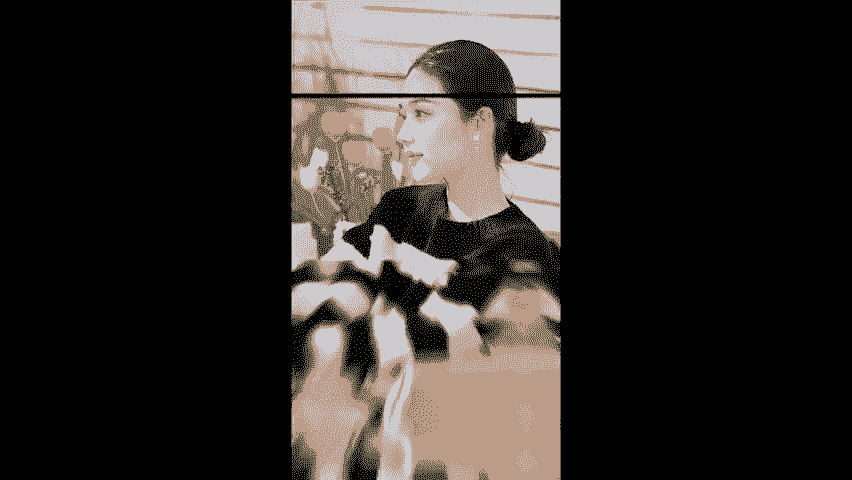
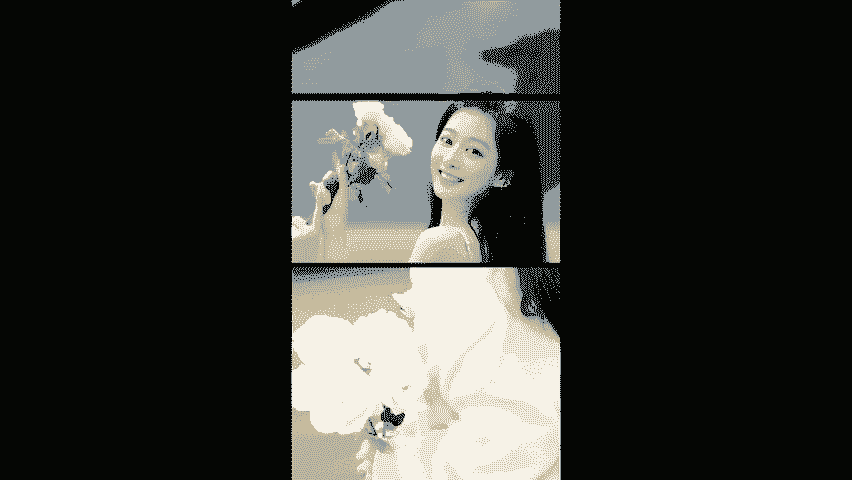
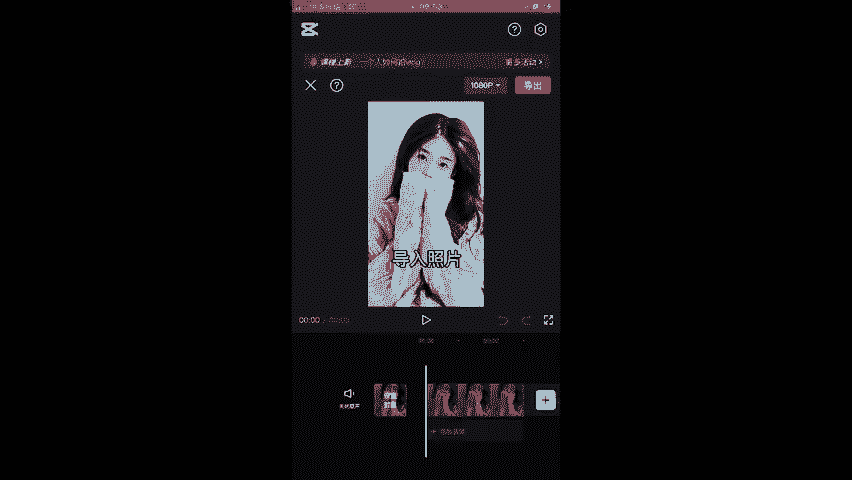
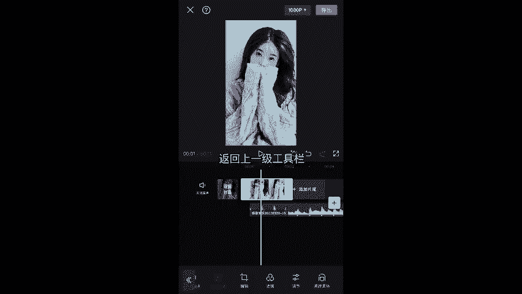
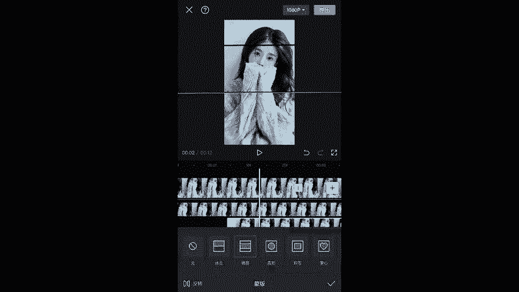
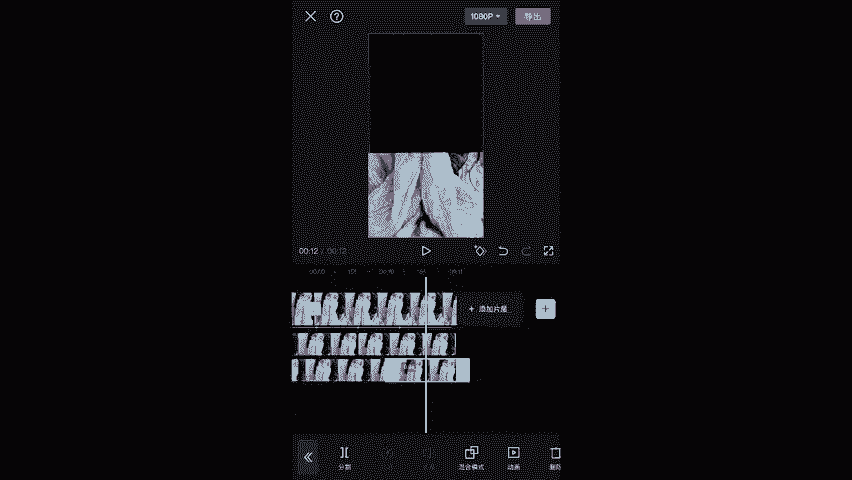
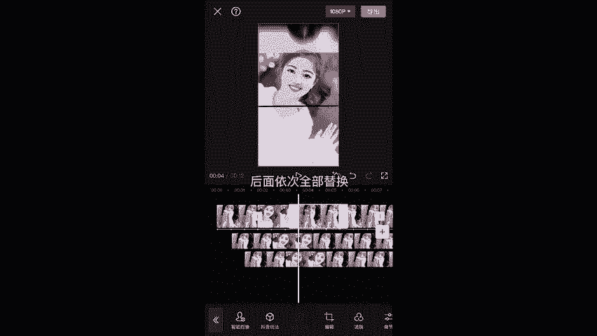

# 视频号创作分成计划保姆级教程，从开通收益到制作原创，打造月入10w的自媒体账号！！多元变现方式实操讲解 - P14：炫酷三分屏卡点 - 坐在旗杆看极光 - BV1GH1yYiECy

。

。🎼打开剪映，开始创作，导入照片，添加音频，选中音频，点击踩点，自动踩点踩节拍。2、点击对勾，选中照片，将照片长度拖至与第三个黄点对齐。

🎼点击动画入场动画。🎼选择动感放大，时长0。6秒，点击对勾，返回上一级工具栏，点击蒙版，选择镜面蒙板，将蒙版缩小一点，移至上方，点击对勾，选中照片，复制6份，选中第一张照片，点击切画中画，开始位置拖至。

与第二个点对齐。

🎼点击蒙版。🎼将蒙板向下移动，放大一点。🎼与主轨道照片留一个边，点击对勾。🎼复制6份，将最后一份拖至画二轨道。🎼开始位置羽化一错开一个点。🎼选中画二照片。🎼点击蒙版。🎼将蒙板向下移动，调整大小。

🎼与画艺照片留一个边。

🎼复制5份，将结束位置拖置与音频对齐。

🎼将三个轨道的第二张照片替换成另一张照片。🎼后面依次全部替换，你学会了吗？

