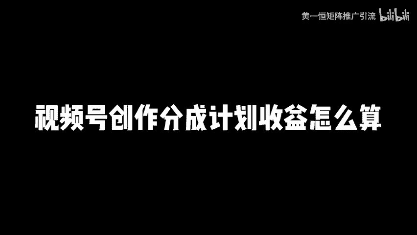
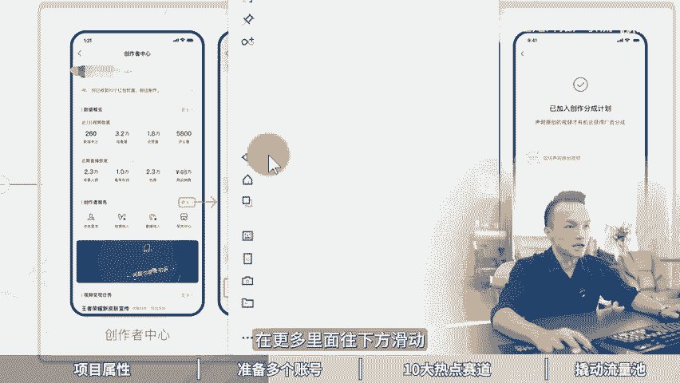

# 视频号创作者分成计划玩法，视频号创作分成计划收益怎么算？视频号创作分成计划怎么开通，视频号创作分成计划过原创，视频号分成计划快速开通，视频号分成计划赛道，视频号 - P1 - 黄一恒矩阵推广引流 - BV182421Z7pR

🎼最近比较热门且蓝海的项目玩法，视频号分层计划，相对于其他平台的竞争白热化，视频号这块相对比较蓝海。加上千内。最近很多人都在在各种创作收益。今天给大家掰开揉睡的讲清楚。视频号创作分层计划，季节废话。

一个视频给你分享视频号创作分层计划玩法，视频号创作分层计划收益怎么算，视频有点长，记得先收藏，一起来看，我给你分享如何准备多个账号，确定十大热点赛道以及批量撬动流量池。现在看项目属性。

那到底什么是视频号创作分层计划。如果你搞过工装流量组，那就很容易理解，它就是视频版的流量组收益。当我们发表视频，打了原创，在评论区就会显示广告，用户如果点击的评论区的广告就可以获得相应收益。

记得咱们打开投屏手机给大家演示一下，你点击视频号，在这里面我们刷到一个视频，然后点击这个平。

在评论区里面，只要有一个以生命原创，你往下方滑动，这时候它就会显示一个广告，显示的一个房产的广告。如果用户点击的这个广告，那我们就可以获得相应收益，那这个收益到底怎么样呢？其实整体还是比较可观的。

像这个视频获得了10万家的手机，初步估计流量已经达到千万级别。这千万级别已经给这个up主，一个视频至少是赚了几千块钱，甚至更多。所以咱们如果发表视频，特别是一些热点视频，整体呢收益还比较不错。

比如这一个号刚开始发布的时候没有上热门，每天只有几10块钱，后面突然就变成了1340。为什么能达到这么多，就是因为咱们的视频上热门之后，才可以获得比较高的一个收益。好，再看这个账号。

46个视频产生收益1500多，这个收益来记住它是单日的，并不是累积所有的一个收益。那每天我们去做到底能获得多少收益，这是很多新手的同学比较关心的问题。咱们来看一下啊，刚开始你去做。

可能咱们也没掌握什么技巧，也没触碰到热点，有可能只赚几条钱，慢慢的来我们找到了一些比较好的选题，流量变大了，变成了几时上百。突然我们有几个作品上了热门，流量达到千万级别。

这个时候我们收益立马就变成了好几千，所以最终收益它还跟我们的内容以及选这个赛道强强关联。那基我们来给大家参考一下收益。有的伙伴说，那如果我有100万播放能获得多少收益。这个啊其实是不确定的。

比如说咱们第一个视频300万的播放能够达到1500块的收益。那这时候呢其实是比较偏高的，相当于100万播放大概有00块钱。而第二个视频，它100万播放收益啊只有30块钱，比前面可以说是少了10倍。

第三个视频79。6万的播放，收益100多块钱。为什么。会有这样的差异。最主要的就是看我们发表的视频是什么赛道。它匹配的广告，又务是什么赛道。如果你匹配的比如说是一些汽车房产，这种是高商业广告。

点击单价会比较高一些。如果你是匹配的是游戏，甚至有的伙伴开的严创，他都没匹配广告，那收益自然就什么比较小的那当我们在操作的时候，这个项目需要符合什么条件才可以操作呢？

首先我们的视频号粉丝量需要满足100个以上，这是一个硬性指标内容呢必须要打的原创。所以刚才我们划到这个作品上方的时候，它会有一个叫做以声明原创，没有声明是不会匹配广告的。同时呢。

我们还得会有一定的视频点击基础，懂得简单的什么去点击软件。第五个，目前视频号呀它是有量扶持的。对于全期的账号来说，你发表的5到10次新视频，它会给你5到10次推流，能够拿到平台1000到10万流量补贴。

所以咱们知道作用是到触放的热点。你发布的作品前期啊就可以获得一个相对来说比较可观流量。那具体要如去做，咱们来看一下如何准备多个账号。首先我们要准备微信号，微信号的话。

你需要准备几个手机手机卡并且来进行实名微信，使名完之后啊，接下来我们就可以去开通这个视频号了。那视频号开通，你只需要去点击视频号，然后发表第一个作品，他就会引导你提进开通，这个基本上没什么难度。

发表第一个作品就可以创建每个人呢目前是可以开通两个视频号。如果你想搞比较多的账号，你就得借助加两个朋友，让他们帮你进行一个实名的。那分层计划，当我们有了视频号之后怎么去开通呢，有两种方式。第一种方式啊。

就是当我们在发表作品的时候，自动符合条件，它系统就会。直接给你进行个邀请，直接就为什么邀请你进行开通。如果大家不是很清楚的，这里面我给大家准备了一个图，你可以截个屏保存一下。

到时候参照这个图啊就可以进行开通。我也可以给大家演示一下好，咱们返回到视频号里面来，点击视频号找到右上角的这个个人中心。在这里面呢，我们选择这个叫做视频号的创作者中心。在创作的中心之后啊。

那么往下方滑动。大家看到啊，像我们这个号发的是锤直细分的啊，也有一点收益。但是呢因为我们发的细分是非常比较小，收益呢也非常小。我们点击更多，在更多里面。

往下方滑动，它会有一个收入变现，在收入变现里面就会有一个叫做创作分成计划。你点击之后，按照引导，按照提示就可以去什么进行一个哎开通。那么第二种方式呢？就是有的伙伴呀可能暂时还没有收到这个邀请。

那这时候怎么办？你可以持续的发作品。那么当你的满足条件之后，它系统会邀请你的，记得一定要严重，不严重是不会邀请你的。除了之外，还有一种方法，就是我们在这个特别是你比如说你发的第十个作品。

突然这个作品火了。火了之后啊，我们打开这个呃自己的视频号的消息列表里面，在消息列表里面，这时候会有很多的一些信息。那么这时候信息你就需要重点的去注意看一下，有没有什么。那么开通的信息。

如果有这个开通的信息，你点进去之后，他就会直接引导你进行一个什么哎开通来看一下广告展示。那当我们已经开通的视频要创作分诊计划，我们想获得广告展示是必须要发表这个原创视频，它才会匹配广告。

如果不发表呢是不会匹配的。第二个我们得加入了创作分诊计划，开启原创视频，在评论区下方它就有机会展示。但是这广告它不是百分百展示的，只是说有一定的机会，如果你的视频内容匹配不到广告，那就没办法展示。

那收益查看的话，那就通过刚才我们演示的路径，然后点击之后，在这里面就可以看到我们哎视频的一个收益。比如说参与收益中的视频有多少个创作分诊收益是多少钱，就是必须要打原创标签，没打原创标签呢。

是无法获得这个什么收益的那有的账号接下来做什么赛道来来看一下实当热点赛道。如何去选择一个好的赛道。选择呀永远是大于努力的，选择不对走的就。页眼错的越深，就是赛道它决定的收益，赛道决定了我们收益的上限。

所以有的伙伴可能在做一些赛道，但是做了几个月，收益呢非常的少。这时候你可以考虑换一下赛道。因为收益的逻辑啊主要就取决于什么咱们的这个评论区。所以如果你的行业，你的赛道，用户不喜欢点开评论区。

那你的行业流量收益就会比较小。所以咱们再选择第一个用户呢喜欢点评论区看到，第二个人群相对来说是比较啊，就是说质量比较高一点的。随别的广告能够匹配到一些汽车房产广告，那的收益自然就会什么比较高。

那这体给大家推荐十大目前视频号里面的热点赛道。第一个娱乐热点类就是跟一些明星八卦相关的。比如说汪峰老师谢霆芳张柏芝都是比较大的热点。大家如果不了解，可以直接把这里面的赛道关键词，复制一个短一点的。

然后呢打开右上角的搜索框，在这里面进行搜索，搜索完成。话其实你就可以看到很多这些相关的作品，可以找一些比较新的。你看到有些达到8。4万的点赞量，1。7万7。2万，这些都是当下比较热的一些娱个八卦。

这一块呢大家如果感兴趣，做的也更好。第二个就是中老年祝福类的，就是一些啊中老年他会给自己子女转发这种祝福，或者报平安，你可以在这里面搜中老年祝福，就可以看到很多竞品做的案例。这些视频呢做起来都非常简单。

因为有的呀就是一行文字，然后来配上一个背景，你可以看到啊，1。2万的数据，3000多的数据，整体的来还是比较不错的。还有聊天搞笑类就是一些聊天的搞笑截图。我们在这里面搜索一下聊天搞笑。然后点击搜索。

搜索完成之后，你会发现啊就是一些聊天记录，10万加这种聊天记录，我们随便找一个聊天记录生成器，把他们的段子拿过来改改，换看背景，换换头像，然后录个屏就搞定的，有没有技术难度，其实是没有的。

比较小其他的还有一些什么知音音乐文案鸡汤生活热点冷知词工具人心引录、怀旧经典表情包视频，这些呢是相对来说比较火的，大家可以去搜入关键词详细了解这里我就不去详细的给大家拆解了，来看一下。

这里我还给大家准备了一个可参考的模仿账号。什么意思？比如说有的伙伴可能做摄影类的做生活观察，心灵鸡汤、历史文化、个人随笔艺术书法以乐体前收藏兴趣。这些呢其实还有很多比较做的好的账号啊。那么这些账号呢。

大家如果想参考的话，你可以找我。我把我整理这些账号分享给大家，让大家有一个对标账号来进行参考。数之外，我们做重视频的时候，还有一种比较简单的方法。就是当你在做的时候，如果你学会使用这个模板来套的话。

就比较简单了。套模板我们只需要改改背景，替换一下标题和文字，5分钟就能做一个原创视频。那这种方法来，这里时间关系我就不详细的演示了。大家如果感兴趣也可以找我，我把它分享给你。好。

接下来当我们选择了赛道之后，我们就需要去撬动流量池。首先目前视频号的流量扶持还是比较给力的。对新账号来说，你发表的前三个作品直接给你1000流量扶持。比如说这我们一个新账号特地做了测试啊。

我们单独减了一些视频发上去。前三个你看一000放量，后面呢就没有播放量了，就是流量扶持。第二个呢创作任务，它隔段时间在我们的创作的中心里面就会有个创作任务，这个创作任务，你点击之后点参饮。

接下来你发表视频满足条件就可以获得5000流量奖励。各位同学5000流量至少也值100块钱了。第三个，当我们能够达到1000的基础流量，你就能够进入到下一阶段流量词视频以或者推荐视频或者推荐。

这种就是什么？目前视频号给的流量扶持。其次呢就是系统的推荐量。那对于一些数据比较好的呀，我们的视频呢将进入到下一个流量池里面来。它跟我们像其他短视平台的推荐其实非常相似。所以视频的数据持续增长。

我们就会进入到更大的流量池。所以他发表视频之后，会先给几百个人，1000个人，200个人去看。如果这些人点赞评论。还有推荐数据指标都比较好，就会进入到下一个词里面，不断的进行推荐。那除此之外。

如果你发表的视频流量确实比较少，那怎么办？还有一个办法叫做做人启动。什么叫能启动呢？比如说你在发表作品的时候，可以在标题里面卡上一些搜索关念词，可以把搜一搜视频号的一些排名给他布局一下。

一买一些有热度或者说你搜权的关键词，你也可以选择去加上100个群，然后呢这个群我们称之为种子群，种子群什么意思？相当于就是你把你的视频号分享到这100个微信群里面，至少能够获得1000个初始流量。

那么一天加10个群，10天的话，你加满100个问题呢也不大。那如果这些你觉得太麻烦，你也可以选择啊，那么有公众号，比如像我们公众号有超过23万粉丝，我们只需要在公众号里面推一下。

基本上就可以获得几千个流量，也可以选择直接付费加热，这些呢都是可以的。宝贝同学我是黄一涵只做落地推广方法，刚才给大家分享了视频号创作分诊计划项目。另外我还给大家整理的是8个品台的项目打法。

教大家如何布局多项目和多流量管道，这些呢都是我原创的，可以通过主页来临捷进学习。如果觉得今天视频比较不错的，请大家一键三连，感谢大家支持。咱们下个视频呢再会。

