# 视频号和抖音截然相反 - P1 - 赵啦啦讲私域流量 - BV1Q7bWeSEJS

🎼拿抖音的打法去做视频号，必死无疑。两个平台的打法根本它就完全不一样了。视频号对英广的限制简直就不要太大营销类的短视频啊，在抖音啊你可以跑的很好，转化投产绝对是正的。但是你拿出视频号来铁论你就跑不了。

立刻给你限流，严重的直接给你封号。现阶段啊视频号对社区内容的生态看的比自己的命还重要。营销啊，只要你在短视频里面出现营销比较多的那容，立刻平台就会给你限流，甚至封号，不会再给你发一的机会的。

很多平台在刚开始商业化的时候就会显得睁一只眼闭只眼。比如说抖音刚开始商业化推进的时候，就是从娱乐平台转型一个电商平台，就这个节点啊，抖音做的是非常非常野蛮。视频浮夸的暴力的营销的，别管什么样的全都上。

每年啊315抖音基本上都是擦着头皮过去。如果说真的你去深究的话，抖音以前每年必过315就得一年手电筒在抖音的短视频里可以。

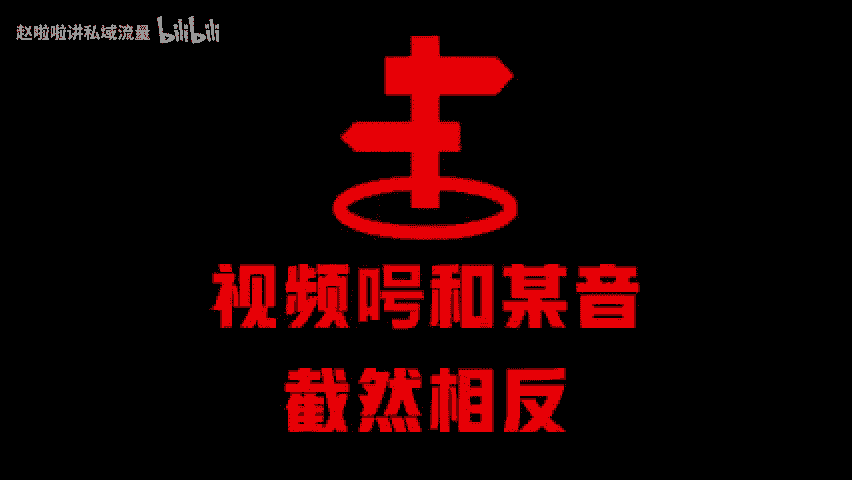

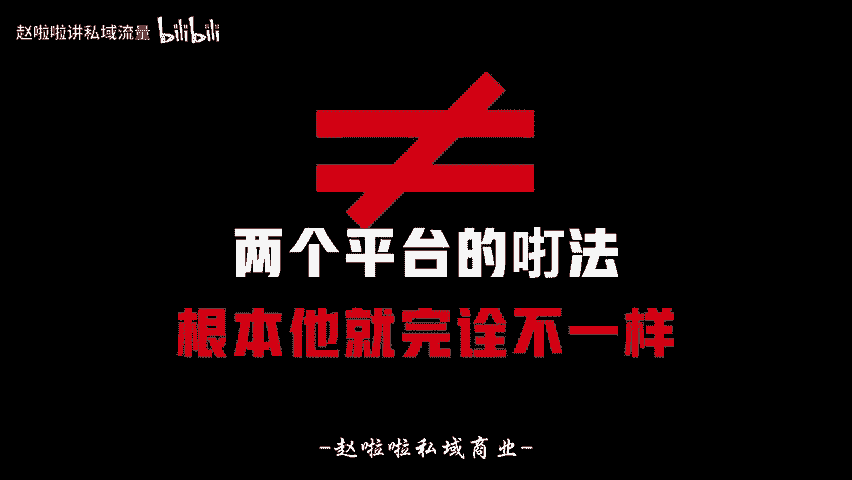

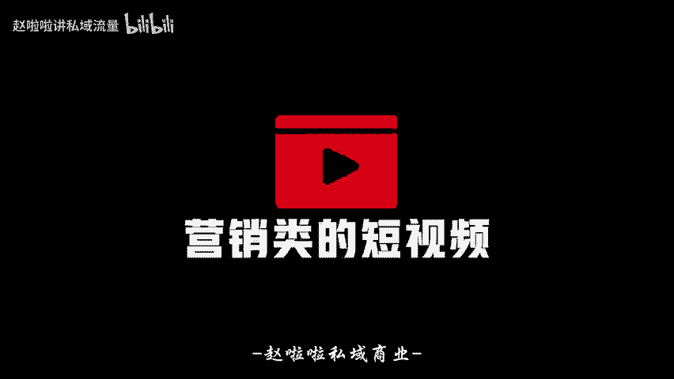

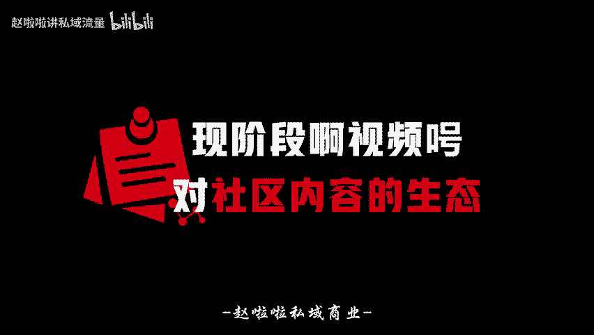

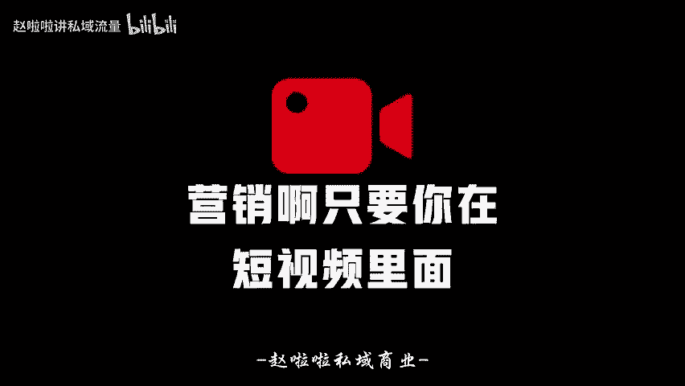

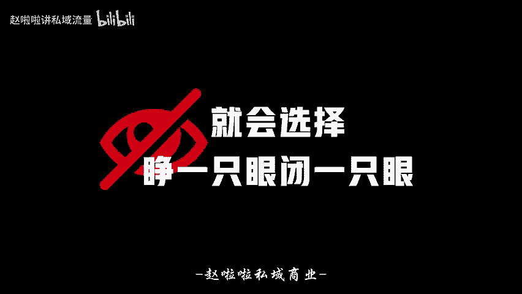

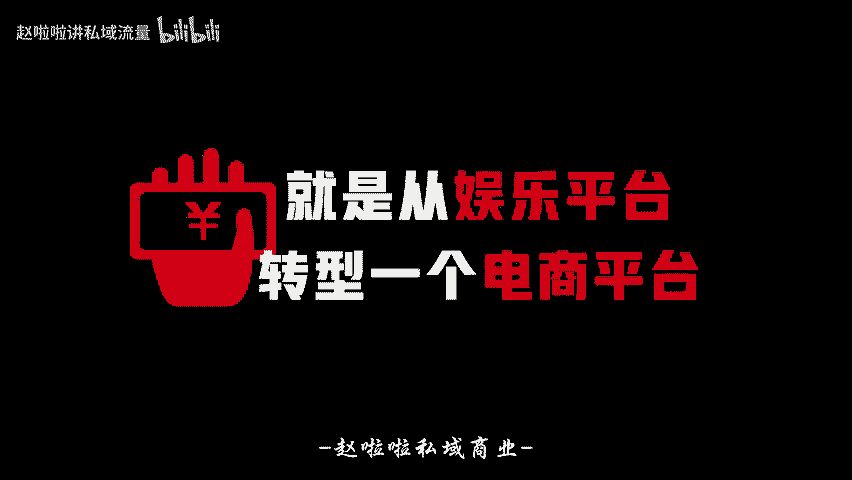

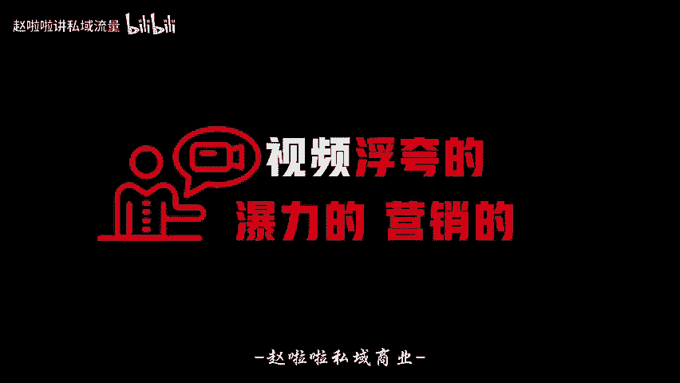

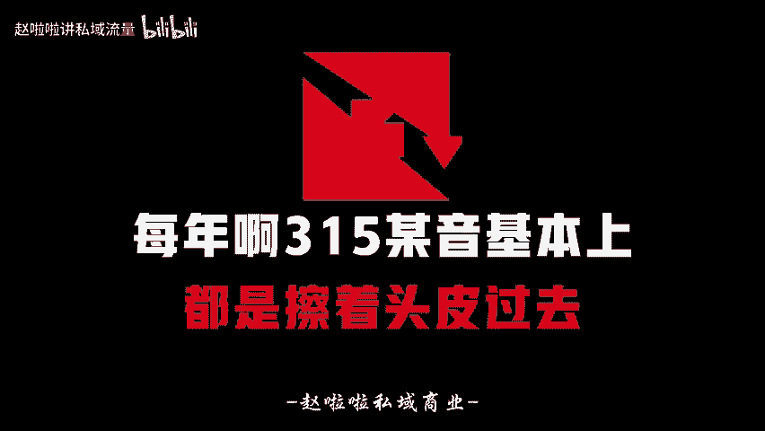

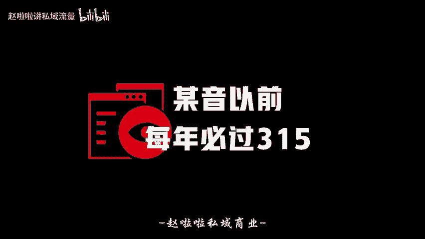

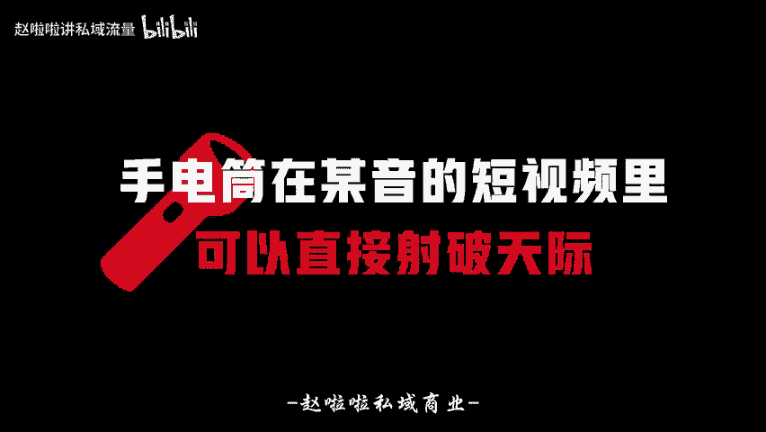

🎼直接射破天际。但真实情况，你拿到这个手电筒，它的光速可能只有泥鳅那么小。抖音的商业化为什么能这么快且成功？核心其实还是路自一视频号为什么发展的这么慢，还这么保守呢？卖货类的视频啊，你不赢销。

你转化怎么可能好，投产怎么可能好。想知道现在视频号爆量的素材长什么样子啊，跟抖音有什么区别，投放了物料两者的真实差异，我整理了一份对比文档啊，大家可以直接找我来领就去。然后你仔细研究一下。

我在这里面呢记载了非常详细的两个平台的打法差异，算法流量差异，还有推荐的机制差异。今年你想做好视频号呢，你肯定要把这个研究透。

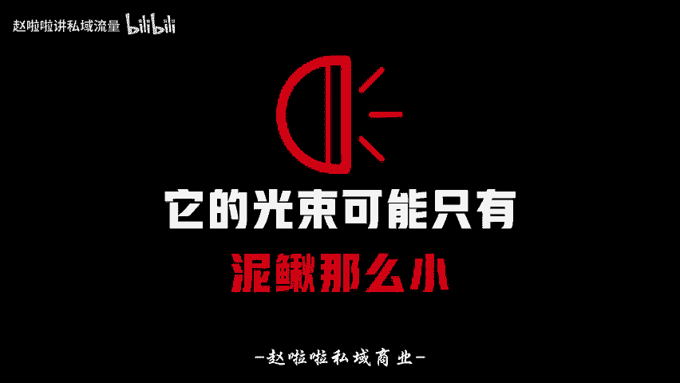

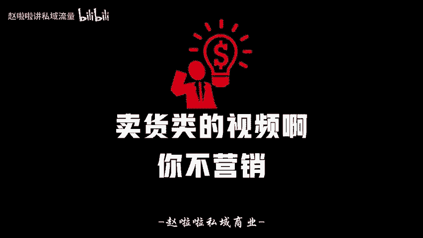

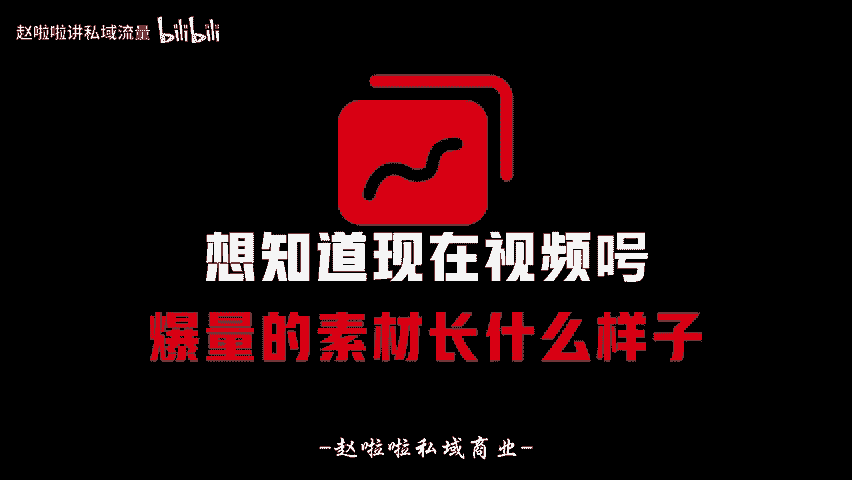

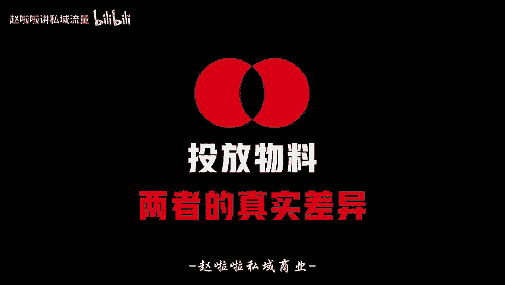

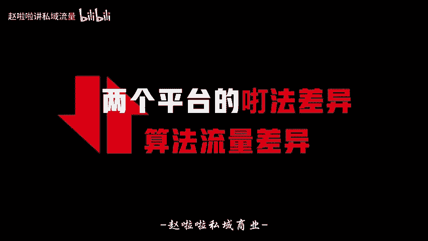

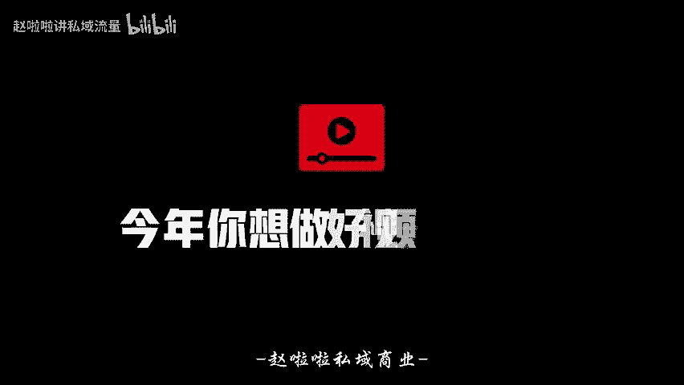