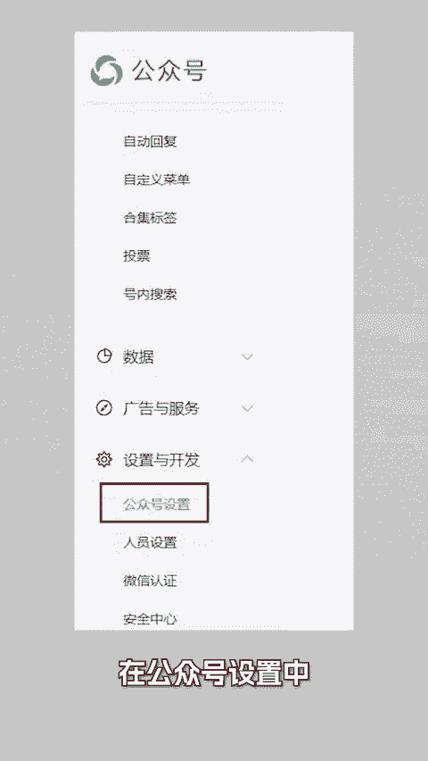
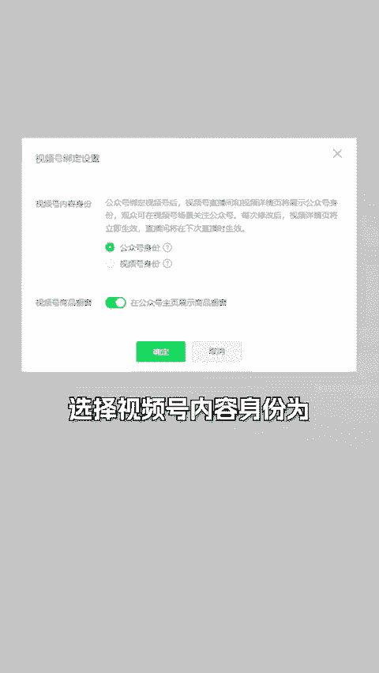
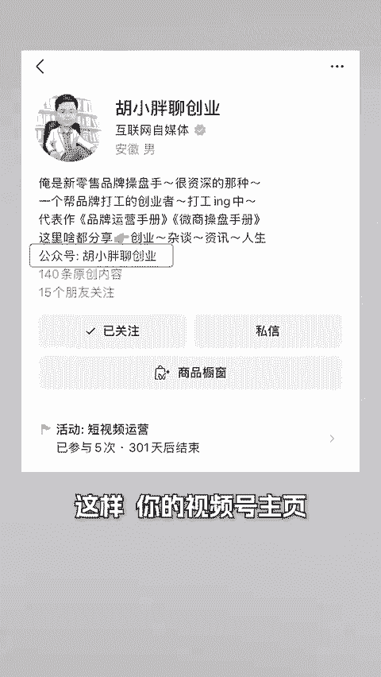
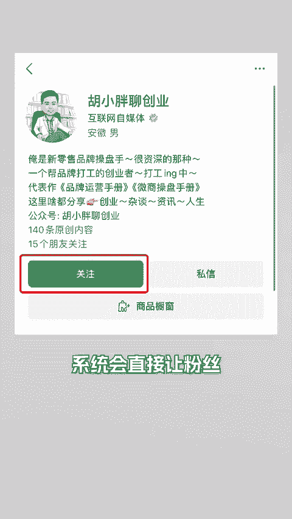
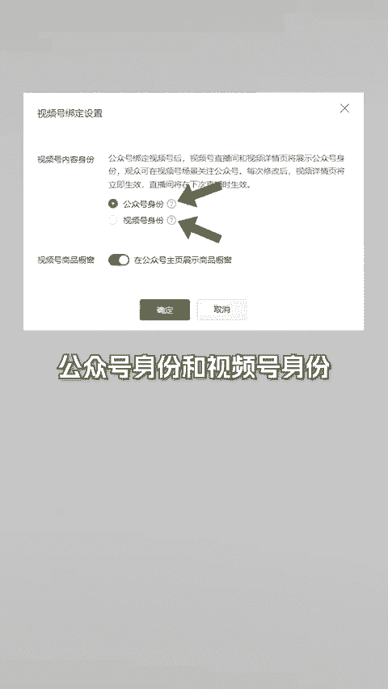

# 视频号如何导流公众号？视频号内容身份如何选择？ - P1 - 胡小胖聊创业 - BV1Sw4m1k7Jr

🎼视频号如果导流到公众号呢？其实很简单啊，两步搞定。第一步在公众号设置中啊绑定视频号。第二步，在绑定设置中啊，选择视频号内容身份为公众号身份。这样你的视频号主页就会显示公众号。

此时啊当粉丝在视频号中点击关注后啊，系统会直接让粉丝关注公众号。于是我们就可以成功的把视频号导流到公众号了。

🎼但这么操作有一个坏处啊，那就是这个粉丝后期接收视频号的内容只能从订阅号入口接收，而不能从视频号入口接收。因为粉丝之前啊关注的是公众号，并不是视频号。🎼为什么会这样呢？

这就需要我们来了解一下视频和内容身份的这个知识点。🎼在公众号后台的视频号绑定设置中啊，有一个视频号内容身份选项分别是公众号身份和视频号身份。当选择公众号身份选项后啊。

视频号主页和直播间啊将展示公众号身份，并引导关注公众号。当选择视频号身份号啊，视频号主页和直播间将展示视频号身份，并引导关注视频号。所以啊视频号内容身份选项。

就是让你选择粉丝关注的主体可以是视频号本身也可以是公众号，那应该怎么选择呢？这里啊给大家一个我思考或者答案啊。视频号1万粉丝以内选择视频号身份。因为视频号啊一万粉丝可以申请精微认证啊。

享受诸多视频号权益。这个我们就不能浪费掉。

🎼1万粉丝后啊，你可以根据需要来选择。如果你有后段业务啊，需要试域线索，那建议选择公众号身份。因为公众号里面啊做营销更方便。如果你没有后端业务，并且你对公众号需求较弱啊，就选择视频号身份。

