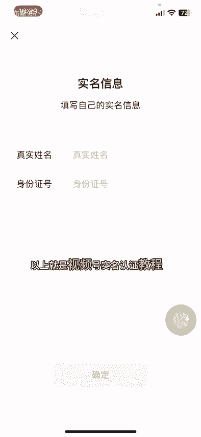

# 视频号实名认证教程，一个视频号可以做几个实名认证？视频号实名认证和微信实名认证有什么区别？一个身份证可以实名认证几个视频号？#视频号实名认证#视频号投流 - P1 - 时布斯郑州小程序开发 - BV1ogm3YQEbD

🎼大家好，这个视频给大家介绍一下视频号如何做实名认证。一旦实名认证以后就不能修改了。大家一定要谨慎视频号的实名认证跟个人微信的实名认证是分开的，可以一样，也可以不一样。演示一下如何来操作，点发现。

点击视频号，点击右上角人物头像，点击创作的中心，再点击带货中心，点击视频号的名字或者头像，点击右上角三个点，再点击账号安全，再点击账号管理，可以看到视频号实名，目前是未实名。如果说你要实名的话。

点击实名。视频号实名以后不能取消和更换。所以说一定要谨慎。一个人的身份证可以实名两个视频号。如果说想实名更多的，你可以做企业栏微认证，这个就必须是有限公司，需要营业执照对公账户才可以做栏微认证。

企业栏微认证可以认证50个视名号。企业栏微认证以后，直接就可以开播了，非常方便。想做矩阵的，一定要去做企业机构认证，点击开始认证。

🎼假如说你自己的视名用完了，你也可以用别人的，用朋友的，用家人的都是可以的。这个视名跟个人微信实名是两码事，你学会了吗？以上就是视频号实名认证教程，希望对你有帮助。

