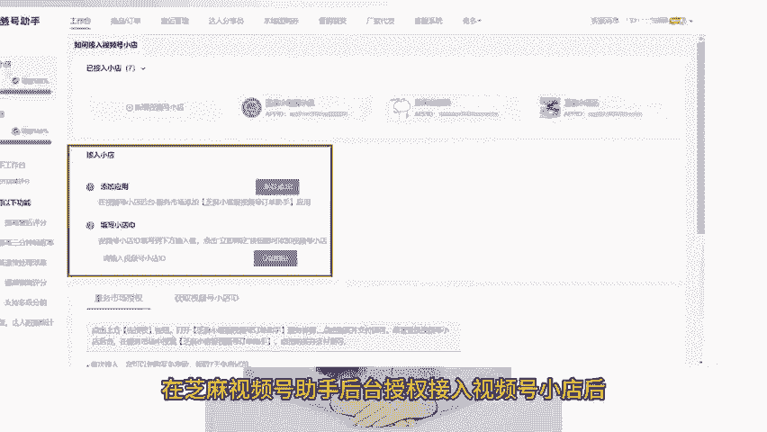
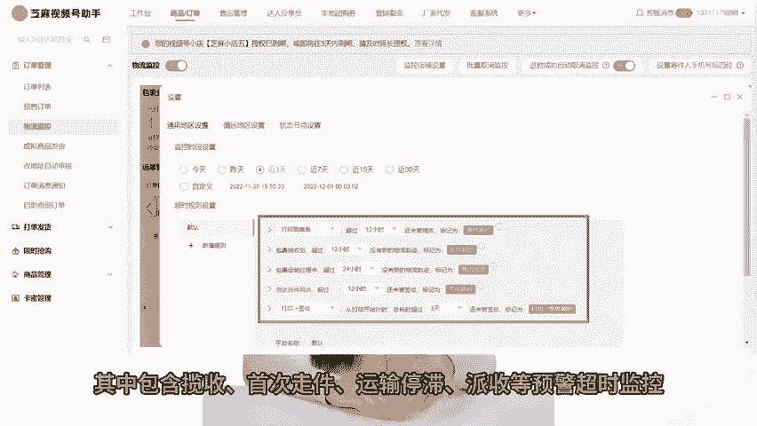

# 视频号小店运营技巧五：视频号小店订单如何设置物流监控？ - P1 - 芝麻客服 - BV13KWDeLEzz

了解视频号小店运营玩法，高效运营视频号小店视频号小店订单发货超时怎么办？订单物流异常，订单派件异常如何第一时间得知。如果你想知道视频号小店如何设置订单物流监控，一定不能错过这个视频。

本期视频教会你如何快速设置店铺物流监控，做好包裹发货管理，减少漏发件问题键视频号小店官方后台是没有物流监控功能的，需要借助视频号小店第三方管理工具，芝麻视频号助手来完成。

在芝麻视频号助手后台授权接入视频号小店后，开通物流监控功能，选择需要监控的视频号小店系统会自动监控已经发货的订单物流状态，也支持自己上传需要监控的物流单号。芝麻视频号助手提供多个标准化物流节点监控。

其中包含揽收、首次走件、运输停滞、派收等。

预警超时监控，帮助客户企业主动提前应对异常物流情况，减少电商罚款与客户投诉。同时，芝麻视频号助手还支持多维度物流数据分析，包括承运商时效分析。

发货地、收货地异常统计、店铺、仓库和平台、物流健康指数等多个维度的数据分析，物流统计数据，还支持以最小单位导出，方便协助客户、企业管理层、优化物流战略决策，节约物流管理成本，具体配置流程。

可联系我们的客服协助，关注芝麻聊视频思域，学习更多视频号小店运营技巧。