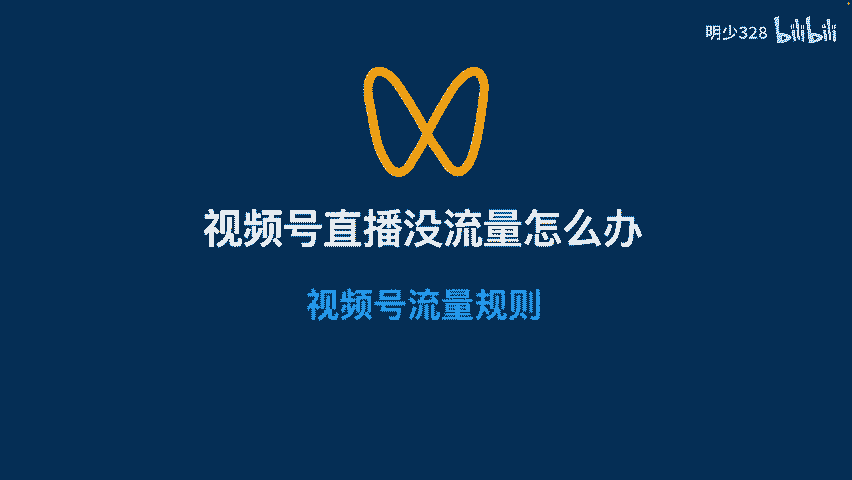
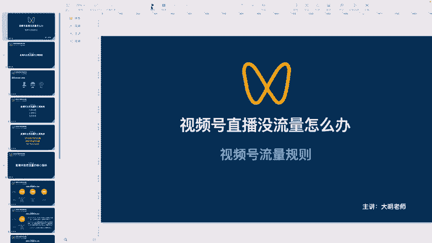
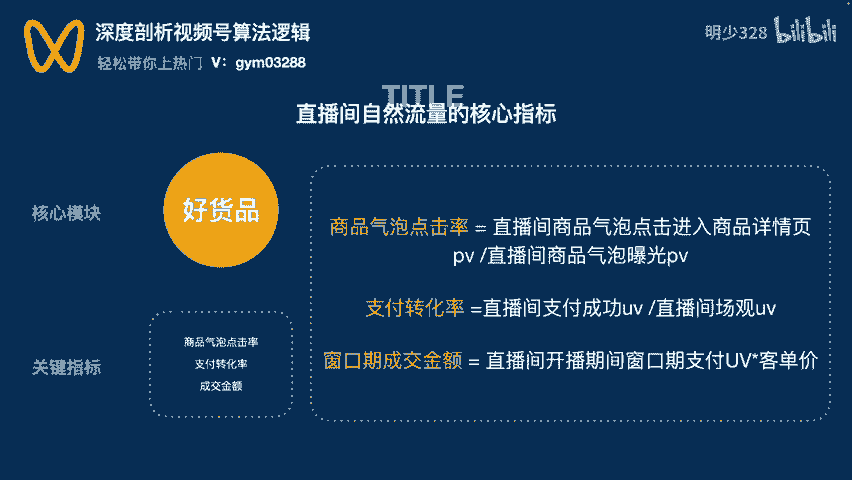
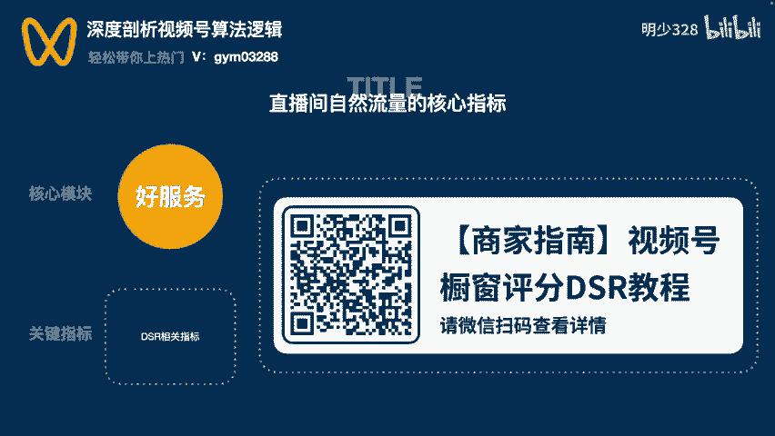

# 视频号直播没流量怎么办？这节课为您讲明白 - P1 - 明少328 - BV1T7igeoEkH

🎼hello，大家好，我是大明。那么今天呢我们为大家讲解的是视频号，没有流量办。🎼主要呢我们围绕今天的主题视频号的流量规则去为大家做一个讲解。嗯那么在讲解之前呢，我先做一个自我介绍。嗯。

我们呢是负责视频号带运营。那如果说在这个过程当中，大家有相关的问题，也可以去私信我们的这个老师，呃，不管是哪个老师在我们的运营的层面上都能给大家呃一些些许的这样的一个帮助和这个方法的一个讲解。

所以说在后期的运营层面上呢，我觉得更主要的还是在实操。所以说呢大家如果说听到这个课程，更多的还是在这个理解的层面上，但是真正的去了解，去接触，包括在这个过程当中能有更多的这样的一个结果。

那我们必须去呃落地去实操。所以说您需要把你的账号提供给我们，然后授权给我们作为运营。

🎼我们在这个过程当中才会有针对性的帮你们解决问题。好，那么我们进入接下来的我们的主题，视频号直播没有流量怎么办？视频号的流量规则。🎼那么有人说视频号直播的流量真是摸不着头脑啊。

这个全凭感觉哈有的时候呢流量比较好，有的时候呢流量也比较差。但是啊在这个过程当中还有一部分账号呃，这样一部分账号，它压根就没有怎么样好过，就是从始至终他刚开始包括呃一直走下来。

到现在就没有一个好的这样的一个流量，所以说呢就认为是不是我播的有问题啊，或者说我的品有问题呀，或者说这个平台不行，对吧？所以说在这个过程当中很多人就有这方面的疑问，也有方面的各各种各样的质疑。

所以说围绕这方面的问题呢？我们呃这个整理了相关的这个课程内容给大家做一个讲解，希望大家呃能对大家带来些取的这个这样的一个帮助。那么其实呢任何平台的流量都不是随便给到我们的。那他都有。

🎼有一定的这样的一个数据维度。然后呢，系统会有针对性的啊，或者说有根据性的围绕这些维度呢进行推荐。那么视频号直播的流量到底有哪些数据维度呢？那么下面这个达米老师就带着大家一起来去分析去做一个讲解。

🎼首先呢我们第一个讲解的就是视频号的。🎼它的一个流量的主要维度。那视频号从这个平台的角度上来看。🎼那他更愿意希望大家能够打造用户爱看，并且也爱这个购买，或者说我们的售后体验比较好的这样的一个带货直播间。

那这样的话对我们的这样的一个叫什么三个维度，商家平台三方啊，或者说我们的用户啊，用户商家平台这三方都能够比较满意。🎼那根据视频号官方的一个说明呢，每场直播能够获得的自然流量主要受到这以下三方面的影响。

他们分别是什么呢？🎼分别是内容消费、交易转化、售后体验。那这是三个维度。那这三个维度呢刚好击中了平台的目标。在我们的这样的一个创作的过程当中，我们的创作者的内容有流量。🎼商家的商品有销量。

用户的有好的体验，对吧？这是呃这个三个维度。所以说呢它就形成了一个可持续性的良性的一个循环。那么这样呢就可以吸引更多的创作者啊，以及商家，包括用户来到视频号的平台。那么这个平台呢就能够越做越大。🎼啊。

这是它的一个维度。那么我们看第二点。🎼直播间自然流量的核心指标。那视频号把上面的刚才讲到的那三个维度分别定义为。啊，三个点。🎼那这三个点是什么呢？首先第一个好内容，对吧？🎼第二个好货品。第三个好服务。

🎼那好内容的目的是干什么呢？来我们给大家详细的说一啊，这个做一个阐述。🎼那好的内容它的目的是吸引用户进入直播间，并且能够留住用户。所以它的关键指标有3个。🎼那哪三个呢？这个上面呃课件上面也写的很明确啊。

第一个呢就是我们的内容曝光点击率啊，其实也就是一个进房率哈啊以及有效观看的一个占比。那就是说在这个过程当中有没有停留是吧？它停留的一般是30秒啊，60秒啊，或者说180秒啊，这几个区间。

🎼那第三个呢是人均观看时长。🎼对它的人均观看时场。那我们来看一下它的一个计算公式是什么。首先内容曝光率，也就是我们所谓的进房率，它等于点击啊进入直播间的一个流量，这个流量是PV啊。

用用这种专业术语来说叫PV。那么点击进入直播间的一个流量，除以直播间外层的一个曝光的一个流量。🎼啊，和点击进入直播间的一个人数，再除以直播间外层的一个曝光的人数，那就得到了这样一个内容曝光量的啊。

也就是进房量的这样的一个公式。🎼那么第二点呢叫有效观看占比。那有效观看占比它的公式是什么呢？就是进入直播间停留时长达到30秒以上的这样的一个啊这样的一个人数啊，除以直播间场关的人数。

🎼啊和进入直播间停留时长达到60秒以上的这样的一个人数。🎼啊，再处于什么呢？直播间场关的这样的一个呃他的一个人数和进入直播间停留时长达到1米180秒的这样的一个人数啊，和直播间场关的这样的一个人数。

那么第三个呢是人均的观看时长。那人均的观看时长等于直播间总停留时长。🎼除以直播间场关的这样的一个具体人数啊他的公式是这样来去啊核算的哈。呃，具体呢可能大家在这个过程当中听起来啊比较绕。啊。

如果说大家在这个过程当中啊，对我们的这样的一个呃视频号，或者说相关的规则不是特别了解，或者说有什么疑问的情况下，也可以呃联系到我们的这个老师，不管你这个课程是从哪个老师那里收听到的，都可以找到他。

然后让他去帮助你去解决啊，或者说去探讨一下，我们这个相关的问题。好，那么我们继续。🎼那说完好内容了，我们来说一说好货品。🎼那好货品它的目的呢是考量直播间的商品转化，对吧？

为此呢视频号也给他设置了三个的啊这样的一个核心指标。那它的三个核心指标上面写的也非常清晰。第一个呢，商品气泡的点击率啊，也就是用户对商品的兴趣程度啊，到底感不感兴趣呀，是吧？他感兴趣。

他肯定会愿意点击多去了解，对吧？🎼第二个呢是支付转化率。那也就是说用户。🎼看完这个产品之后，他是否有兴趣。🎼产生这个购买，对吧？他是不是点完了之后嗯，要进一步去购买，这是第二个维度。那第三个维度呢。

就是直播间开播期间的窗口成交的金额啊，窗口成交的金额，他们的计算公式是什么呢？来，我们看到右边商品气泡点击率等于直播间商品气泡点击率进入商品详情页的流量，除以直播间商品气泡曝光的这样的一个流量。

那这就是商品气泡点击率，它的这样的一个计算公式。那第二个呢，支付转化率的计算计算公式，等于直播间支付成交的人数除以直播间场关的人数啊，这是支付转化率的。🎼计算公式。🎼第三个呢，窗口期成交金额。

🎼等于直播间开播期间窗口期支付的这样的一个人数啊，乘以客单价啊，这是窗口期成交金额的一个计算公式。详情呢我觉得后边呃接下来好服务方面我会有针对性的啊会做一个整理啊，没有一一的给大家展示出来哈。

因为篇幅的原因时长的原因啊，在这个过程当中不再给大家过多的去赘述。因为每个直播间都不会说完全一样。🎼如果说大家在这个过程当中有任何的疑问，可以联系到我们的相关老师啊，相关老师。

那如果说你找不到相关的老师，我们左上角上面有我的V啊，有我的微，那可以直接搜索添加，然后去找到我。然后我们有针对性的去做一个讲解。🎼好，那么围绕好货品，我们讲了一部分哈，讲了一部分没有深入展开的去说。

那么我们说一下啊好服务方面。

🎼那好服务的目的是什么呢？它是考量用户购买商品之后的售后服务。目前呢视频号会通过它的1个DSR来去刻画商家售后服务的这样的一个能力。那服务能力的好坏呢会影响到直播间的自然流量。

🎼同时呢考察DSR的这个数据呢有很多哈，它的方面有很多。具体呢呃我整理啊我整理了一下啊，然后大家可以截图去这个扫码去具体的去进行一个了解哈，具体进行一个了解。如果说在这个过程当中，你有任何的疑问。

有任何的这个不明白的地方都可以随时随地的联系到我们的老师，或者说联系到我，我们在这个过程当中会有针对性的给大家做一个分析。因为视频号还是刚才说到的签号千面，大家一定要记住视频号，签号千面。

不可能在这个过程当中让你去所有的账号，用统一的方案统一的策略去做这样的一个账号。🎼还有一个特点，视频号在逐步的优化和不断的改进。它是这样的一个过程。如果说我们在这个过程当中一直在用老的这种方法和策略。

那你当下可能有结果。但是过一段时间之后，你就会发现你的账号首先流量不高了。然后结果不好了。所以说在这个过程当中有问题出现了，我们要干什么，要去找到问题的根源，而不是说去抱怨说哎呀，我的主播不行。

或者说我的品不行。🎼或者说我的这个账号有问题了，或者说这个平台不行，其实那些都是表面性的问题。那我们要找到问题的根源，问题的根源在哪？我们共同去沟通，共同去分析。到时候我们有针对性的去解决问题。🎼好。

那所以呢想要视频号的直播，有更多的自然流量，那么就需要围绕以上的这几点呃，它的相关的维度和数据有针针对性的呢去制定好优化的方案和政策。🎼啊，这是这个这一点。

🎼那么我们来看。🎼第三点，影响直播间自然流量的其他因素，还有什么？🎼来，我们看一下。🎼首先呢上面讲的都是已经跑通的这个直播间哈，都是已经跑通的直播间。那么对于刚开播的直播间又有哪些指标呢？

那么我们就针对这个问题来去给大家做一个分析和讲解。😊，🎼嗯，对此呢这个官方也给出了相关的这样的一个说明。第一点，冷启动的流量。🎼就是在符合平台规则的前提下，平台都会给我们的直播间有一定的冷启动流量。

那不管是流量多与少，他都会给到你。他不可能说你开播一个人不往里边进，那绝对是不可能的对吧？这只要有人进来，就是给你的冷启动流量。第二点。内容消费表现。在冷起度阶段的过程当中。

系统会重点关注直播间的内容消费表现。🎼对吧那么也就是说系统给我们推荐的这些数据呢啊包括什么呢？直播间的曝光点击率，直播间有效的观看占比。🎼包括直播间的短停快滑，对吧？他根据这些情况呢来去找到对应该内容。

或者说相关的这样的一个货品，有兴趣的这样的一个用户。🎼那并且呢在后续推荐的过程当中做到持续的放大。如果说直播间在这几个指标上面表现的比较差。🎼那么就会遇到一个什么情况呢？就像我们很多人遇到的一个问题说。

🎼这个流量不持续，这个流量就不给我们更多的一个推广，对吧？就没有一个更多的一个曝光。所以说问题就出现了。🎼对吧所以说我们要找到问题的根源啊，要找到问题的根源，所以要有针对性的去分析账号嗯。🎼好。

我们看第三点。🎼每个带货主播每天的获取冷起度流量的扶持的这个场次都是有限的哈。大家不要想着，哎呀，我这一场没有流量，那我是不是开开两场、三场、五场、八场，我一直开播，对吧？没有流量。

我下那下完之后我再开，其实那是无效的，那是无效的。其实在这个过程当中，我们一定要尽量避免频繁的短播。🎼就是你开播一场没有流量，然后突然说哎呀我下播，下播完了以后再去开开播一看，哎呀，流量还不行。

那再去下播，再去开播。其实这个哈没有说这个能够做得起来的啊，没有说能够做得起来的那如果说要试播呢？我们可以做什么呢？做彩排，对吧？可以做彩排，因为这个过程当中你可以有针对性的，或者说你自己的身边的人啊。

这个有针对性的，让他们去看一看比方说啊我们的话术啊是吧？场景啊，这个过品的节奏啊，是不是是不是有问题啊，不要去上来就是啊这个大张旗鼓的啊一场该播了。🎼好就好了，不好就下播了，千万不要这样去做啊。

千万不要这样去做好，我们看第四点。🎼那么除了常规的这样的一个曝光点击率，呃，有效的观看时长占比的这样的一个指标以外呢，呃处于冷启动阶段的这样的一个直播间，比较容易被捕捉的信号啊，是什么呢？就是用户是否。

🎼快滑嗯啊就是是否用户快滑，这个快滑的标准是什么呢？就是3秒钟。🎼目前停留3秒以下视为快化啊，就是3秒钟为一个呃界限，3秒钟以上啊，基本上就不算什么无效的用户了啊，它是有效的，3秒钟以下就属于快化。

属于无效的嗯。🎼那这样呃更有利于我们去评判我们的直播间用户的这样的一个基准，对吧？短停快滑这样的用户比例比较高的情况下，也会影响到下一步的这个流量，也会影响到下一步的流量啊。

很多说哎呀这个一波流量进来了，然后没有停留，一下划走了，对吧？划走了，有很多方面的因素哈。刚才讲到的是一方面。🎼啊，他首先进来以后，不是说对你的直播间不感兴趣，这只是我们片面的理解。那更多的是什么呢？

他在这个过程当中是带着任务进来的那也就是在官方的层面上给我们做了更多曝光。🎼但是这个曝光呢并不是说让他去过来购买的，或者说让他去关注啊、停留啊、互动转发呀。

不是做这方面的这样的一个工作的他们带的任务是什么呢？就是要考核考核你的直播间是否有违规的行为，是否有低价引流的这样的一个嫌疑，是否能够对用户产生更加积极性的这样的一个影响，那这就是决定性的因素。

要不要给你接下来推人，对吧？啊，这是这一点。🎼好。🎼第五点呢。🎼在冷启动流量做放大的这样的一个过程当中，推荐系统会关注到放大流量，它的后续的承接效果。嗯，那么后续的承接效果包括什么呢？

🎼商品点击率以及支付转化率。🎼那围绕这两点呢来去保障我们更加精准的流量给到商家。很多人说哎呀，我这个直播间里边有更多的人，对吧？有更多的停留，我们就想办法让他们有更多的购买。

购买完了以后就会有更多的这样的一个流量，对吧？其实在这个过程当中有一定的因素，但是它不是决定性的因素，它只是参考的一个标准，它不是决定性的因素，大家一定要记住，所以说直播间是否有成交。

在我们的运营层面上啊，可能。🎼不会把它看的那么重，因为你账号得达到相关的这样的一个平台推流的标准的维度上。🎼你才会后期能够更持续更稳定的把这个账号给走下去，而不是说当下我要卖多少钱，当下我要卖多少单。

🎼如果说我们当下去关注了这个点儿，可能在我们后期的过程当中，运营的层面上就比较吃力。其实对我们来说啊，我们那有是呃有这个方法能够解决相关的问题。但是我们的这个时间啊，或者说会在这个过程当中会延长。

再有就是什么呢？最终耽误的是商家的时间，也就是我们主播的时间。🎼所以说呢在这个过程当中会围绕我们的账号啊，有针对性的去解决问题。有什么样的问题，那我们就拿出来去详细的去分析。而不是说我原来是什么样。

现在是什么样。那我原来这个流量特别好，转化特别好？那我现在为什么不好了。那是不是这个平台不给我流量了？🎼其实不给你流量是有原因的，只不过是在这个过程当中，你没有找到真真正的原因而已。

所以说呢在这个过程当中，我们去参与，我们要了解你的账号，而不是说像很多人讲的一样啊，你的账号是这个问题，你的账号是那个问题。那我们参与以后能给你解决什么什么什么样，对吧？能给你达到什么什么什么样的结果。

其实那只是表面性的去说一说而已。但是视频号呢跟其他平台是不一样的。视频号他除了公益流量以外，他还有更多的私域流量，所以说在没有看到后台之前我们任何一个运营都不会给你很明确。

或者说斩钉截铁的去给你说你的账号出现了什么问题，对吧？所以说这也是我们在跟客户沟通的呃过程当中，很多客户不理解，或者说我们不给他讲一些干货的这样的一个原因。🎼不是说我们不讲解干货。

是因为我我们不想去乱说，不想去夸大我们的这样的一个宣传啊，我们就是实实在在去做事。所以说呢在这个过程当中有任何的疑问，可以联系到我们的老师啊，可以联系到我们的老师，我们在这个过程当中呢。

也会有针对性的去帮助大家解决问题啊，那么以上呢就是今天分享的内容，希望对大家有所帮助啊，更多运营的这个方式方法，也希望大家能够关注大明老师，我们后期还会有相关的这样的一个课程啊。如果说大家找不到我啊。

可以添加我们屏幕当中的微啊，可以加我的微啊，有任何的疑问，可以随时随地找到我啊，也可以联系到呃这个发送给你课程的这样的一位老师啊，有什么样的问题，都可以随时随地的找他啊，感谢大家的聆听。

🎼今天的分享到此结束，我们下期课程再见。

