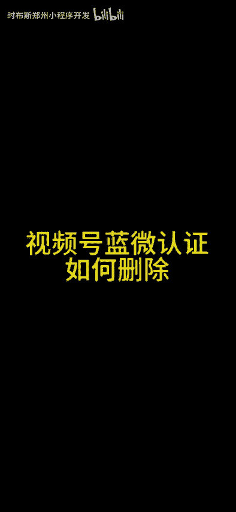
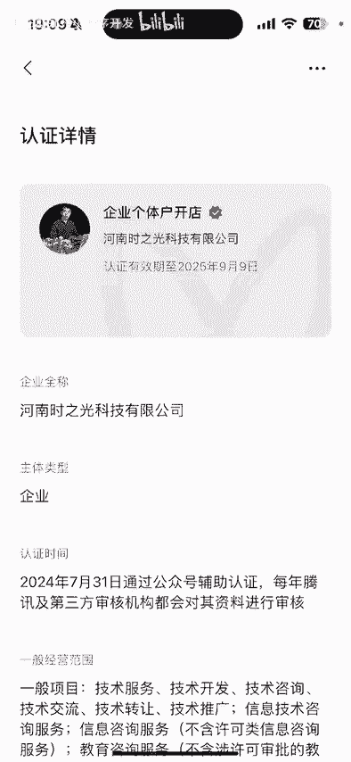
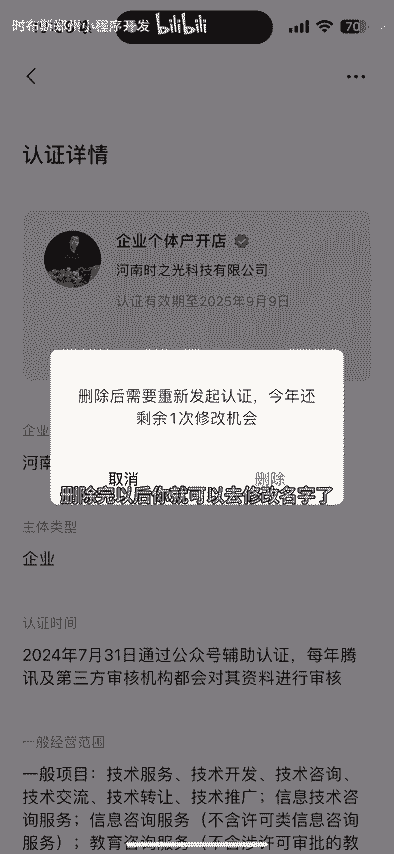

# 视频号蓝v怎么删除？视频号蓝微删除教程，视频号怎么不能修改名字？#视频号优选联盟 #视频号蓝微删除#视频号蓝v删除#视频号投流#视频号运营 - P1 - 时布斯郑州小程序开发 - BV16bveeyEyw

🎼大家好，这个视频给大家介绍一下视频号蓝威认证怎么删除。如果说你的视频号做蓝微认证了，想修改名字是没有办法修改的，必须删除完以后才可以去修改。演示一下如何来操作。点发现点击视频号，点击右上角人物头像。

点击创作的中心，再点击带货中心上面更多按钮，点击认证，在这位置可以看到咱们视频号的认证。如果说你想删除的话，点击右上角三个点。😊。

🎼点击删除认证，删除后可以重新发起认证。今年还有一次机会，一定要谨慎，你学会了吗？以上就是视频号如何删除栏莓认证，删除完以后，你就可以去修改名字了。

