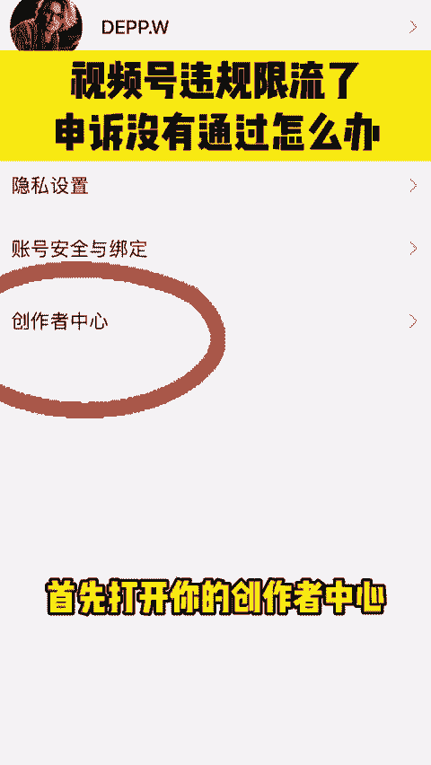
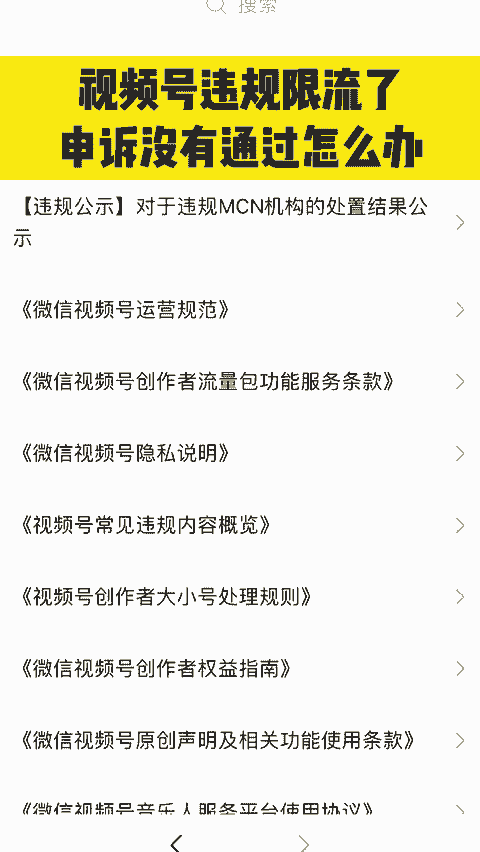
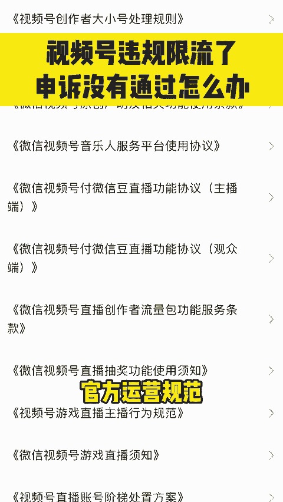
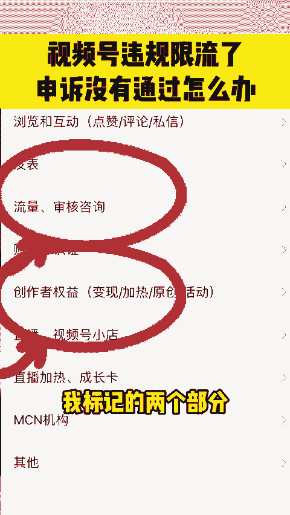
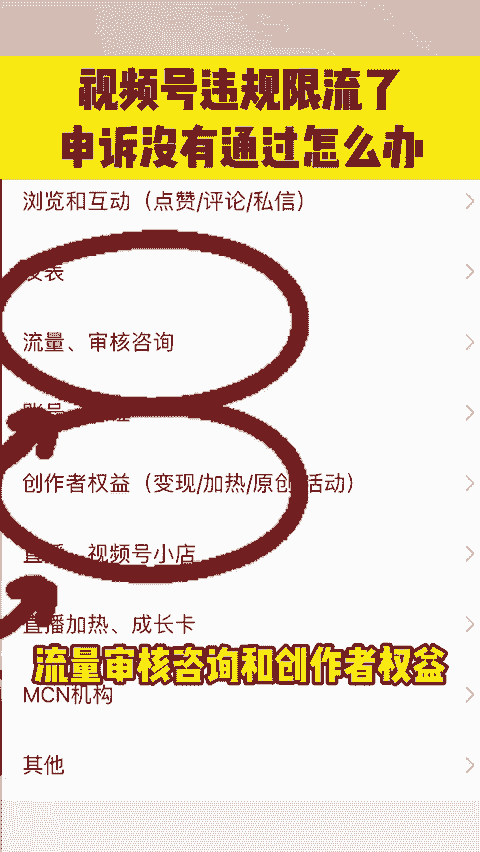

# 视频号违规了怎么办？三步教你彻底解决 - P1 - 创业青年小杨总 - BV1YmiMe8EbZ

🎼视频号违规限流了，申诉没有通过，或者错过了申诉时间，你不要绝望你的账号还有挽救的机会。今天呢我来详细分享给你一些实用的解救方法。🎼先点赞分享到朋友圈，别以后找不到了。首先打开你的创作者中心。

拉到最下边，找到帮助与反馈，然后你点进去，找到平台规则，再点一下，仔细阅读这个视频号的官方运营规范。根据规范调整你的账号内容。违规就把内容删掉，头像或者签名违规就赶紧换掉。

确保你账号没有明显违规问题之后，发布十条的原创视频，让平台看到你整改的决心和态度。接下来很关键，注意听好了，按照我的建议进行申诉，99%，让你申诉成功。首先打开创作者中心划到最下边有一个问题咨询。

重点来了，我标记的两个部分都需要进行反馈和申诉，流量审核咨询和创。

🎼作者权益这两个都要提交申诉，因为你单独提交一个反馈啊，是很难有回复的。你在申诉的时候呢，千万不要随便写两句话，就直接提交你一定要明确的告诉平台，你是因为什么原因被限流了，自己目前做了什么样的整改。

申请恢复什么权限。如果你是被限流了，那就去申请恢复流量的权限。如果你不能加热就去申请恢复加热权限。如果说你的原创不过关，那就去申请恢复原创功能，同时你附上三张相关截图，一张是拍摄现场的照片。

证明你内容的原创性，一张是视频编辑文件的截图，证明你的内容是你自己剪辑的，最后一张是账号后台新发布的10条高质量原创内容的截图，证明你已经完成了整改。我社群的会员呢，按照我这个流程啊，整改和申诉？

🎼基本上把号都救回来了。我有一份视频号的旗号指南，我们团队用它轻松实现单条视频一天涨粉1万多，播放量突破100万。2024年，如果你想入局视频号，评论区告诉我你的想法，你的行业，今天我分享给你。

