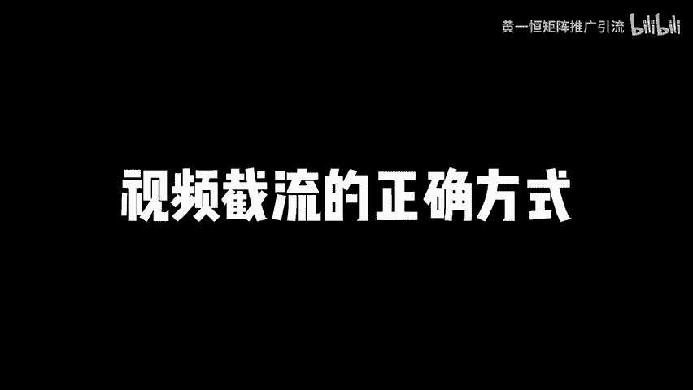
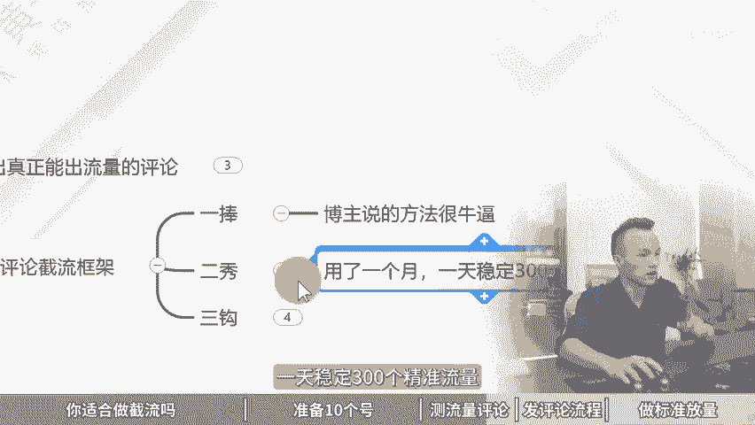

# 视频截流的正确方式，做截流获客的4大步骤！ 同行截流玩法，截流是什么意思，短视频截流软件，截流获客工具，截流获客软件，获客截流系统，怎么引流截流，线上引流截流！ - P1 - 黄一恒矩阵推广引流 - BV1SW421X7rC

🎼一天可以打300到500粉的偏灰色的视频截流引流方法。一个学员给我分享了他的私意流方法。听完后我就感叹失意流原来可以这么晚，接下来我就跟大家分享一下他的玩法到底是怎么做的。季节废话。

一个视频给你分享视频截流的正确方式，做截流获客的四大步骤，视频有点长，记得先收藏，一起来看，我给你分享什么人适合做截流，如何准备10个号，如何测流量评论，发评论流程是什么？怎样做标准放量。

先来看你适合做截流吗。很多伙伴连截流都没搞清楚是什么，直接就开干，干了一个月放弃了，白干了。记住截流，它是通过人力堆出来的，需要每天花大量时间进行操作，它纯粹就是一个搬砖活。如果你经常看我的视频。

看评论区，你就会发现有很多伙伴就在搞截流。他们呢也是非常勤快。只要涉及到什么账号注册的，就到下面。

评论卖自己流量卡，什么养号还得一级一卡。再比如说做什么黄金项链的。首先需要准备数人号，这个怎么买？贴上图片，贴了图片之后还需要用小号去进行一个互动，告诉你，收什么里面有的，这些都是需要人效来买。

每天花大量时间重复的进行操作。那截你有什么优势呢来看一下。首先他适合于所有团队，只要有人就给操作，而且门感非常低。毕竟我们只要会发评论就可以搞节流，没什么技术含量，主要是依靠人效来稳定。

相当于我们需要有很多人去操作，每天花大量时间。如果你想非常简单非常轻松的去搞那这个节流呢显然就不太适合你，那节里有的伙伴也也是误解的。比如说大部分人都是基幕糊的概念操作，真正理解任何的人却非常少。

有的伙伴来担心节流方号严重，迟迟没有开干。很的伙伴呀一直想花钱买所有的黑科技，结果买了钱被人割韭菜，发现方号更严重，平均搞10个流量就放一个账号搞。账号呀都搞的什么？可以说是头大。

那节流的核心到底是什么？总结就三个字叫做拟人化，千万不要去研究什么啊。那么在IP下面发多少条评论能显示私信的上限是多少，评论的极限又是多少，这些都没有意义。重点就在于什么？拟人化。

那拟人化呢就要像真人一样的进行操作。如果你像真人一样操作，那你的评论就给发很多。如果你不像这人操作踩到红线，就会导致你的账号，比如说被禁言啊，被关闭这个功能，严重者来账号直接挂掉了。

那做截流到底能赚多少钱呢？来看一下，很多伙伴可能刷了一些视频，发现说啊搞截流的一个好的截流手一天能至少截50个流量。多的呢能够节到啊100个，那一个流量，比如说咱们卖个啊100块钱，或者卖个50块钱。

卖个30块钱，那一天也能够小有几千块的利润。这种呢其实理想情况，但是现实对于很多新手伙伴来说，去搞节流，你会发现，现实情况就是一般呀正常节流下来也就是20到30个流量，一般很难超过100个以上。

除非你的一条评论报了啊，当天能够加到七八十号人，那一个流量大概20块钱。比如说以14月份比例。那么也就是20左右，一天净利润600块钱。那这个呢其实也是比较不错的。如果咱们搞团队操作啊。

那你的利润最多一天也就差不多是啊300到10来块钱。那这样做呢就没太太多意义了啊。因为这个员工他一天干十几个小时，而且这个1几小时的工作量是非常大的。所以呢他很难去经营说啊大规模的放大。

让员工来帮你搞这个节流去赚钱，他会的话，他基本上自己就干了啊。那既己如果做。首先第一步我们需要准备10个账号。那么10个账号呢，我们需要遵循一的前提就是EG以和一网络，那么不多开，防止设备关联。

也不连wifi，防止IP关联。啊，这个是很重要的。另外一G以后的话，这个号呢，它是给多平台的。比如说我们搞个5个平台，每个平台搞个账号，那这种是可以的。但是如果你去多开。然后多开的话。

每个平台搞3到5个账号就容易关联。然后还需要准备10张手机卡。那手机卡这一块可以是死卡实卡的话，一般我们都是去办这个听卡，或者在网上搞这个儿童手表卡，也就是18151319号段的。

大家在买卡的时候可以问一下卖家，避免买错了啊。另外实卡这一块呢都是有这个实名限制的，一般30天最多使名一张卡，它是没办法说短时间内搞很多卡。除非是有些平台，比如说你搞这个呃平台小红书啊。

它这个虚拟号段也能注册，那我们直接使用这个1716的号段注册就可以了。这种的话，大家可以去买这个灵业注册册卡，成本也就5块钱一张，你买个20张卡，那也就是什么接近100块钱左右。

而且一个人的话也能够使名20个卡是没什么问题的。然后呢还需要准备10台手机，那手机的话像我们用的比较多的是这个红米的9或者pro，那么价格在。400到500之间配置的话是6加64G配置。购买渠道。

如果你有经验，可以到闲鱼上面去讨，价格便宜些。如果没有经验，怕翻车，可以通过某东某搞内台来贵30到50。但是有售后啊，有问题，直接找卖家，卖家帮你解决。然后我们还需要配得上流量卡，流量卡的话。

如果你买的听卡自带流量，一个月5G1G20G够用了，那就不需要了。如果你买的没有这个流量，那怎么办？你就需要单独配这个流量卡。流量卡呢，目前我们用的是这个物联网卡，物联网卡，它的价格啊，主要是比较便宜。

啊，基本上是69块钱，不是一个月，能用24个月，每个月呢有40G流量，所以套餐价格呢还是比较实惠划算的。大家可以找一下，实在找不到的也可以来找我。我把我的这些渠道分享给你，帮你节点时间呢？

也是什么比较不错的。好，接下来咱们可以操作哪些平台做节流啊，其实我们可以并不是说啊只搞一个平台。其实很多平台都有我们的客户，所要有客户就可以搞扩大一下覆盖面，什么抖音、快手、视频号，小红书B站西瓜。

那如果你打其他平台的粉，比如说一个伙伴做什么啊墨客呀或者交友粉啊，或者说是相亲们这些那其他的一些平台也可以去搞的。好。第一步第二步呢，我们需要去测流量评论，流量评论呢真的非常重要。

要测试出真正能够出流量评论，否则你发这些评论啊很多都是没用的。而且这个流量评论一定要老板亲自下场去测试，不要去依赖应营人员，因为你要知道，如果这个应营人员，他自己能测试，他为什么还给你打工记住。

能当老板，就是因为有些东西啊，你能做他不能做。如果他都能做的话，那他就是老板，你就是给他打工的了。这个咱们得搞清楚。那这里面有一个流畅的评论框架给大家参考一下，就是一沟二秀三沟啊，这个呢非常重要。

那一捧怎么捧呗？就是我们要捧一下博主博主说的方法很流畅，很厉害啊，这第第二个秀秀的话就是你要晒一下自己结果用了一个月，一天稳定300个精准流量。好，这第二个第三个怎么勾呢？

我现在做了一套SOP整个团队小伙伴都在复制套SOP一天能够有七八十个。这套SOP啊，你可以觉得这己行业修改。

好，这就是个模板。所以大家可以套一下一旁二秀三沟，每个行业都可以用，它是一个万能的流叉框架模板直接套用就可以了。好，接下来看第三步发评论的一个流程。首先我们在发评论的时候啊，有一个顺序。

这个顺序呢很多伙伴容易搞反。我们每条视频啊都是第一个先玩播玩播是什么？就是先浏览观看观看完之后，我们点赞点赞之后我们再评论评论完之后再转发收藏。就是我们要给这个up主贡献一些数据，赞贡献的话。

你自己去发这些就不容易被删除。结果一看一个铁粉在下天评论，那肯定是支持的。如果一个连关注的都没有，还是打广告，很多人看到他就直接给你秒了，这个点需要注意。另外呢每个评论内容是不能一样的啊。

我们要重新打是什么意思。比如说虽然我现在表达的是一个东西，但是我发出去的时候，我可以重新打一遍，啊，改几个字或者用语音输入，语音输法，你重新表达一下，多多少少会有几个字不太一样。那这几个字不太一样的话。

就可以。别为新的评论，那成功率就会比较高，避免发一条重复的评论。记住单击单号一天的评论量呢尽量不要超过10个，最多最多不要超过20个，超过20个就很容易导致你的这个评论量直接被。啊，被沉下去了。

直接就不显示被隐藏掉。所以这块呢不要谈量这一个咱们在做的时候啊，是非常重要的一个细节。那最后一步呢就第四步，我们需要做标准放量。什么意思？相当于我们需要把这个流程标准化，然后让团队去复制啊。

所以把流程标准化，让其他人复制打造更多的这个简流手通过团队人员来来进行放大，比如说依靠人效来稳定，你可以招几个实习生，他们来的时候，每天把你的流量模板把你的评论模板拿过去发就可以了啊，什么时候发一条啊。

把这流程告诉他，让他来做就可以了，将人效拿满。另外呢其实在行业里面还有一个比较主流的玩法，叫做兼职放量。那什么叫兼职放量，就直接上兼职，去找这些线上的兼职，让兼职来帮你打一条评论3块钱。

产生一个有效的线索那么再给一块的奖金，相当于用别人的账号这种方式呢是全国的IP啊，根本就不用担心说什么账号呀，或者什么上限率或者限流的情况发生，假设你有500个。给你罚，那这就不得了了。

那一人一天发10条，相当于5000个口子。那么一个口子3到5条线索，一天下来2万个线索，成本呢非常非常低。关键是啊这里面有个好处，账号呢不是你的，他也没有风险。IP呢也不会说被污染之类的来算一下成本。

那5000条评论对我们来说一条评论3块钱，我们需要支付15000块钱，然后线索一块的奖金，2万个线索，2万块钱，合计加起来，我们需要付出35000块钱的一个成本。但是我们能产出2万条线索，凭借一个线索。

接近成本什么75元。各位伙伴7。5块，你搞一个线索，搞一个名单，搞一个客户哪里能搞到这个已经是成本什么非常非常低了。好，各伙伴，我是黄一恒只做落地推广方法，刚才我们学习的节流打法。

如果我们想扩展更多流量渠道，这时候咱们得学会布局多流量平台，那怎么做呢？这里面我给大家准备的18个平台的流量打法，教大家如何。不及多流量管道这些呢都是我原创的，可以通过主页来连接进行学习。

如果觉得这个视频比较不错的，请大家一键三连。感谢大家支持，咱们下个视频呢再会。😊。