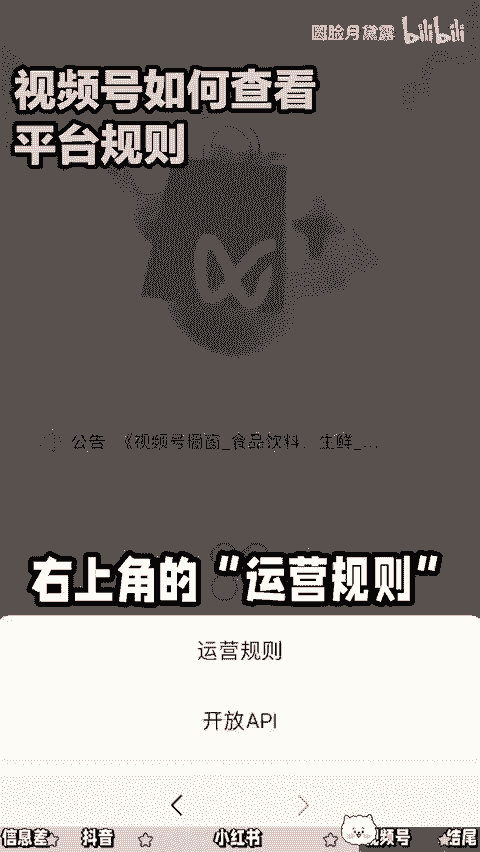
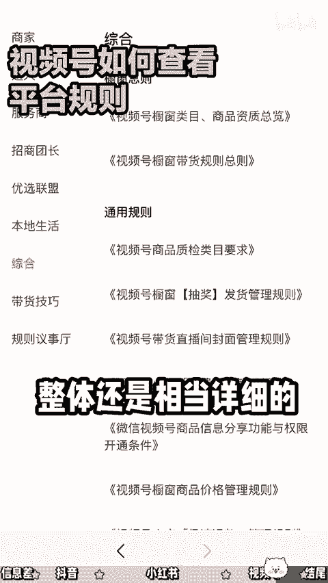

# 触犯平台规则会封号，那规则在哪里看？ - P1 - 圆脸月黛露 - BV1ZE421P7q6

🎼触犯平台规则可能会被限流禁人封号。那平台具体的规则在哪里可以看呢？这是很多新手都会遇到的问题。那作为一个9年经验的新媒体运营，今天手把手的教你抖音的话其实可以网页搜索巨量学最上方搜索你想要看的内容。

比如说内容规范相关的课程通知产品呃，都会有相关的介绍。如果你想具体到某个行业。比如说医疗也可以直接搜索相关的一些资质审核规范、行业须知内容常见的问题等等，都会有详细的解答。

而且都是免费的那小红书的话可以在我创作中心、创作服务规则中心，最上方的这个社区公约也是最基础的版本。带大家可以简单浏览一下啊。那平台其实是鼓励真实原创、反对炫耀，没有科学认证，过度浮夸。

冒充他人煽动性的等等这些内容，以及社区公约的一些官方的解读优质作者的访谈审核规则的解读等等。这些呢你也可以花时间看看。那针对笔记引流。

🎼的问题我会建议大家直接去看小红书种草学官网上关于聚光投放的一些规则讲解，或者联系销售客服来聊聊。基本上你就知道你这个行业的红线以及问题在哪，是资质问题还是内容质量还是应有问题。那视频号的话。

其实可以在创作者中心这里点击带货中心。然后进入视频号带货官网右上角的这个运营规则，就可以看到不同局限下的具体规则，包括商家、达人、服务商、团长优选联盟本地生活等等。那整体还是相当详细的。

除了我们上面提到的这些当你的作品收到后台的违约通知，基本上也会标注具体的违约原因，我们也可以针对性的进行申诉或者调整自己的内容。学会了就去简单试一下吧。前坤为定义我件是黑马蚁的点赞是我不脱别的动力。

我们下期再见。

