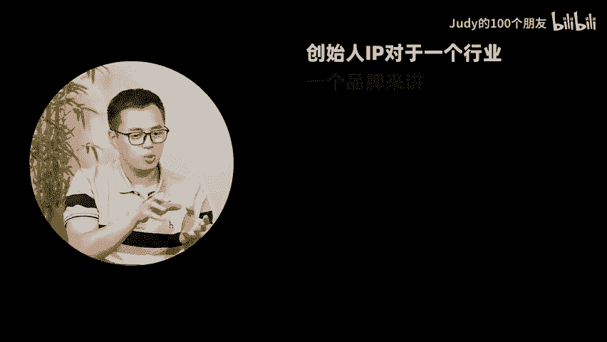
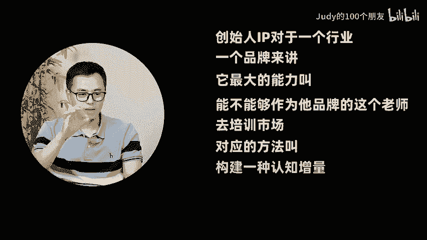
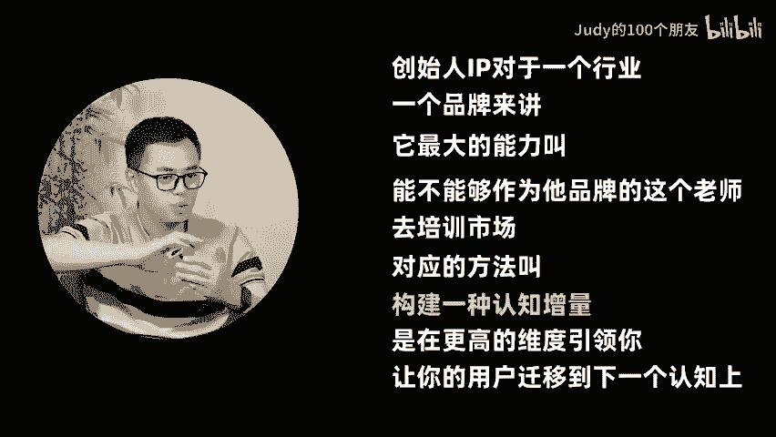
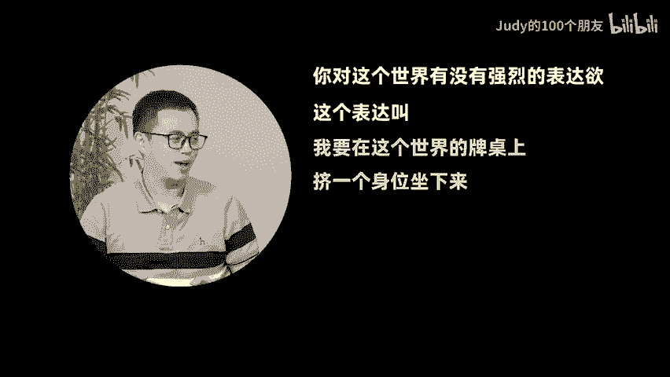

# 谁说中老年人才玩视频号？9个亿月活的背后，还潜藏着哪些商机？ - P1 - Judy的100个朋友 - BV16QxCe7EHS

🎼视频号的月货已经9个亿了，抖音是卖货，小红书是种草的，视频号是专门给我的老板看还会有哪些潜在的细分品类，你看到是有机会的？人的生意远大于货的生意。第一，它消费能力会更强。第二。

它会更关注这个产品的内涵。那对普通人的冲击和挑战为什么？今天市场上给IP的一个定义叫它是用来获流量呢，说流量是一切生意的根本。呸价值才是一切生意的根本。大家说我们应该向流量下跪，贵什么贵。😊。

🎼hello大家好，今天呢请到我的朋友润宇，他是一个视频号的商业大V。那么这期会聊一聊，大家很感兴趣的视频号未来还有机会吗？我叫王润宇ID叫润宇创业笔记。因你们有一直在做视频号这个领域的一些生根。

因为我看到上个月有个报道显示视频号的月活已经9个亿，得还是蛮夸张的。我们跟品牌圈子里CM圈子里的一个交流，你知道他们会怎么定义吗？抖音是卖货小红书是种草的视频号是干嘛？

视频号是专门给我的老板和给我的PR的同事看其实从去年开始，大家就说流量没有红利了，到底哪里还是下一个流量的洼地，这不是视频号，今年会有很多的一些新的机会。三年前吹这个话呢肯定没毛病。

因为当时其实抖音的整个日活跃应该已经到达了7亿左右，但是呢微信的日活跃应该在10亿到11亿，他这个中间你减一减就会有3亿左右的这3亿人，他再用微信。

但是他没有去看短视频和直播理论上虽然他是社会的存量用户，但是他很有可能是整个。😊，🎼短视频和直播市场的增量用户。所以这就是我们说为什么它是最后的洼地的原因。今天我们每个人打开手机。

你会发现我们身边的用户，我们完全不知道微信有视频号这件事情的人几乎没有。其很多今电商人来到视频视频这边起量还容易起，但好像卖着卖着卖着它的品特别容易过气，为什么容易过气，你很容易碰到这个品类的天花板的。

所以在视频号里要做LTV也就是用户生命周期的价值，你不能拿一个爆品拼命薅视频号虽然看的人多，但是里面形成消费习惯的用户，他还在增长的过程中，还需要你培育他，的就是不是还是那个信任厚度的问题。

就是有一些行业在这里面就会特别不错。比如说整个教培的类目，在视频号里跑的是特别好小孩子上课成年人上课教你职场甚至教你个人IP视频直播。那么还有给老年人上课，但凡知识密集型的电商。

比如说珠宝玉石滋补类目在里面跑的也是不错。所以当你越来越多深度进去看视频号的时候，你会发现视频号到了。😊，🎼今天它的红利倒不是说一个叫普涨普跌大开大合的这种洼地的概念，而是说整个渗透率平台官方在帮你打。

你刚刚给我们解读了很多未来的一些趋势嘛。一个是现在是一个很好的商家类去进入视频号的一个时间节点。因为商家他有自己的业务嘛，他自己产品和服务。第二呢，在所有的商家里面特别是重一些跟客户服务类的。

它跟你的交易关系不是就单纯的发生之后就结束了，而需要思域去大量的维护，才能够开展的，然后不断升单的这一类产品就特别适合视频号视频号现在大家都去说他到底跟别的平台有什么区别，几乎天天有人问概问。

反而防止你问我先答了视频号里面的生意是强烈的围绕着人进行，它叫人的生意远大于货的生意。其实视频号本身他在微信生态它的底层逻辑呢是一个架在熟人社交关系网络上的东西。他有公众号这样的兄弟。

有朋友圈这样的兄弟，对吧？只不过有人是思域有人是公寓。短视频和直播加进来之后，只是加快了信息的流动，从而加大了。😊，🎼人设的建立，我们仔细去琢磨一下，我们会把什么东西发到朋友圈去。

就能够代表自己的价值主张的很认同的东西。我再把它归纳的简单一点，你认为高于你的东西是你向往你追求的，就他一定是抬头看的目标，我们都希望去扮演一个更好的自己。记住扮演扮演人就是这样的。

我不是把我的欲望拿到桌面上，是把我的梦想拿到桌面上然后去分享。那么一旦是这样的一个逻辑以后呢，你会发现视频号里大部分能传播的人设都是抬头看的人设。你看好老妇视频号里特别火，他就特别能带货。

当然你在某一个地方的好专家，你能解决我的问题也是可以。旦你仰望的人设建立起来以后，用户就特别容易跟你产生深度的信任，就在小红书里大家认的是我这个人的品味。但是在视频号里。

大家认的是我这个人的人品这是我感觉很深刻的。前两年大家对视频号的一些印象，还是说可能很多品德卖给中老年人呢，还是知识付费这块的虚拟产品呢在视频号成交的特别好。那这一两年会有所变化嘛。

对于一些新的小要入局视频号的人来说，还会有。😊，🎼一些潜在的细分品类，一看到是有机会的，不要去误会他是一个中老年平台。随着渗透率越来越深了。到了明年后年，大家一定会发现他的用户会逐步下移。

比如说在今年基本你看他的消费数据已经从老年移到了姐姐，中年女性，家庭里面有娃有老公家庭的消费中枢。第一他消费能力会更强。第二，他会更关注这个产品的内涵内容的内涵也好，品牌故事的内涵也好。

情绪价值的内涵也好，当这些东西拼在一起，你会发现在去年到今年，他的品类里面有几类很有意思，他就会长得很快。像香云纱呀、沉香呀满面群啊，在上面就会增长的很快。样大家会流行一个词叫创始IP嘛。

比如说像新中式的服饰也好，还是一些沉乡现象这种疗愈类的品牌也好，那往往都是由一个IP在前面引流。然后在后端在成交产品的。但这一两年各种企业家IP下场。他们带着高的信任，高的背书的雷军啊，周弘祎啊。

那对普通人的冲击和挑战会什。我觉得IP一旦下场。😊，🎼它本质上倒不是在存量中做争夺。今天市场上给IP的一个定义叫它是用来获流量，流量是什么？流量就是这个认知增量。创始人IP对于一个行业。

或者对于一个品牌来讲，它最大的能力叫能不能够作为他品牌的这个老师去培训他的市场，然后他培训的方法叫构建一种认知增量。它其实是更高一个维度，在引领你就是让你的用户迁移到下一个认知上。

有点像当时那个江南春说的抢占了用户的一些心智，而且是一种新的心知，它是用新的替旧。因为用户在认知上有一个天性，就你我也都一样，天性这样喜新厌旧。哪怕你今天做的不是教培，营销的本质就是教培。

就是我把一个概念塞到你的脑子里，只不过教培交付的就是这个然后营销交付的是塞完以后我要给你有一个产品，他有个产品要交付嘛，卖车就是我先告诉你你得有个移动在家。其实所有关于新主张新概念增量理念的营销。

它都是这么来的。我们最后收回到那个。朱迪问我。

🎼创始人IP是干嘛呢？创始IP就那个老师，或者你说的再极致一点，他就是那个教主。所以我感觉很多老板做创始人的IP的思路完全的错，老板也好，品牌也好，他得占据到用户认知的制高点。

就那个点是网红代替不你平投放代替不了你的你要去那个点扎个根立把旗跟大家说，我为什么是我是不一样的烟火啪把那个烟火放了。然后大家抬头看烟火，那个注意力就是你的流量，把那个高点占了，然后你往下跑的时候。

自然这个注意力能转换成流量，也许大也许小，但是这事已经不是最重要了。以我说老板做创始IP的目的不是去卖货。但是最终你的结果一定能把货卖了，是这个逻辑。

要不然你作为一个老板应该天天在直播间里21商链接你跟你的员工抢工作，你的员工去干什么呢？没事干了呀这很精彩。

因过去这一年似乎成了很多老板的心病觉得我做不起来这个IP公司完蛋把创始IP或者把自己做内容这件事情当做拯救公司唯一的稻草。我觉质上老板的这种焦虑都。😊，🎼市场卷大部分能做成公司的。

通常不是因为你的专业技能有多强，而是因为你在专业领域里面，你的主张是人群当中最坚定。因为你坚定，你能看的最远，你能承受住中间路程当中的艰险，所以你做成了唐僧，所以你才能招来孙悟空孙悟空其实比你能干。

所以你才能到猪八戒猪八戒其实比你滑头，所以你才能招来沙僧沙僧比你忠诚，但是最后他们的老板是你是唐僧，因为你看到了远方嘛，其实在以前我们没有流量这件事情的时候，创业的基本法就是这样子，谁坚定谁是。

谁看得远谁是谁有信仰谁是赢，但为什么到了流量上变成谁胸口碎大石，谁是演，我特别特别反对，在前面可能在几年当中。当然，有一些是抖音的博主再提，说流量是一切生意的根本。

呸价值才是一切生意的根本价值再往下叫你对未来的定义才是一切生意的根本。大家说我们应该像流量下跪贵什么贵，最后流量一定会流向对社会有价值的资产和人。你刚刚说那一段很像是创业者的使命。🎼它的初心是什么？

应该是使命感内容化内容才是创始人IP该做的内容的核心和基石。对这个东西才是具有感召力的。我今天早上好像也是听了你的播客，我觉得讲的特别好，说创业者天生就是个表达者，我特别赞同我创业15年。

如果我们没有对这个世界表态的欲望，你是不会去创业的。那其实你可以测试自己，你对这个世界有没有强烈的表达欲。这个表达叫我要在这个世界的牌桌上几个升位坐下来，管你们喜不喜欢我。我觉得这可能是创业的原点。😊。

