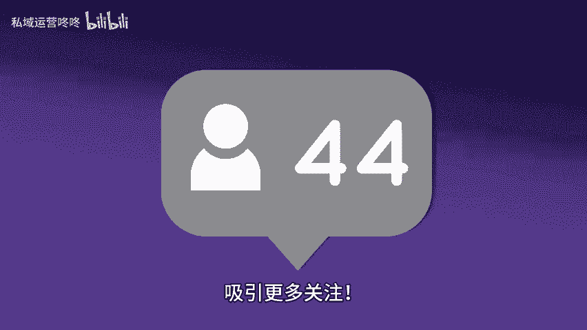

# 账号权重低？掌握这些方法，提升权重！ - P1 - 私域运营咚咚 - BV1vPWFeCEdT

🎼账号权重低，是不是让你很苦恼？没关系，今天我来分享一些简单有效的方法，帮助你提升账号权重，以保证内容质量。内容是王道，确保发布的每一篇文章都高质量有价值，能够吸引用户的注意力。2、各项数据好。

注意跟踪你的各项数据指标。例如点赞评论转发量等，互动率越高，账号权重自然就会随之提升，积极与粉丝互动，增加内容的曝光度。3、定期更新，保持活跃，是提升权重的关键。制定一个内容更新计划。

确保定期发布新的内容，保持粉丝对你的关注度和期待感。4、标签与关键词选择精准的标签和关键词，让更多的用户能找到你的内容，合理使用热门标签，可以提高你内容的曝光率，吸引更多关注，只要坚持以上4点。

你的账号权重一定会逐步提升，让你的内容被更多人看到。😊。

