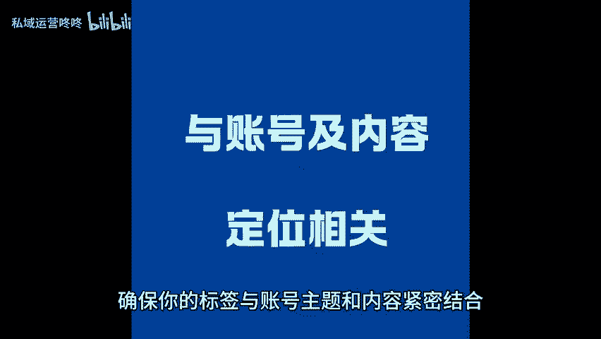
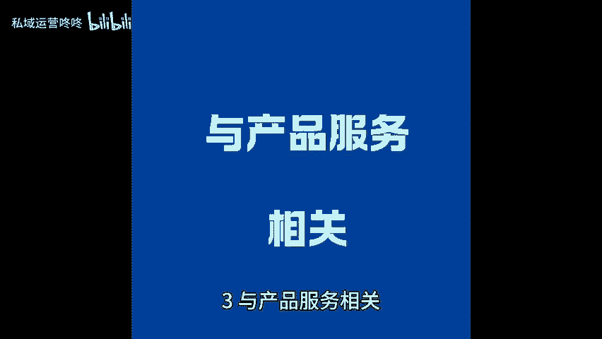

# 账号标签这样打，精准流量飙升！ - P1 - 私域运营咚咚 - BV1NsYveJEKW

🎼小伙伴们今天来聊聊如何，给你的账号打上精准的标签，让流量轻松标升。一、与账号及内容定位相关，确保你的标签与账号主题和内容紧密结合，这样才能吸引到对你内容感兴趣的用户。比如，如果你的账号是关于护肤的。

可以使用护肤心得、美容小技巧等标签，让目标用户一眼认出你的定位。2、与目标用户需求相关。考虑目标用户的需求与痛点，使用他们长搜索的关键词作为标签，这样能提高用户的点击率，让他们更容易找到与你相关的内容。

例如学生党护肤、上班族减压等，针对特定人群下手更精准。3、与产品服务相关。你是要进行产品服务的推广。那么标签中一定要包含他们，这样可以直接引导潜在客户了解你的产品，比如天然护肤品定制家居服务等。

帮助你获取更多精准流量，通过合理打标签。你的账号会吸引到更多精准用户，流量自然也就水涨船高了。😊。

