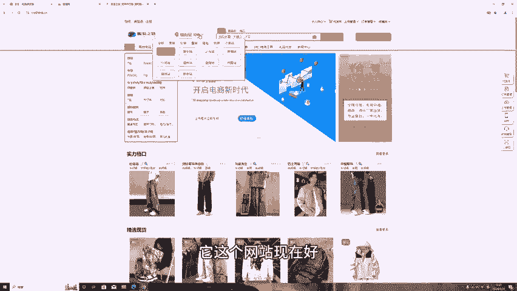
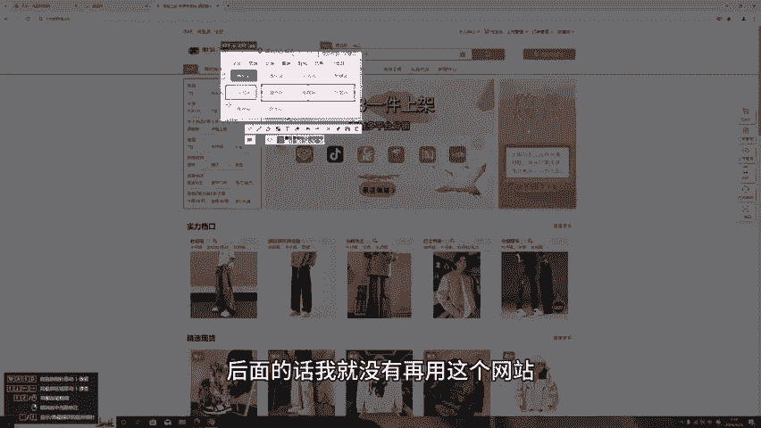
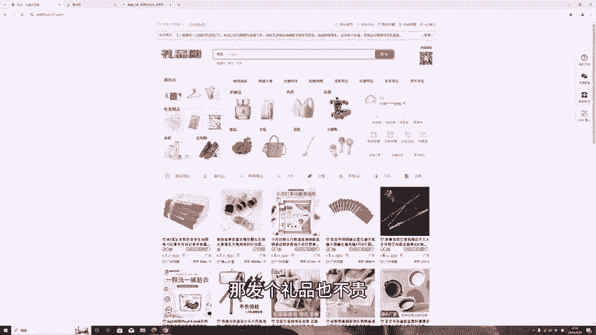

# 货源网？礼品网？到底有没有用？ - P1：studio_video_1727341802703.mp4 - 葱头创业记 - BV1rcxjeqEA1

今天晚上刚好有空就来说一下货源网站好了，然后。今天下午有个兄弟，他又给我推了一个新的货源网站。这期视频主要是针对新手新新商家或者没开过店铺，不知道哪里拿货源的，这个是叫货利列货网，网址在上方，好吧。

为什么我今天要出个视频？那就是因为他这个网站有一个特别大的一个优势，好吧。就是他这个好吧，48小时。未发货。赔付3元，他这个是学谁的？他是学抖音不是有1个48小时，没发货，就会罚3块钱嘛，超时的。

他这个学抖音的，他这个就解决了抖音的一个问题嘛。就是你抖音你是一件代发的些货发不出去，他最后超时了就扣你3块钱嘛。他这个就保证他会发货就会罚3块，赔你3块钱，但具体会不会赔，我还不知道。

我没有用过这个网站，这网站应该是后面才冒出来的。之前也没听过这个网站好。还有的优点是一件代发，它优点都写出来了。六大保障，一件代发，一件不过以图收款，一件售后48小时发货，48小时未发货，赔付3元。

最重要的是这两个，一个是一件售后和和48小时未发货，赔付33元，就这两个他有优势好了，然后他目前的话是有5个站点，一个是这个什么望江之旅，安阳九江的这是童装的这是女鞋的，我没有注册账号。

我就看不了那个价格，我就不去注册了。你们的话，你们要去了解，可以直去搜这个网站好吧，他也在上方，可以直接去搜。内衣的这个就不用看了吧，这个基本上你们没法卖的装的。他这个男装的话是1狮跟杭州的。

他这个的话就是男装可以去试一下，它货源的地方比较。材料这些比较好，像那些比那些揭阳的话会好一点点。它这个十是跟杭州的。好像是南昌的文具，不看这个网站感觉是应该是刚做出来的吧。

它也是弄成一个供应链的一个方式吧，把那些档口全部集合在一个供应链网站上。就主要的话就来说一下这个优势，它有个48小时未发货罚3块钱赔偿赔偿3块钱的，这个挺有优势的，好吧，所以就专门出出一些视频来讲一下。

因为我之前用的是这个这个网站，那这个网站现在话好像又更新了好多个站点啊，之前的话，它一共是有。

4个站点的后面又更新了这么多，我这个基本上就这个沙河赞，后面的话我就没有再用这个网站了。

因为这个就新商家嘛，新手小白没做过电商的，然后货源又不知道怎么去弄的，去这些货源网站，先去前期过渡嘛。他这个的话就没问题。但只是行那的男装好像他确实衣服的质量好一点，比这个揭阳的好一点。

这个温州的好像是卖什么的，我看一下也是卖鞋的，温州卖皮鞋的。陈海都是卖玩具的。织女站是卖童装的，因为我还像之前有一期视频专门说过了，但是我是做了女装跟男装，但我没有做的就是童装。

因为童装它的保证金要5000。现在好像我看抖音现在那个规则又变老像，那个保证金下调了是吧？童装可以去试一下，好吧？那你童装收货率起码会比女装低很多，可以去试一下女装退货率高是因为他自己穿在他自己的身上。

他自己就能很明白很明显的看出自己那里合不合身。这个童装的就穿在自己孩子身上的，不会说很很明显，或者说可能合身这样也能继续穿，没必要退款这样的，全都的战鞋的金鱼战是什么来？也是卖鞋的，好吧。

这两个网站可以去了解一下，他说好像没有什么48小时，什么赔赔偿3块钱的。我看你讲。好像没有，他这个还有淘工厂，现在。微信小店。退货无忧专区精选现货。其实我们之前做女装最烦的就是没有现货，不是。

动不动就缺货缺货，他现在还要说一个什么惊险现货，就是这个地方，此区档口围常未货款，可以有效降低缺货风险，要找他们下午两个时间点打单发货。那也挺好的，反这两个网站自己去了解一下。

现在好像支持的平台越来越多了。好吧，基本上全平台，这两个网站自己去了解一下。还有一个这个的话是一个补单刷单，或者你要发礼品啊什么之类的，或者你发货不了，先发这些礼品。

后面再补寄商品的都可以用这个网站我自己也在用，好吧，呃，我还有70多块，好吧，反正我觉得挺好的。他那个物流也挺好的，不会说什么经常会有那些物流异常啊，它有时候个别可能几十单出现一单这样的一个情况。好吧。

关键也挺好的，反正这三个网站自己去了解，一个货源网的，还有一个经常因为要补单刷单，可能会用到网站礼品网好吧，就这么多了。因为你发空包的话，其实也不太安全。哎，发个礼品，发个礼品也不贵啊，也就1块多。

也还好吧，这期视频就先到这儿。后面最近的我应该也会有更多的时间。有空的话，晚上我就会更新视频，好吧。

嗯。