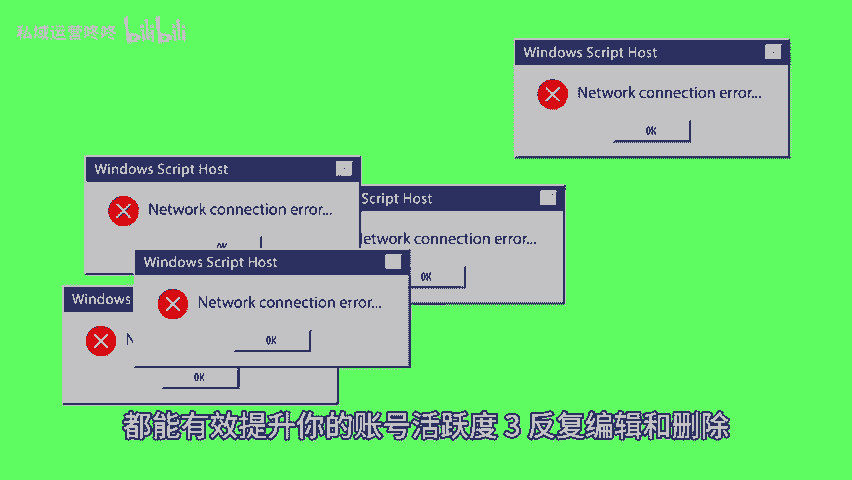

# 起号初期如何避免走弯路？这些误区你一定要知道！ - P1 - 私域运营咚咚 - BV1CMnZeLESA

🎼在起号的初期，许多人常常会陷入一些误区，导致走了不少弯路。今天我们就来聊一聊如何避免这些常见的误区，以盲目跟风。很多新手容易受到热门内容的影响，选择盲目跟风，导致难以吸引到真正的目标受众。

建议大家首先分析自己的兴趣和擅长领域，然后从中发掘可持续发展的内容方向，找到自己的优势所在，形成独特的风格，这样才能让自己的账号吸引到更多的目标用户。2、活跃度不够，在起号初期活跃度不足。

会直接影响到账号的曝光率和发展潜力。为了提高活跃度，建议大家制定一个合理的内容发布计划，确保固定的更新频率，同时多参与平台内的互动都能有效提升你的账号活跃度。3、反复编辑和删除内容一不满意就删。

这样不仅影响账号的稳定性，还很费时间，因此，不妨在发布前进行适当的检查，但也要学会放下不必过于苛责自己，你会惊喜的发现用户对于真实的渴望。4、缺乏。😊。

🎼续性在任何一个领域想要成功，都离不开持续性的努力，建议新手们设定明确的短期和长期目标，并将目标细化为具体的执行步骤，同时保持对内容创作的热情。以上就是今天的分享。

希望这些小tips能帮助到刚入圈的小伙伴们。😊。

