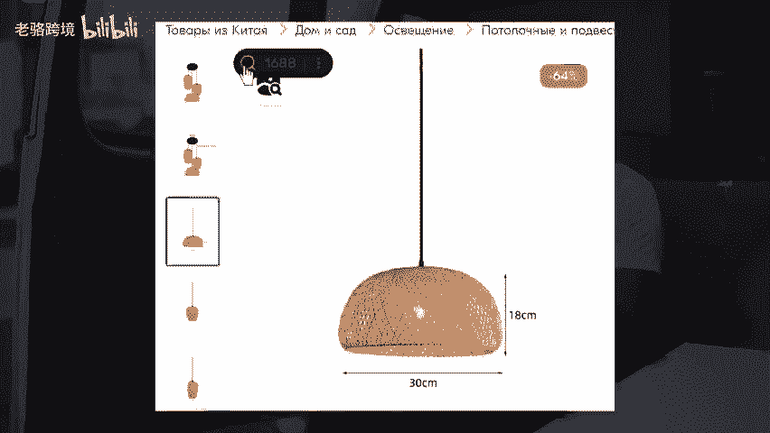

# 跨境大卖都在用的三个跨境工具 - P1 - 老骆跨境 - BV1PFsYenE8C

🎼跨境大麦都在用的三个工具。第一个跨境导航里面不仅包含了各种跨境软件、ERP工具、全品分析工具、关键词查询工具以及货源渠道等等，几乎包含了你在做跨境中所需要用到的所有工具，在这里都能找到。

第二个免费上货软件，可以将国内电商平台的商品一键搬家到你的跨境店铺里，并且还支持自动翻译功能。比如把图片中的中文翻译成外语。第三个，找货源工具，一键就可以找到货源厂家，还能进行价格对比。

精准的找到源头货源。以上我说的这些工具，你要是找不到的话，也可以回复工具，我给你安排。

