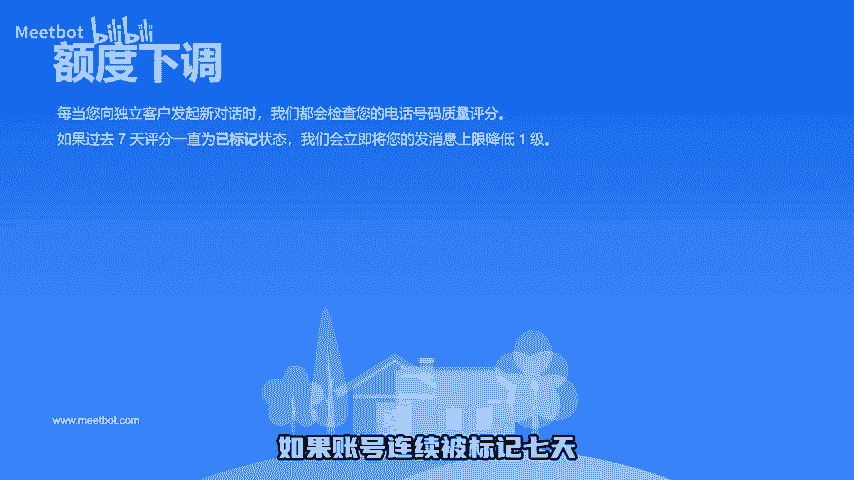
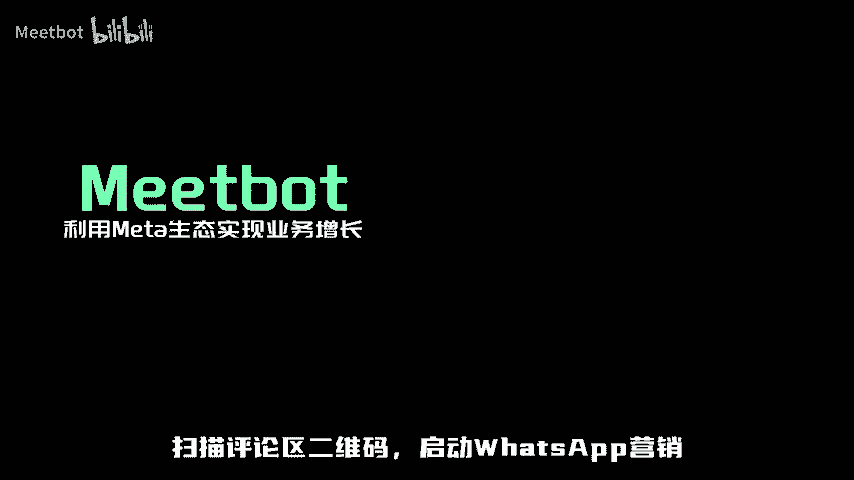

# 跨境小知识｜ WhatsApp发消息居然还有额度要求 - P1 - Meetbot - BV1njbpeaEQo

本视频将介绍whatsapp消息限额。但您了解企业账号的特别之处，消息额度是指在连续24小时内，企业账号可以主动给多少个客户发消息，共有5个级别的额度，从250到无限额不等。若完成BM企业验证。

则初始额度为1000天。若BM申请到广告时客，则初始额度为10万0天。当过去7天发送的消息数超过当前额度的一半，且账号质量为中或高，则在24小时后升级到下一个等级。如果账号连续被标记7天。

则消息额度会下降一个等级。扫描评论区二维码启动whatsapp营销。

