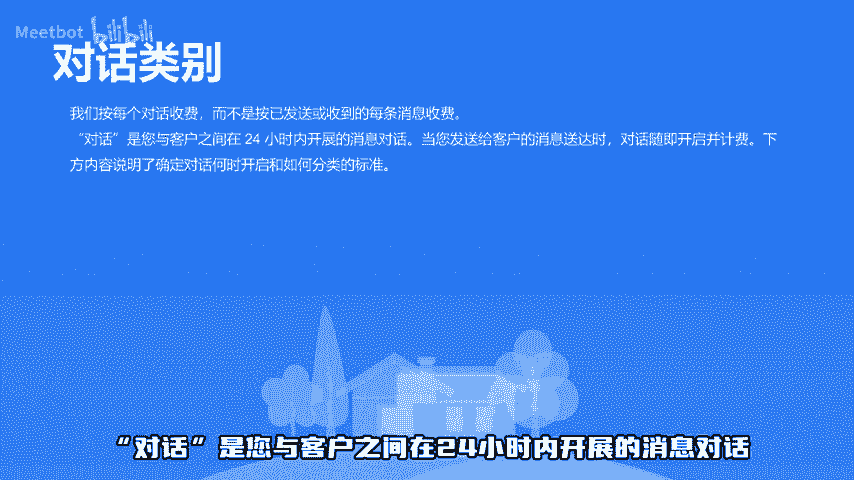

# 跨境小知识｜ WhatsApp消息收费政策 - P1 - Meetbot - BV1nEbpecEUZ

本视频将介绍whatsapp消息收费政策whatsapp办对话收费对话是您与客户之间在24小时内开展的消息对话，对话分为营销、交易相关身份验证及服务。前三种需申请模板消息。服务对话仅可使用自由格式消息。

当您向客户发送或批准的消息模板时，会检查您和客户之间是否已开启同类别模板对话。例如，在第0小时已经发过营销模板消息，则在接下来的24小时多次发送营销模板消息，不会重复收费。

基于不同国家及对话类别进行收费，请查看表格获取详细信息，需要注意的是，营销和交易相关模板即将调价，扫描评论区二维码，启动whatsapp营销。😊。

