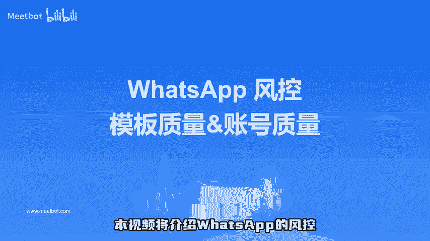

# 跨境小知识｜ 认识WhatsApp模板质量及账号质量 - P1 - Meetbot - BV1mMbse1E7B

本视频将介绍whatsapp的风控。什么是模板质量和账号质量？企业账号共有9种模板质量，按照颜色分共有4种评分颜色，在使用模板时首选绿色评分的模板，其他颜色的模板都有不同程度的风险。

企业账号共有三种账号质量，两种账号状态和模板一样，绿色的高质量表示安全，黄色、红色以及已标记，都建议暂停营销或者停止发消息，否则账号可能收到警告甚至封号，扫描评论区二维码，启动whatsapp营销。

