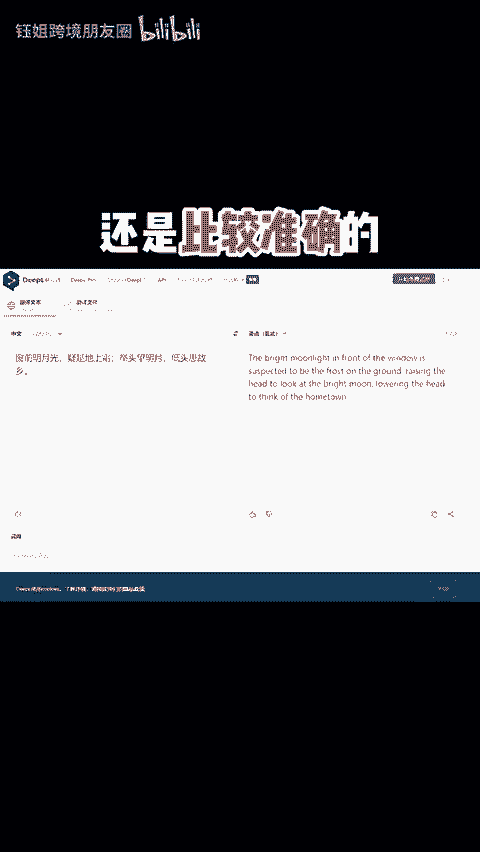
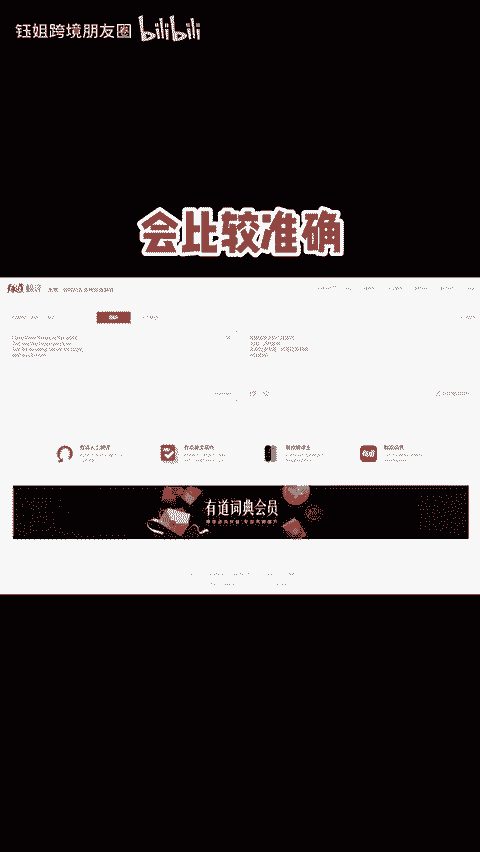
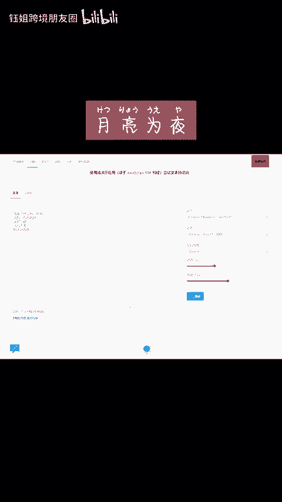
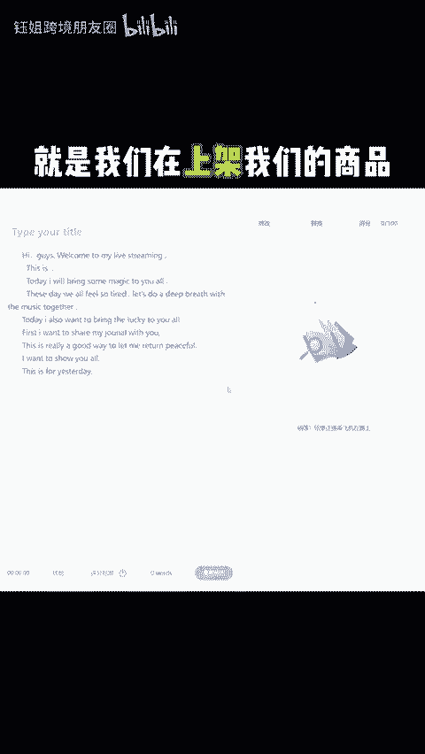

# 跨境用什么翻译工具好用？ - P1 - 钰姐跨境朋友圈 - BV1eaxseEEQt

🎼这这套婚音怎么办呢？其实我给大家已经分享过了很多的翻译软。比如说我们的我不到谷歌翻译官还有微软。那这些这么多的软件到底我该用哪个？今天给大家会下一简单收藏。

首先呢我们非常的对难它有测试文去翻译古诗还是比准确的。所以说它呢我个人的感受来说，它是一个比较自然和符合当地表达习惯的一个翻译软件。因为有道呢大多数大家会去用英语汉去查会比较准确。

那谷歌这一块呢不光是汉译音还可以实时去。因为网络去翻译成中文翻译官呢很多人去旅行的时候，喜欢拿它当成一个随时随地去查，然后包括同步给老外怎的一个工具。比如说我们在直播间的一个对话的一个使用。

也可以去尝试一下微软可以判到它的一个有声朗读，这点真的是让我印象非常的深刻。我爱世界上的三件事。太阳月亮和你太阳为晨月亮为夜。😊。

🎼和永远的你当我们编辑好一段文本的时候，可以在里面去选择不同国家的发音。在我们直播间去做无论说的时候很好，还有它的一个语法修改这个功能。就是我们在上架我们的商品去描述它的时候，它能帮我们直接去。😊。

🎼语法的错误，以上不选的题代表个人观点，不喜请倾喷。还有什么不懂的吗？欢迎在评论区我们共同讨论，肥哪个扮演这是最好用的呢？😊。

