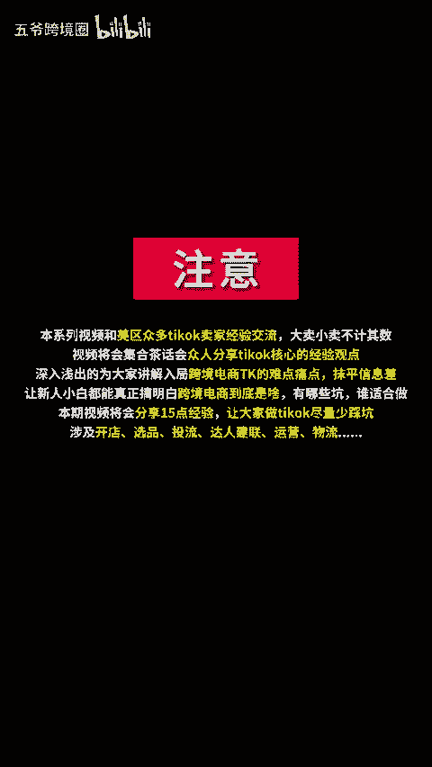

# 跨境电商Tiktok经验交流会分享（建议收藏） 让所有想做TK的卖家们少踩坑！#五爷跨境圈#TIKTOK#跨境出海#跨境电商#亚马逊跨境电商 - P1 - 五爷跨境圈 - BV1hp2AYUEVZ

。🎼之前搞了一期茶话会进行TK的讨论，然后总结了有十几点，下面用这个视频跟大家简单的分享一下。第一点，产品客单价太低了，无论是建联还是头流，都非常难很难盈利。第二点，客单价最好的就是在30到50美金。

第三点，商品卡可以出单，但是要做爆款的模式才能赚大钱。

🎼4、爆款模式意味着需要大量的视频和素材，可以自己拍，可以是大量的达人视频和文剪，头流则是从中取得最优质的视频进行投流。第五，筛选达人很重要并建联自己的达人库。第六，美区大多数的TK卖家都不赚钱。相反。

东南亚TK反而基本的都在赚钱。🎼第七，现在美区有几个大难题。🎼备货数量有点难拿捏，少了送让。🎼都没有库存可销售了，多了，库存压力又大建联是越来越难了，回复率越来越低。达人的视频质量越来越差。

现在基本建了1万个达人，回复40个，筛选20个纪样，拍视频的只有10个或者更少。第八，做举证，做达人流量号也是一种玩法，结合独立站或者做品牌宣传。🎼ってるでしょ。🎼内容电商要抛开货架电商的思维。

内容要做到有趣有料。第十，每剧的直播还是不成熟，建议先不用搞。11。🎼TK官方补贴8月份就进一步降低了，尾层配送费仍然是大头。🎼12、做TK要有额外的清库存渠道，要做好赌的心理，卖不动就清。

🎼13、一半人看好TK说TK是抖音的1。0版本。🎼抖音目前是4。0，另外一半则是继续观望的状态。14、很多人在TK做B to B的生意也是一个不错的选择。

15、目前最赚钱的还是TK的服务商或者做TK的培训。

