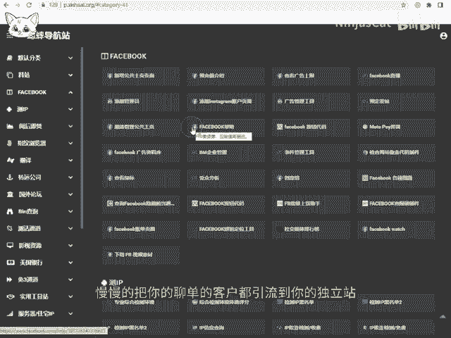
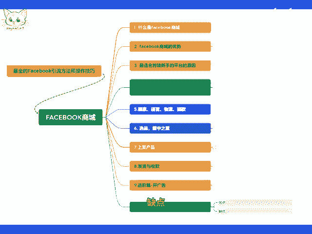
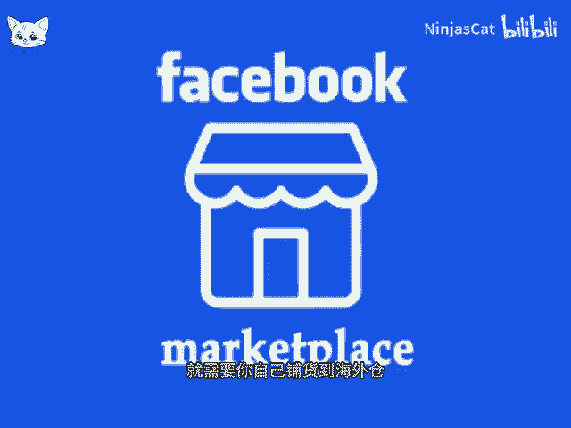
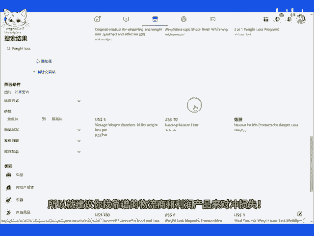

# 跨境私域电商FACEBOOK商城的具体操作十亿免费流量／10，跨境私域运营总结 - P1 - NinjasCat - BV1oDpueuEZU

。🎼10、跨境私域运营总结。首先说一下，做facebook商城，要随时准备后期有一个独立站，慢慢的把你的聊单的客户都引流到你的独立站。前期不需要独立站，没有稳定客源独立站的收款方式，有pay票和str。

如果你是卖的高仿或者保健类的，可以找第三方收单公司合作。facebook商城里的客户，特别是下单过的客户，要及时保存到你的whatsapp里，最好建个独立站承接。

因为facebook和whatsapp都会封号。说实话，我不一直不懂为什么跨境私域都能作为一个单独的培训，不就是建独立站发邮件吗？最多加个whatsapp类似于国内微商团队的管理。

但是偏偏就有人在专门做这个培训。到处割韭菜。先来说说这个平台的优点。一、启动资金少。几百块成本，就可以在FB开100家店铺疯。

🎼铺货，全球那么多国家想定位哪里卖就定位卖哪里。2、用户询单多COD货到付款模式出单很容易。3、利润高，打底三位数，我也出过四位数利润的单笔订单。4客户慢慢沉淀在私域有复购率也能在私域做营销。

这一点很重要，缺点一无法规模化，想做大就非人工，而且很多国家有时差，需要熬夜，由于门槛低，招人就会存在自立门户现象，但是有一点可以放心。如果你做的是中东货盘，对于新手来说，物流回款。

货源供应商就是该平台本身的门槛，所以请人工做聊单客服，完全不用担心自立门户这一点。2、全程英语文字交流，没有英语基础，聊单会比较慢。

🎼3、虽然走的是货到付款，也会有拒收概率和货物丢失概率造成损失。如果选择自发货，就需要你自己铺货到海外仓，首先需要备货给中转仓，中转仓会发到目标国家的海外仓，最终出单以后。

把收货地址和产品信息发给海外仓通知物流商发货，最后物流商会派送快递小哥送过上门后代收款返给物流商，最后物流商就给我结款，这就是货到付款COD模式，注意一点有点坑，就是假设你备了100件货，卖了80件。

仓库说只有5件货，提醒你早点备货，特别是成人用品，充气娃娃一类的货，这种事情是很常见的，所以就建议你找靠谱的物流商和利润产品来对冲损失。同时找一家靠谱的物流商也是很重要的。

我的建议就是从facebook商城号免费流量开始，虽然免费流量麻烦，但只要。

🎼解决了就是源源不断的流量保库。现在付费流量是有点贵，免费流量解决了测评问题。聊丹又解决了售后问题，前期虽然有点难熬，无法小规模做到年入百万，但成本低投入少，员工工资又属于可变成本。

给员工买的设备还可以三手变卖。前期你可以不招人，先自己测试呗，总成本不会超过1000。最后说一下，人不是成本是资产，等你通过一个低成本高人力的项目有了团队，你就会发现超级个体的缺陷。

现在都大集团军作战了，你还特种兵单打独斗，一个打三个又能怎么样。🎼筛选出靠谱的人，凝结一个团结的团队，把每一步都走稳，成功就如约而至。好了，关于FB商城的所有操作就讲完了。如果你售卖问题。

可以留言或者私聊我，感谢你的观看。