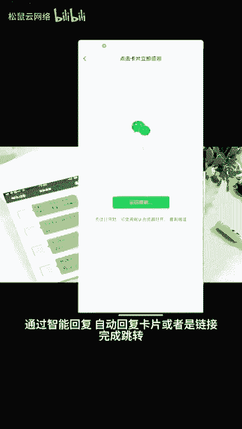
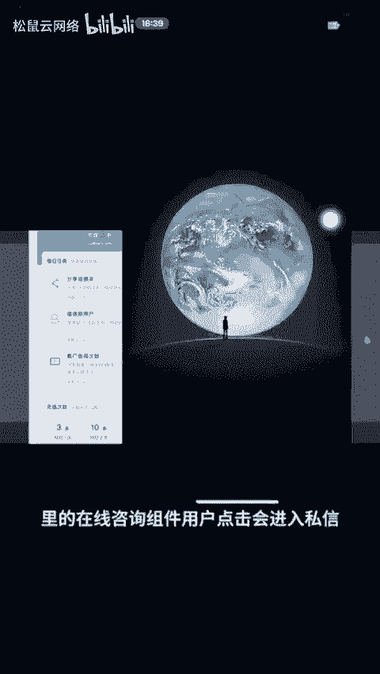
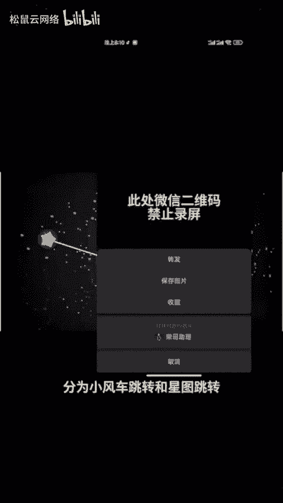
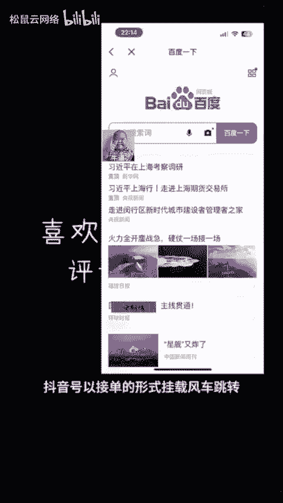
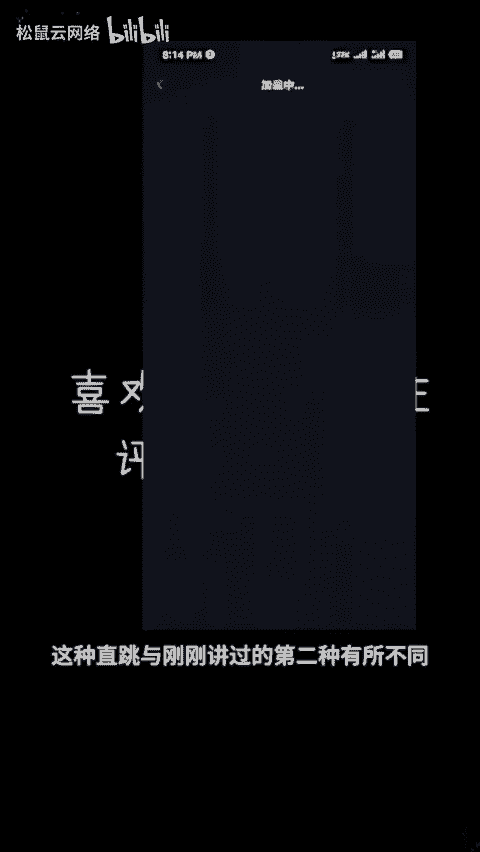
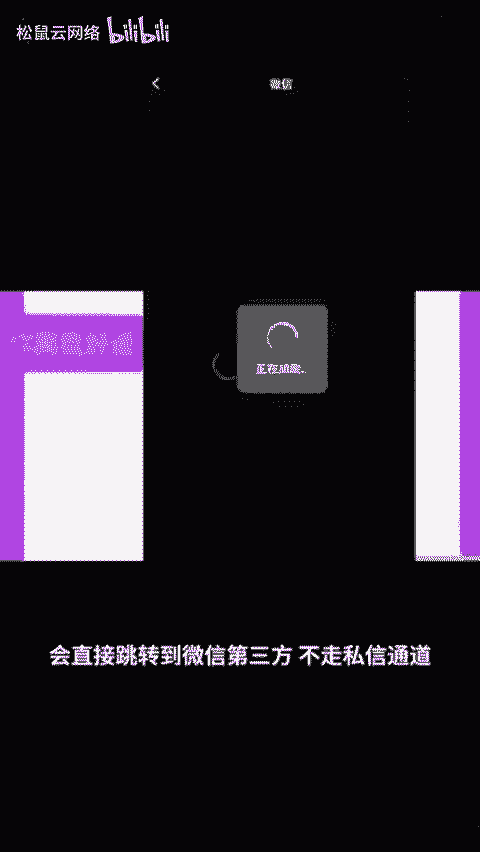
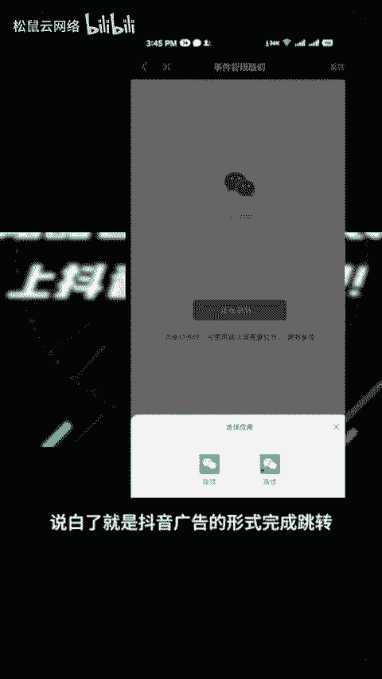

# 跳转如何搭建 有哪些方法？ - P1 - 松鼠云网络 - BV18z421B7Kk

🎼抖音如何跳转到微信，现在的大部分商家在抖音上进行获客，还是通过转到微信去完成营销闭环的。目前抖音跳转到微信的形式有很多。不过，不管哪一种形式都是需要认证抖音企业号栏V。

或者在半蓝微的状态下才可以进行操作。一共的话有7种跳转方式。第一种私信跳转，用户进入私信界面的时候，通过智能回复自动回复卡片或者是链接完成跳转。第二种，预约跳转在视频左下方。

也就是通过配置企业号的私域经营工具里的在线咨询组件用户，点击会进入私信，通过私信手动或者自动发送卡片或链接的形式完成跳转。第三种直播跳转，通过直播间进行跳转。分为小风车跳转和星图跳转。第四种群聊跳转。

通过抖音群聊进行跳转，可以在欢迎语里面设置卡片链接超链接的形式完成跳转。第五种星图跳转，通过巨量星图发布任务。抖音号以接单的形式挂在风车跳转。😊。

🎼第六种，短视频直跳也叫做高级约跳转。这种直跳与刚刚讲过的第二种有所不同。这种跳转点击视频左下角约按钮会直接跳转到微信第三方，不走私信通道，而且还可以授权员工号挂载使用。第七种，投放信息流跳转。

说白了就是抖音广告的形式完成跳转。以上的话是7种不同形式的微信跳转，里面的组合形式还可以有所不同。那么哪种跳转形式才适合您的业务引流呢。😊。

