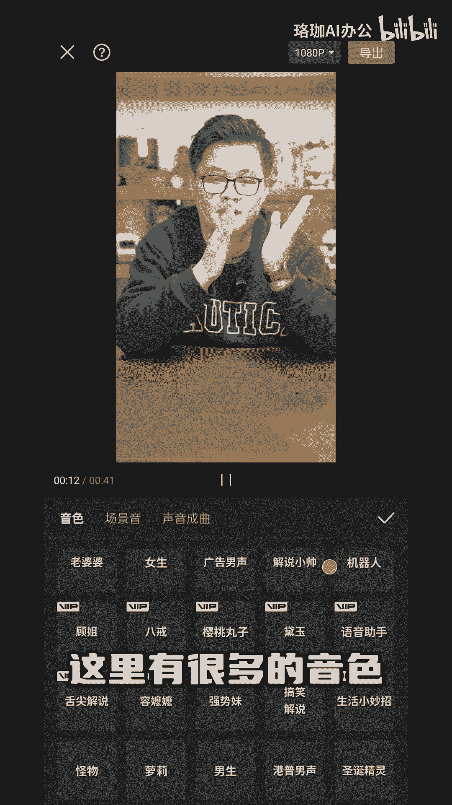
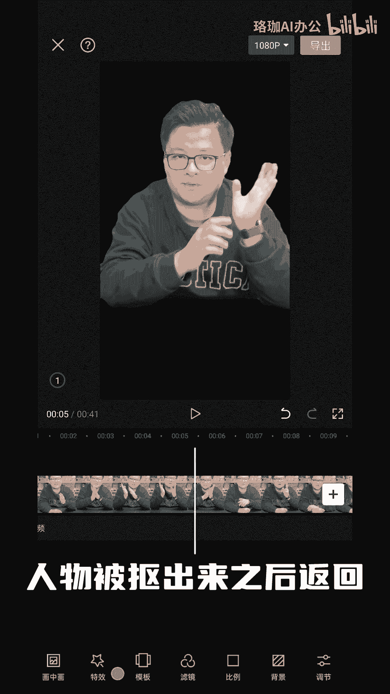
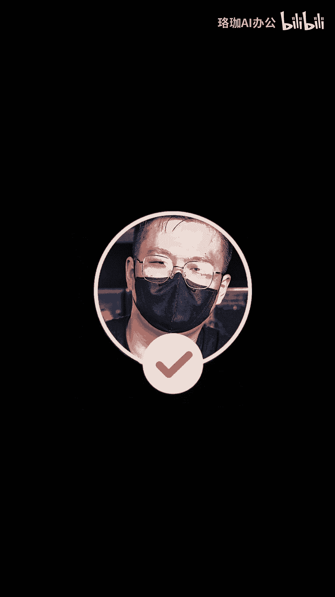

# 身份尴尬不露脸做自媒体🔥超详细教程 - P1 - 珞珈AI办公 - BV1un4y1X79y

🎼新手想做自媒体，又不想露脸，不想露声音可以吗？答案当然是可以了。既然我跟你分享不露脸也能做自媒体的超详细教程，能轻松做出像这样还有这样的效果，一分钟就能学会。第一步是换头像。

打开这个软件点击特效人物头效形象，这有很多形象可供选择，随意选择一个替换脸谱。第二步换声音选中视频条点击声音特效选择自想要的音色，这里有很多的音色可以选择。第三步换背景回到视频条点击抠图智能抠像。

人物被抠出来之后返回点击背景，这里可以选择软件里面有的背景或者相册里面的图片，这样改完可连轻妈都认不出你了。除了在视频上下功夫，我们还可以选择调整拍摄角度，不露出头部，拍摄身体中间的部分。

还就是只拍摄场景，人不出。如果你对视频拍摄简辑并不熟悉，采取图文的形式来发笔记。如果你想要尝试自媒体，就赶快集中起来吧。这时让你认真做小鼠的要书，我们下期再见。

