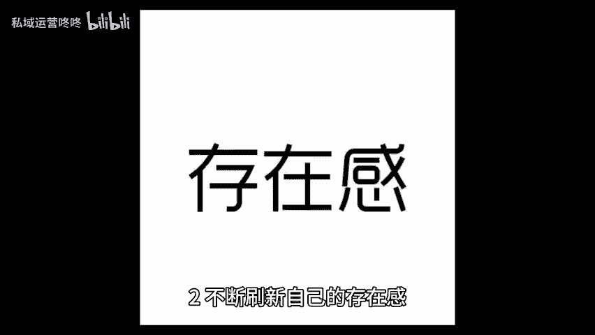
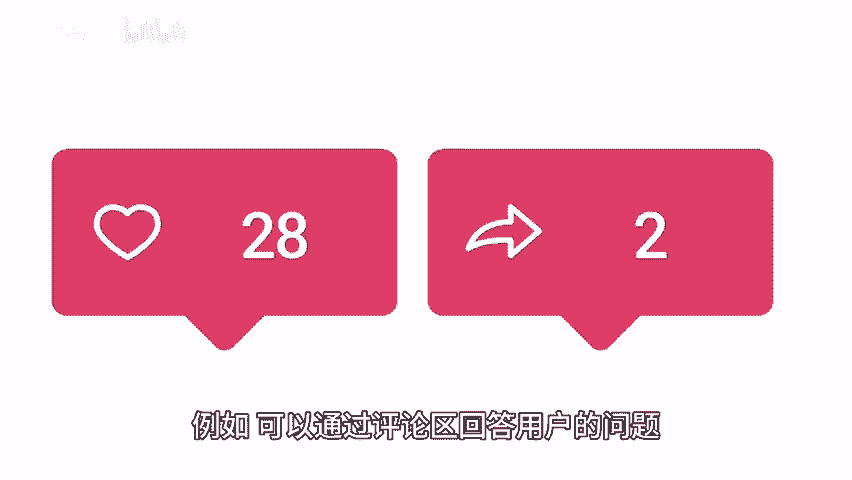
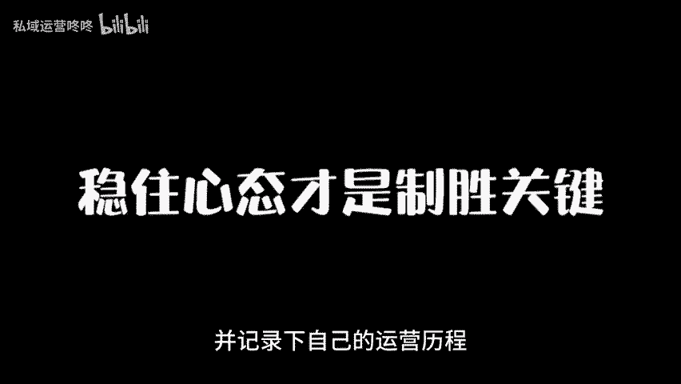
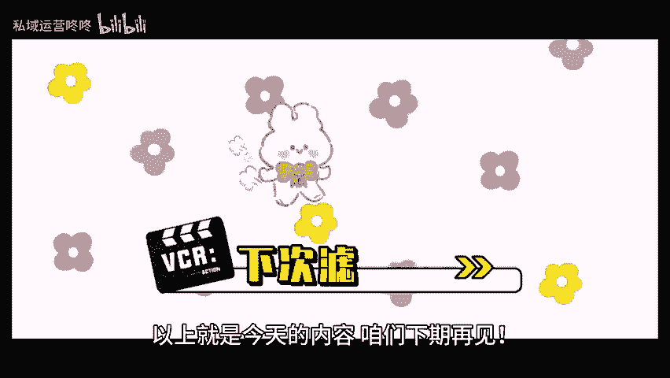

# 运营不只是技巧：三个核心点，重塑你的运营思维！ - P1 - 私域运营咚咚 - BV1KYYTegEEK

🎼作为一名运营人，你是否也遇到过这个难题？掌握了大量的运营技巧，但却总感觉效果不尽人意。今天我们将深入探讨三个核心要点，帮助你重塑运营思维，提升实际效果，以持续不断的更新内容。在当今信息爆炸的时代。

用户的注意力极其有限。因此，运营人必须持续不断的提供新鲜有价值的内容才能有效吸引和留住用户，你可以制定一个内容计划，明确每天每周甚至每月要发布的内容主题和形式，其次，要根据用户反馈，不断优化内容。

最后不要害怕尝试新的内容形式，比如视频直播或互动问答。这些新形式不仅能增强用户体验，还能吸引不同的受众群体，让你的内容在竞争中脱颖而出。2、不断刷新自己的存在感。这并不是说你要无时无刻都在打扰用户。

而是要找到合适的时机与用户互动。例如可以通过评论区回答用户的问题，或者在社交平台上参与热门话题，展示你的专业性与敏锐度。😊。

🎼3、稳住心态，焦虑和急功近利，只会导致决策失误，反而影响整体运营效果。因此，你需要学会接受不理想的结果，并记录下自己的运营历程，定期回顾帮助自己保持清醒的头脑。同时还要设定合理的目标。

目标既要具挑战性，又要切合实际，最后还要记住一点，运营绝不仅仅是技巧的堆砌，而是结合多方面来定制策略的。以上就是今天的内容，咱们下期再见。😊。

