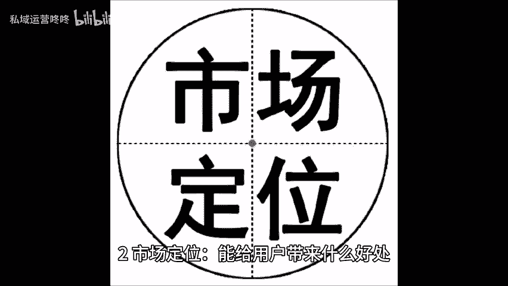
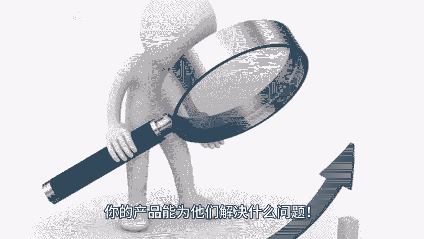
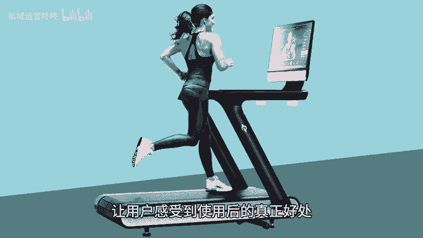

# 运营人学会这三点，产品定位不再是难题！ - P1 - 私域运营咚咚 - BV1jLe4e7E7H

🎼hello，宝子们，今天我们来聊聊产品定位的那些事儿。作为一名运营人，掌握产品定位的技巧，可真是太重要了。下面我为大家总结了三大重点，快来看看吧。一、产品定位类型及差异化，在选择你的产品类型时。

一定要找到与众不同之处。比如你是在做护肤品。那就可以考虑加入一些独特成分或环保理念，让自己的产品从众多竞争者中脱颖而出，记得差异化是吸引用户的关键哦。2、市场定位能给用户带来什么好处。

你必须明确告诉用户，你的产品能为他们解决什么问题。比如说如果你推出的是一款智能健身器材，那一定要强调它如何帮助用户节省时间与提升锻炼效果，让用户感受到使用后的真正好处，才能提高转化率哦。

3、传播定位受众的独特行为，分析目标受众的购买习惯喜好以及社交行为，能帮助你制定更精准的传播策略。举个例子，如果你的受众群体喜欢短视频，那就多利用短视。😊。

🎼平台发布相关内容，提高曝光率和互动性。只要掌握了这三点产品定位，绝对不再是难题。大家快动手试试看，优化你们的产品定位，找到心仪的目标客户吧。😊。

