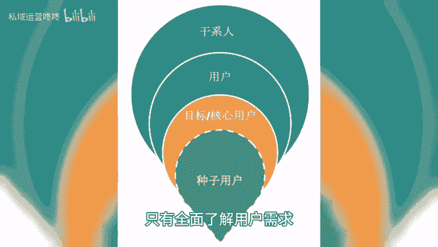

# 运营如何做好深度内容，吸引更多目标用户？ - P1 - 私域运营咚咚 - BV1gw4m1Y7Qf

🎼在运营工作中，如何打造深度内容，吸引更多目标用户是每个运营人关注的重要议题。今天就和大家聊聊深度内容不可以或缺的三个方面，帮助大家优化内容策略，吸引更多的目标用户，以深入洞察用户需求。在开始创作之前。

我们需要通过市场调研数据分析等方式，深入了解目标受众的需求。关注的话题痛点和期望，只有全面了解用户需求，才能针对性的提供有价值的内容。此外，还可以分析关键词搜索和平台流量数据，掌握用户的偏好和行为特征。

这些信息将为你的深度内容提供重要参考，让你更好的满足用户需求。2、避免内容同质化，在追求深度内容的过程中，避免内容同质化非常重要。当用户看到大量雷同的内容时，很容易失去兴趣，导致流失。在撰写内容时。

可以寻找别人尚未触及的角度和新颖观点，以此吸引用户的注意力。而对于热门话题或行业动态，不仅要写表面现象。😊。

🎼还要深入挖掘背后的原因和影响，并提供具体的案例和数据支持，以此培养用户对你的内容的依赖和信任感，从而建立起稳定的用户群体。3、优质内容与生活息息相关。为了吸引更多的目标用户，你需要确保你的优质内容。

与我们的日常生活息息相关。在内容中引入真实的案例和故事，展示成功或失败的经验，并从中提炼出有启发性的教训，也可以提供具体的步骤和解决方案，帮助用户解决实际问题。

例如分享健康食谱、旅行攻略和职业技能培养方法等，或者将你的内容融入到日常生活场景中，让用户与你产生情感共鸣，加深用户与你的连接。以上就是今天分享的内容，咱们下期再见。😊。

