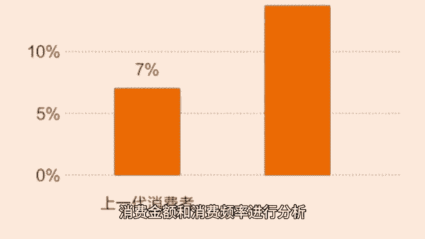
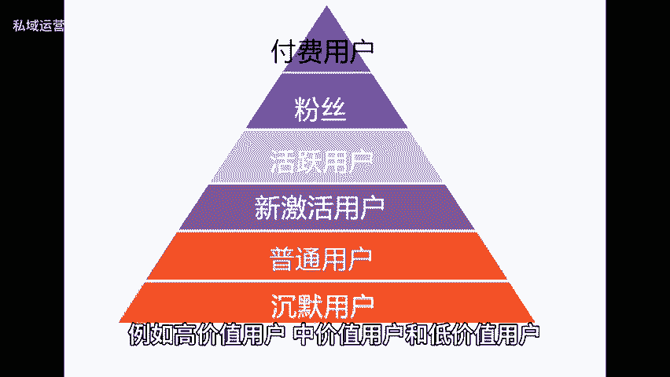
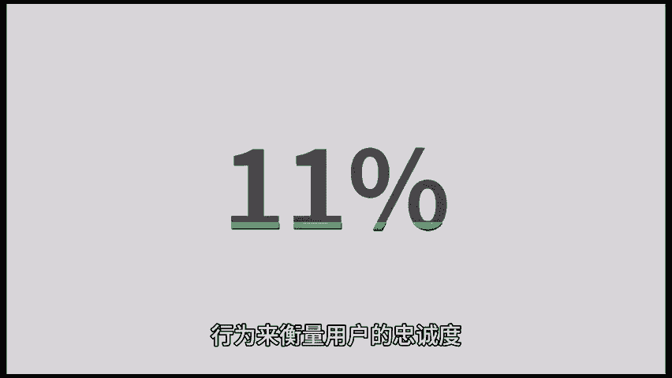
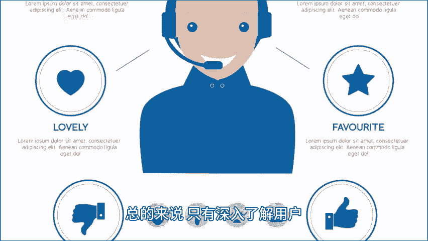

# 运营如何做好用户价值分析，进行有针对性的营销？ - P1 - 私域运营咚咚 - BV1pT421a7yK

🎼在当今竞争激烈的市场环境中，了解用户的价值和需求是成功运营的关键。今天就和大家聊聊如何进行用户价值、分析以及如何利用分析结果进行精准营销。主要从一下两个方面入手与用户的购买力。

通过对用户的最近一次消费，消费金额和消费频率进行分析。我们可以评估用户的购买力，并针对其不同的购买能力制定营销策略，因此，我们需要收集用户的消费记录和订单数据。这些数据可以包括用户的购物历史。

订单金额、购买频率等。然后我们可以根据这些数据来划分用户的购买力级别，例如高价值用户中价值用户和低价值用户，针对不同级别的用户提供对应的营销内容。2、用户的忠诚度。

了解用户的认知、兴趣、购买和忠诚度方面的情况，可以帮助我们评估用户的忠诚程度，并采取相应的策略，提升用户的忠诚度。首先，我们需要对用户的认知进行分析。这包括用户对品牌的知晓程度。😊。

🎼品牌形象等方面。其次，通过用户的兴趣和购买行为来衡量用户的忠诚度。最后，用户的忠诚度还与用户的满意度和售后服务相关。同时，建立用户反馈渠道，了解用户的需求和意见，并及时做出调整和改进。

也是提升用户忠诚度的重要手段。总的来说，只有深入了解用户，才能赢得他们的青睐，并取得市场的竞争优势。以上就是今天全部的内容，咱们下期再见。😊。

