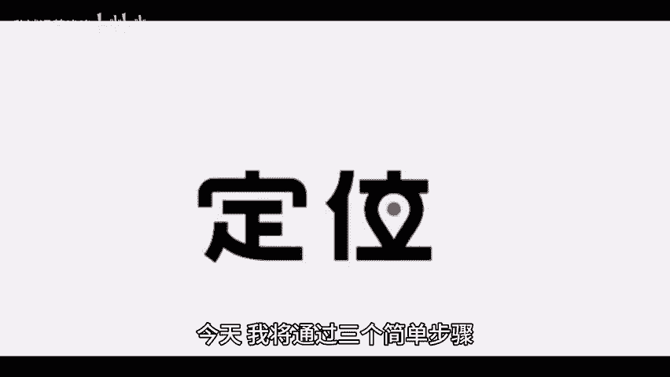
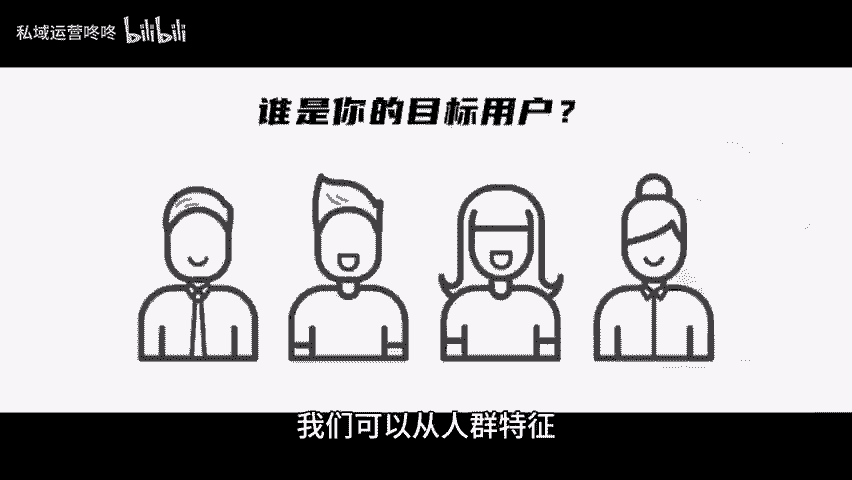

# 运营如何做好账号定位？三个步骤拿下！ - P1 - 私域运营咚咚 - BV11w4m1k7nX

🎼在运营工作中明确的账号定位是成功运营的关键。今天我将通过三个简单步骤，帮助你明确自己的账号定位。第一步，你的产品是什么，无论你是提供实物商品、数字产品还是服务都需要清楚的了解其特点和优势。

问自己几个问题，你的产品解决了什么问题。他与市场上其他产品相比，有什么独特之处。你的品牌核心价值是什么？只有在深入了解产品后，才能更好的进行后续的市场分析和受众定位。第二步，你的产品要卖给谁。

一旦明确了你的产品，就必须考虑目标受众，我们可以从人群特征，用户心理特征以及用户需求这些方面来分析。第三步，以什么形式推广和触达用户，不同的产品和受众特征决定了推广方式的多样性。

我们常见的推广形式有社交媒体平台。KOL合作内容营销以及线上线上活动等不同形式的推广，可以帮助我们触达不同的用户，以上就是今天的干货分享，希望能够帮助到大。😊。

🎼家咱们下期再见。😊。