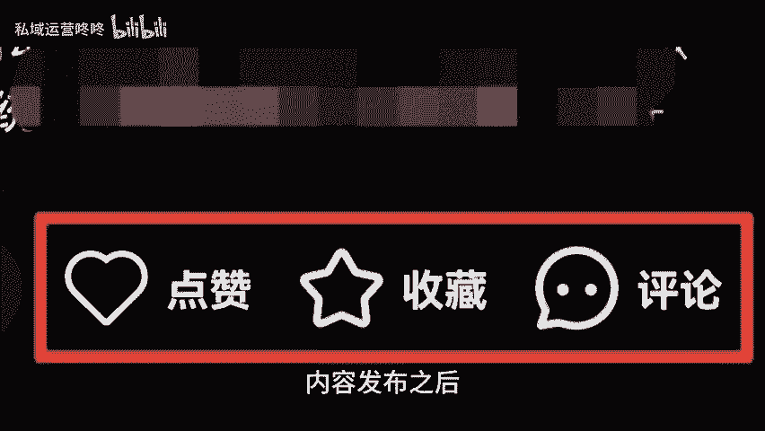
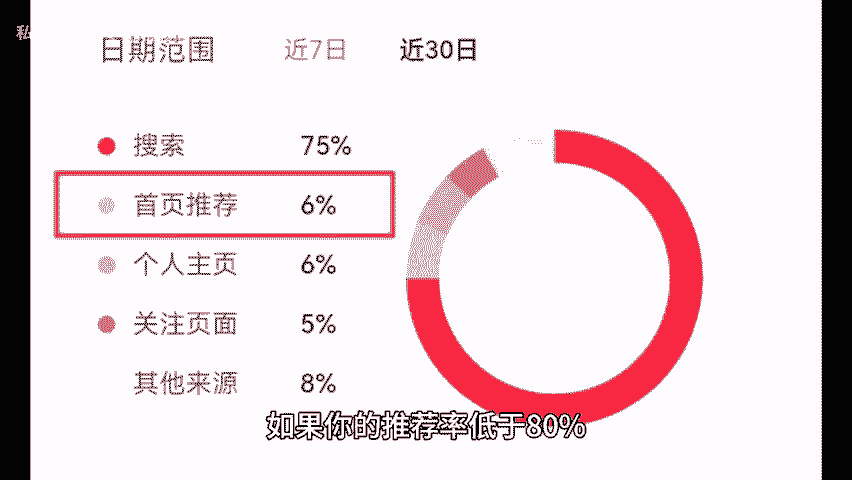

# 运营如何判断账号是否起号失败？ - P1 - 私域运营咚咚 - BV1NPHXeqEd5

🎼大家好呀，今天我们来聊聊如何判断你的账号是否起号失败，一浏览量连续一个月不过百。如果你的浏览量连续一个月都在100以下，那就需要警惕啦。这种情况往往说明内容没有吸引力或者目标用户群体选择不对。

需要重新调整一下内容策略。2、没有用户互动内容发布之后，既没有人评论，也没有点赞收藏等互动数据，那就说明用户对你的内容并不感兴趣，试试调动一下粉丝的积极性，问问他们想看的内容积极与他们互动。

3、首页推荐低于80%，如果你的推荐率低于80%，可能就是内容质量或者发布时间不合适了。记得多多分析数据，找出最佳发布时机，获得更多的推荐率，4、推广券效果不佳，使用了平台的推广券过基础数据还是不佳。

那就要考虑一下你的内容价值了。推广只是辅助优质的内容才是王道，继续提升内容质量才能有更好的效果。起号周期不固定，短则半个月，长达3个月。只要。😊。

🎼坚持不懈，总会迎来突破的那一天，希望以上的分享能帮助到大家。😊。