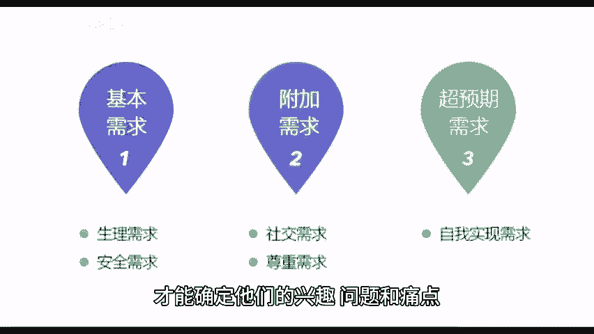
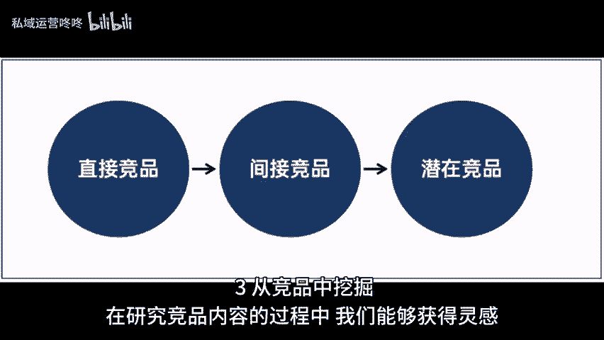

# 运营如何寻找合适的选题？三个路径get！ - P1 - 私域运营咚咚 - BV1im421g7D6

🎼众所周知，一个好的选题就是吸引用户提供有价值内容的第一步。今天我将分享三个选题路径，帮助大家能快速找到合适的选题。一从目标用户的需求里来，只有深入了解你的目标受众，才能确定他们的兴趣问题和痛点。

从而创作出符合他们需求的内容，我们可以通过市场调研平台评论区以及用户反馈中了解用户的需求，一旦了解了目标用户的需求。你就可以根据他们的关注点，和痛点来选择合适的选题。这样做，可以确保你的内容。

对用户有吸引力，同时也能提供有价值的解决方案。2、从热点话题中提炼，把握实时热点，你可以提供与当前事件相关的内容，吸引更多用户当然在选择热点话题时，要确保它与你的账号定位相符合。

并且能够为用户提供一些有价值的观点或见解，同时，记得及时跟进热点话题的动态，保持内容的及时性。3、从竞品中挖掘，在研究竞品内容的过程中，我们能够获得灵感。😊。

🎼甚至是自己没有涉及到的角度与话题，需要注意的是不能完全照搬对方的内容，而是找到符合自己账号定位的话题，以此作为切入点来开展选题以及内容创作。今天的分享到这里就结束了，希望对大家有所帮助，咱们下期再见。

😊。

