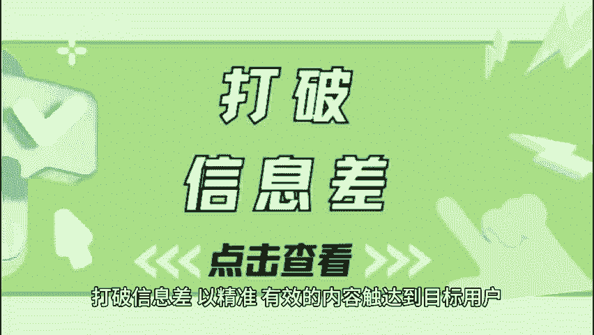
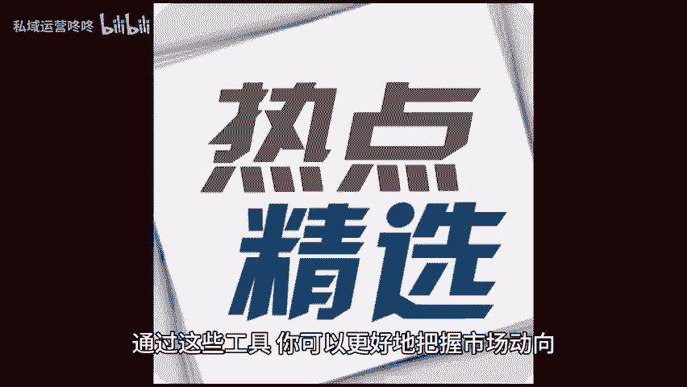

# 运营如何打破信息差？三个技巧助你一臂之力！ - P1 - 私域运营咚咚 - BV1EmxjeKEpX

🎼打破信息差以精准有效的内容，触达到目标用户，是运营成功的关键所在。下面我将分享三个实用的技巧，帮助你快速提升内容质量，增强与用户之间的联系。一选题用工具筛选热门话题。好的选题不仅能引起用户的关注。

还能激发他们的阅读兴趣，而要想找到最受欢迎的话题，你可以借助一些专业的工具来进行筛选。通过这些工具，你可以更好的把握市场动向，确保你的内容始终紧跟潮流。2、文案用文案生成工具。

优秀的文案往往能够直接影响到文章的点击率和转化率。目前市面上有很多文案生成工具，可以帮你快速生成，符合主题的标题和正文。这些工具通常会根据关键词和语境，提供多个不同的文案建议帮你摆脱写作瓶颈。

3、图片套用设计模板，一篇优秀的内容，不仅文字内容要精炼吸引配图同样不可忽视，而利用设计模板来制作图片，无疑能减少你在视觉设计上的时间投。😊。

🎼度和心理负担，许多在线设计平台提供了丰富的设计模板供你选择。你只需根据自己的需求挑选一个喜欢的模板，并替换其中的文字和图片，即可轻松获得专业水准的视觉效果。

希望以上分享的三个技巧能够帮助你在运营的过程中事半功倍。😊。