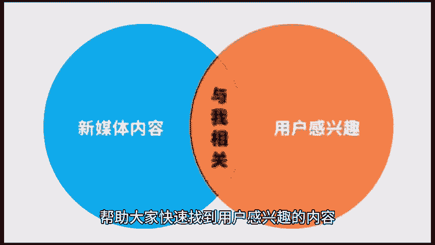

# 运营如何找到用户感兴趣的内容？ - P1 - 私域运营咚咚 - BV1jcsSeXEw5

🎼在内容为王的时代，如何找到用户真正感兴趣的内容，已成为每个运营者必须面对的挑战。下面我将分享三个方法，帮助大家快速找到用户感兴趣的内容。一、搜索行业大词，要想了解用户的兴趣。首先需要从行业大词入手。

行业大词是指在特定领域中，用户频繁搜索的关键词。这些关键词通常能够反映出用户的需求。痛点和关注点，我们需要明确目标受众是谁，他们的需求和兴趣点是什么，从而缩小搜索范围，在选择关键词时。

要选择那些搜索量较高的关键词，这意味着更多的人在关注这个话题。2、查看同领域近期高赞高收藏的内容。查看近期高赞高收藏的文章，能够帮助你发现哪些主题和形式，最受用户欢迎。这种方法不仅能提供灵感。

同时也能帮助你避免重复竞争激烈的内容，你可以通过各大自媒体平台，用户留言或评论等方式，找出这些高赞内容的共同点。比如内容结构、语言风格。😊。

🎼和图文搭配等以此来指导自己的创作。3平台首页经常看到的内容，许多内容平台会根据用户的行为数据，推荐用户可能感兴趣的内容。你可以借助这一机制观察平台首页经常出现的内容。以此判断用户的偏好。

在运营过程中找到用户感兴趣的内容并不是一件容易的事情。但通过以上三个方法，你能更精准的把握用户的需求，创作更具吸引力的内容。😊。

