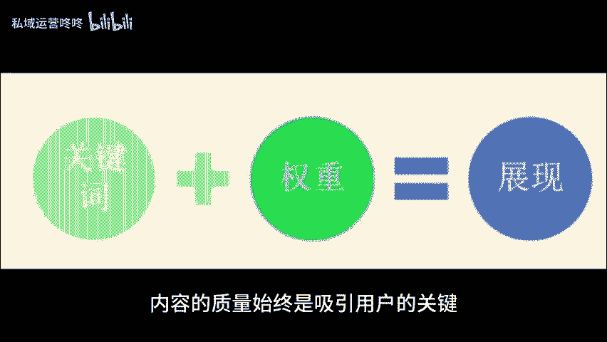
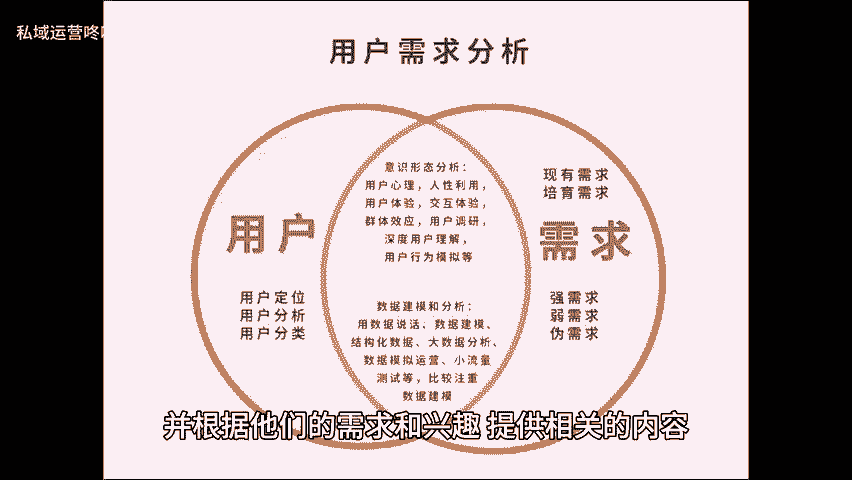
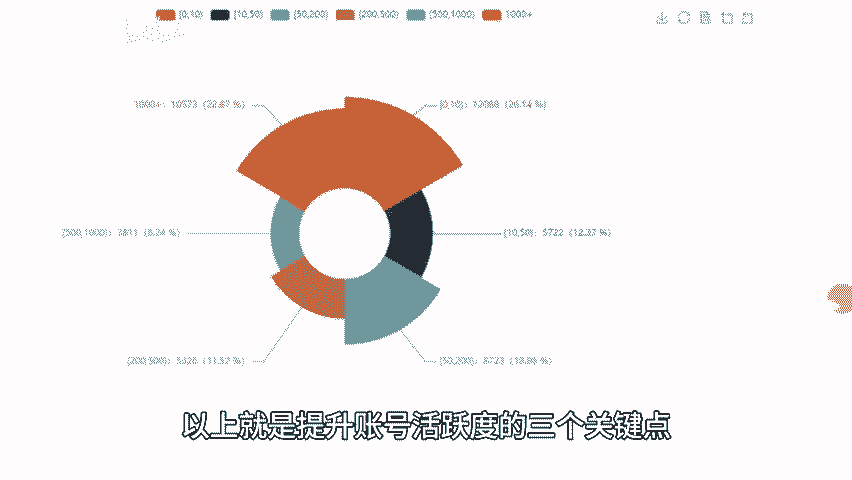

# 运营如何提高账号权重？这三点缺一不可！ - P1 - 私域运营咚咚 - BV1nf421q7o9

🎼要想让自己运营的账号在众多账号中脱颖而出，提高权重和影响力并不容易。下面我将介绍三个关键因素，帮助你提升账号的权重。一内容优质、有价值。不论是哪个领域。

内容的质量始终是吸引用户的关键优质有价值的内容可以提供给用户实用的知识，有益的信息或娱乐价值，从而增加用户的年限和阅读体验。2、内容垂直。

针对特定的受众群体进行垂直领域定位是提高账号权重的另一个重要因素，通过明确定义目标用户群体，并根据他们的需求和兴趣，提供相关的内容，能够吸引更多的目标用户，提高账号的精准度和影响力。3、账号活跃度。

账号的活跃度是公众号权重提升的一个关键指标，活跃度包括用户互动。粉丝积极度文章分享等多个方面，我们可以通过积极回复评论、私信等方式来提升账号的活跃度，以上就是提升账号活跃度的三个关键点。

希望对大家有所帮助，咱们下期再见。😊。

