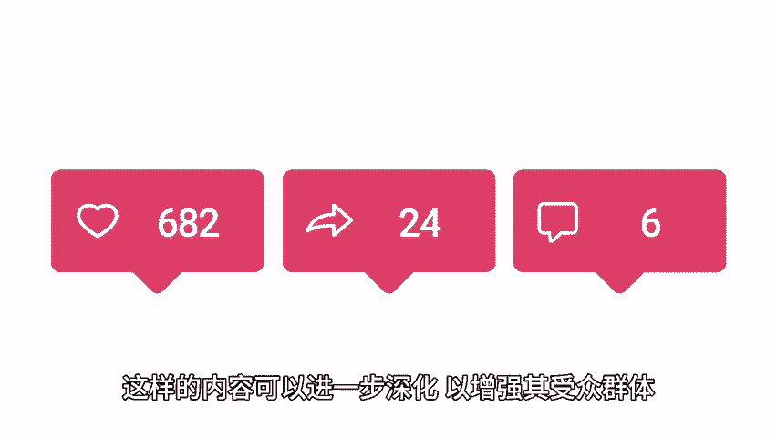
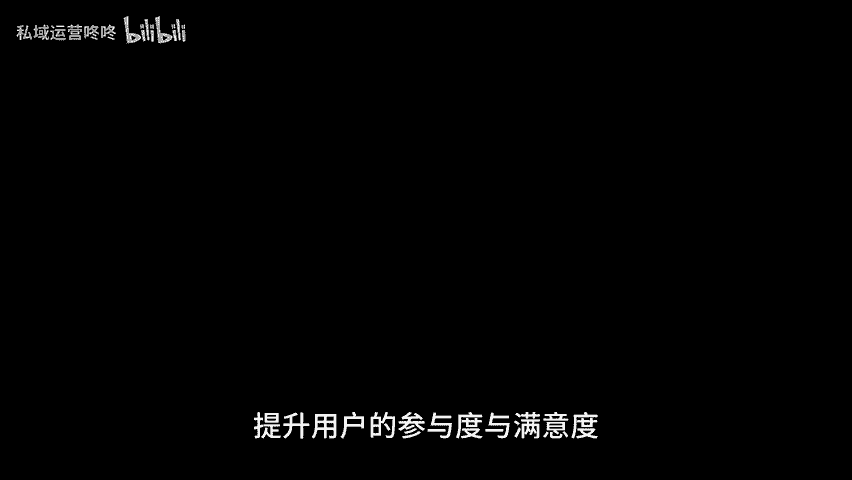

# 运营干货：发布内容后，别忘了这三步！ - P1 - 私域运营咚咚 - BV1bz421B7Bu

🎼在运营工作中，内容发布只是第一步，许多运营者在发布后往往忽视了一些重要的后续工作，这可能导致内容的传播效果大打折扣。下面我将为大家介绍发布内容后必须执行的三大步骤，让你的运营工作更上一层楼。

第一步复核确保内容无违规。即使在内容发布后，你也要再次检查内容是否符合平台的规定，包括标题正文图片等，确保没有任何敏感词汇或违法信息，避免引发违规问题，违规的内容不仅会被平台删除，还可能导致账号被封禁。

给运营带来巨大的损失，因此，在发布完毕后，花几分钟时间对内容进行复核，是一项不可或缺的工作。第二步，积极互动活跃账号，通过评论区私信以及私域等多种渠道，及时回应用户的反馈和建议，能有效增强用户粘性。

你可以针对用户的疑问，给予详细解答，或者对有建设性的评论表示感谢。这样不仅能增进彼此的距离，还能提高粉丝的活跃度。😊，🎼步查看内容数据，这包括点击率、玩播率、评论互动等多个维度。通过数据分析。

你可以清楚的了解到哪些内容更受欢迎，哪些方面需要改进。例如，如果某篇内容的玩播率很低，说明内容可能没有吸引力，我们就需要认真思考并调整内容策略，而高互动率则表明用户对某个话题非常感兴趣。

这样的内容可以进一步深化以增强其受众群体，总之，只有重视这些环节，才能让你的账号保持活力，提升用户的参与度与满意度。😊。

