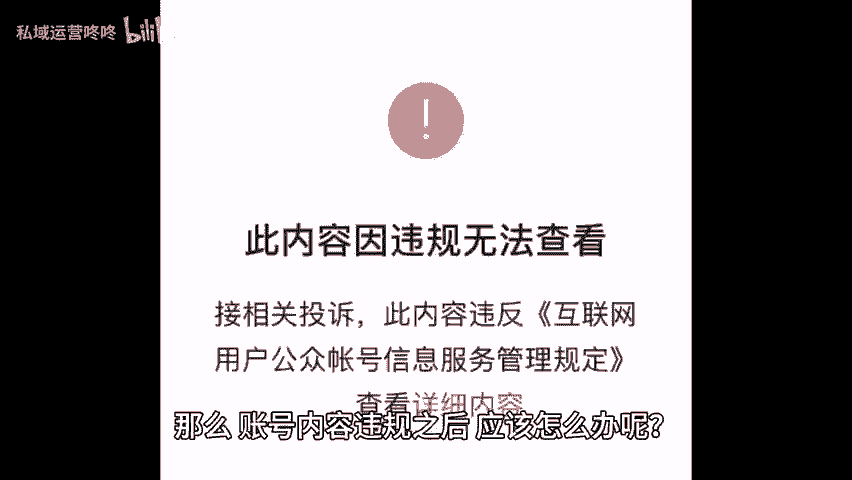
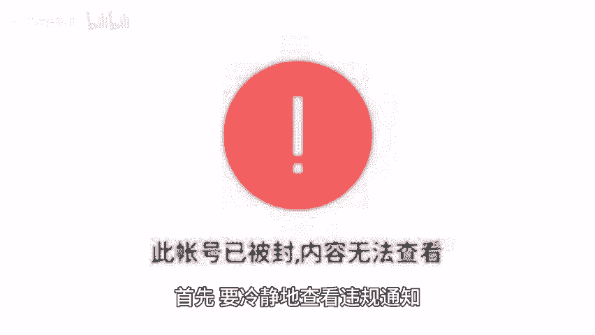
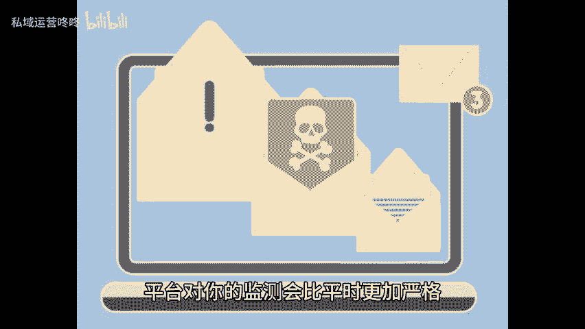

# 运营干货：账号内容违规之后怎么办？ - P1 - 私域运营咚咚 - BV1XqvreHEo2

🎼作为一名运营者，最不想看到的就是发布的内容有违规。但是不管在怎么小心还是会有违规的时候，那么账号内容违规之后应该怎么办呢？这里有一份自救指南，让你的账号起死回生。一查看违规的原因。

首先要冷静的查看违规通知，对照平台规则，看看是不是真违规了。如果你发布的内容并没有平台所说的违规信息，那么别犹豫，申诉走起，有时候平台可能会因为各种原因对某些内容进行误判。

这种情况是可以通过申诉来解决的。2、及时删除违规内容并停止导流。如果内容确实有违规信息，那么最有效的做法便是及时删除这条违规的内容并停止相关的导流行为。此时，你的账号处于敏感状态。

平台对你的监测会比平时更加严格。所以一定不要再有其他的违规行为，保持账号的活跃，确保后续能够顺利恢复到正常状态。3、持续活跃账号，账号违规后要保持活跃，但要避免再次触碰红线，发一些正面。😊。

🎼积极符合规则的内容，让平台看到你的诚意和改变，同时也要积极与用户进行互动，回应评论和私信。良好的互动，不仅可以增强用户粘性，还有助于提升账号的活跃度。记住每个平台都有自己的规则。

我们要做的是尊重并适应它。今天分享的内容就到这里了，咱们下期再见。😊。