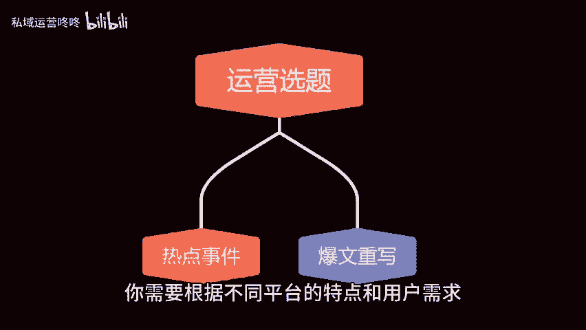

# 运营必备：每日4步工作清单！ - P1 - 私域运营咚咚 - BV1qJ4m1u7JV

🎼大家都知道，运营是一个多元化的工作领域，涉及到多个平台和任务，每天都需要花费大量的时间和精力来完成各种工作。那么你知道月入过万的运营，每天都需要做些什么吗？让我们一起来看看吧。一查看不同平台的数据。

作为一个运营人员，你需要经常查看不同平台的数据。这些平台可能包括社交媒体平台、电子商务平台、网站统计工具等，通过查看数据，你可以了解当前的运营状况，分析用户行为，找到优化和改进的方向。

二选题选题是运营工作中非常重要的一环。你需要根据不同平台的特点和用户需求。选择适合的主题来进行内容创作。在选题时，你可以参考热门话题，用户关注度、竞争对手的内容等因素。

同时也要结合公司的品牌定位和目标受众来制定选题计划。3、编辑内容。你需要根据选题撰写符合用户需求和平台规范的高质量内容。同时在编辑内容时，要注意语言表达清晰。😊。

🎼信息层次分明，并加入一些有趣的元素，以吸引用户的阅读和互动。4、发布内容，利用不同的平台和渠道，由各大社交媒体网站等平台将内容传播给目标受众。在发布内容时，也是需要注意选择合适的时间和方式。

以此增加曝光率和用户参与度，除了以上的四步清单。作为运营，还需要保持高度的执行力和耐心，不断学习和总结经验，才能在运营领域取得长足的进步和收益。以上就是今天全部的内容，希望能帮助到大家，咱们下期再见。

😊。

