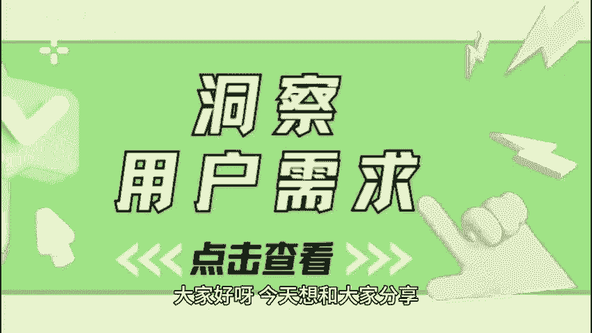
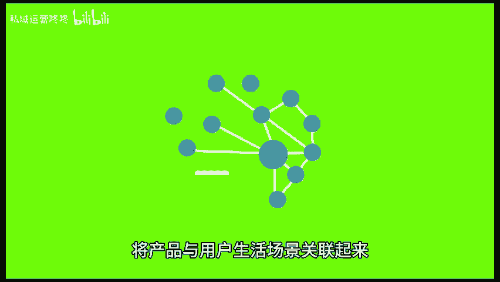
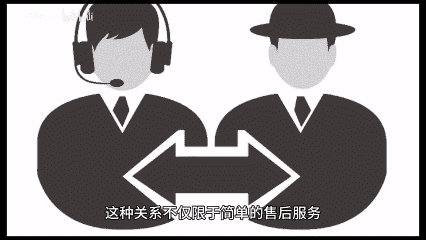

# 运营必学！三个技巧洞察用户需求，提升用户满意度！ - P1 - 私域运营咚咚 - BV1NAtWeTEwZ

🎼大家好呀，今天想和大家分享一些超级实用的运营技巧，让你的产品更贴近用户提升用户满意度哦。一、产品与用户生活场景关联。在运营过程中理解用户的生活场景是至关重要的。将产品与用户生活场景关联起来。

也能让用户感受到产品的贴心与实用。这样用户不仅仅是购买你的产品，更是购买了一种解决方案，一种生活方式。2、站在用户的角度思考，换位思考，能够使你更深入地理解用户的需求和痛点。

从而在产品和服务上提供更有价值的改善，你可以通过用户反馈，来了解他们的真实想法，定期进行用户调研收集意见和建议，能够帮助你识别出用户最关心的问题。与此同时，与用户建立长期的沟通和互动关系。

也能持续洞察他们的需求变化。这种关系不仅限于简单的售后服务，更要在用户的整个生命周期内保持联系，了解他们的期待与反馈。3、亲身体验作为产品的运营者，你应该尝试。😊。

🎼从用户的角度去使用产品，观察自己在使用过程中的感受，包括操作的便捷性、功能的实用性以及整体的用户体验。此外，持续跟踪更新后的用户满意度同样重要。在每次产品迭代后，与用户沟通询问他们对新版本的使用体验。

了解是否达到了预期效果，这种方式不仅能促进产品的持续优化，还能增强用户对品牌的信任与忠诚，通过以上三个技巧，运营人员能够更精准的把握用户需求，进而提升用户满意度。😊。

