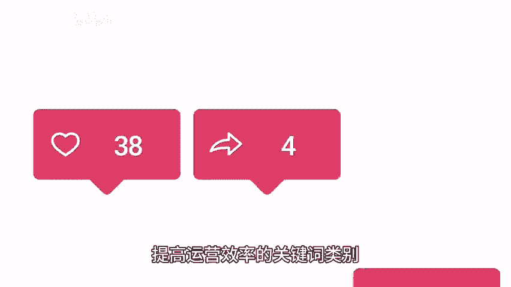
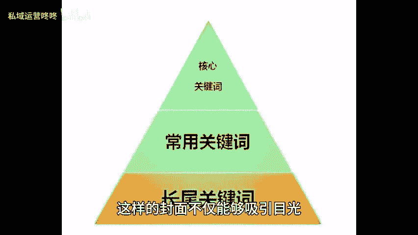
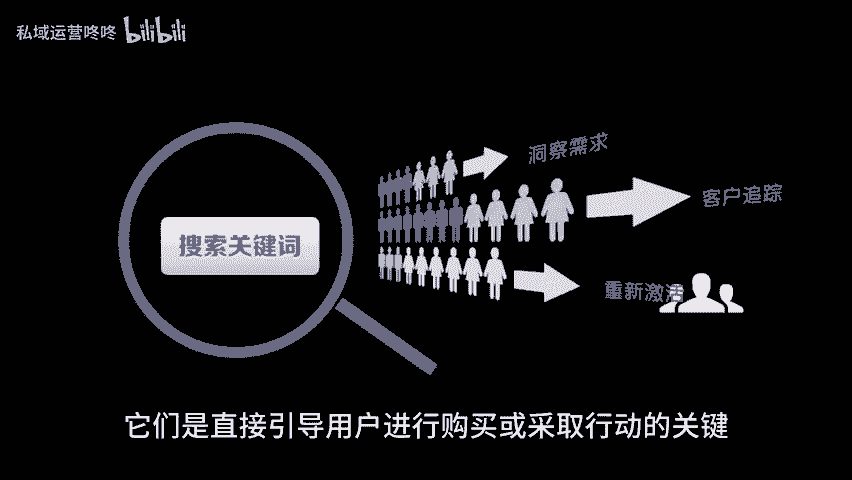
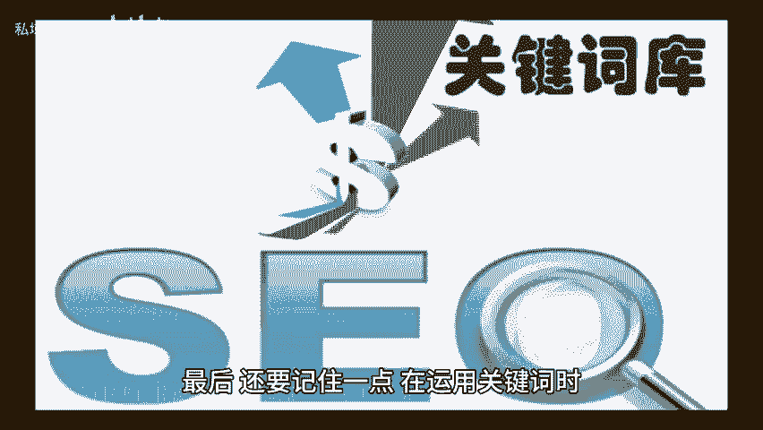

# 运营效率翻倍！三大类关键词大揭秘！ - P1 - 私域运营咚咚 - BV17w4m1Y7sd

🎼在这个人人都想从自媒体平台上有所获利的时代，提高运营效率是每个企业都追求的目标。今天就给大家分享三个能提高运营效率的关键词类别，一大关键词大关键词主要体现在标题和话题标签上。

他们是吸引用户点击的第一眼，例如假设你的内容是关于健身的，你可以在标题和话题标签中使用像健身秘籍，塑造完美身材这样引人瞩目的大关键词。这些关键词直接表明了用户在点击你的内容后所能获得的价值。

吸引他们主动进入你的内容。2、细分关键词，细分关键词主要体现在封面上，它们是展示你的内容特点的关键。在设计封面时，你可以使用与内容相关的细分关键词，以健身为例。

你可以在封面上使用一张展示健身器材或健美图片，配合诸如健美训练指南，增肌秘籍这样的细分关键词。这样的封面不仅能够吸引目光，还能让用户对你的文章产生期待，促使他们主动点击三促成。😊。

🎼交关键词促成交关键词主要体现在内容中，他们是直接引导用户进行购买或采取行动的关键。在内容中使用促成交关键词时，需要注意平衡内容推广和用户体验，以健身为例，你可以在内容中描绘一个健身成功故事。

并结合诸如立即购买，加入会员等促成交关键词。这样的内容既能够激发用户的兴趣，又能够引导他们采取行动。最后还要记住一点，在运用关键词时，要与你的品牌定位和目标用户需求相符合。

避免过度使用关键词而影响用户体验。以上就是今天全部的内容，咱们下期再见。😊。

