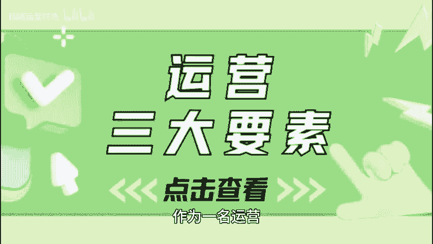
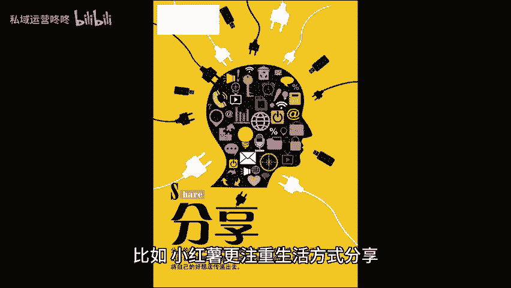
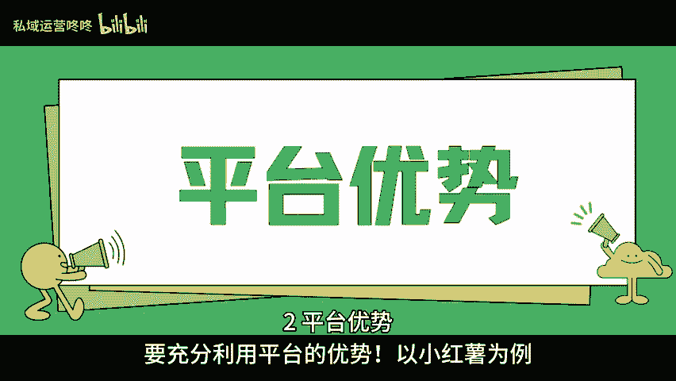
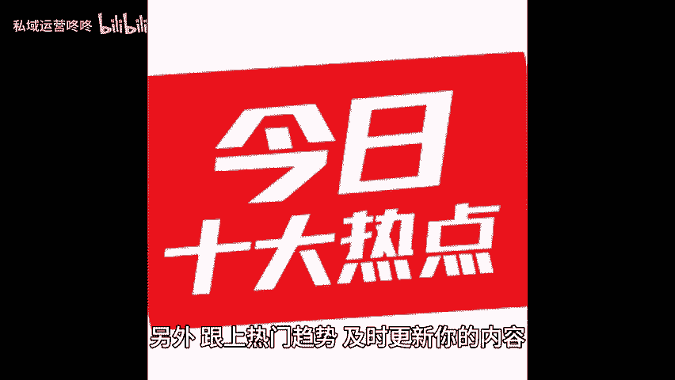
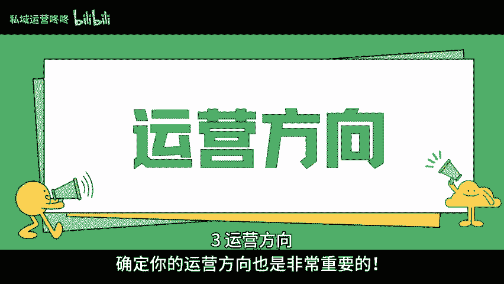
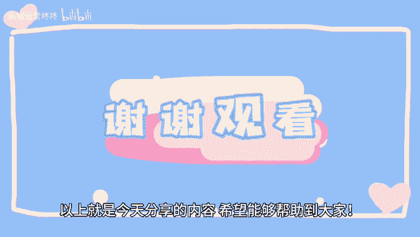

# 运营新手必读：这三个要素你不得不知！ - P1 - 私域运营咚咚 - BV1NTtxeVEvw

🎼作为一名运营，尤其是新手，运营有三大要素是一定要知道的。下面就一起来看看是哪三个要素吧。一平台特性，了解平台的特性是关键。不同的平台有不同的用户群体和内容风格。

比如小红鼠更注重生活方式分享UGC内容和真实体验。因此要记得把自己的个性展现出来哦。而且互动性很强，不妨多与粉丝们交流，才能让你的内容更具吸引力。2、平台优势，要充分利用平台的优势，以小红鼠为例。

它的搜索功能和社区氛围非常友好，让你更容易被发现，善用标签和话题，可以让更多人看到你的分享。另外，跟上热门趋势，及时更新你的内容，才能保持活跃度哦。3、运营方向确定你的运营方向也是非常重要的。

是想做美妆时尚旅行还是美食，明确你的定位才能更好的吸引目标用户，建议定期分析数据，看看哪些内容更受欢迎，调整方向以便更有效的扩大你的影响力。以上就是今天分享的内容，希望能。😊。

🎼能够帮助到大家，咱们下期再见。😊。