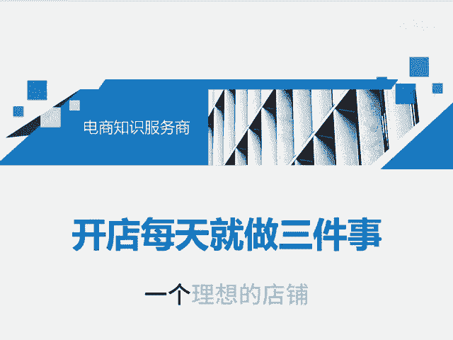
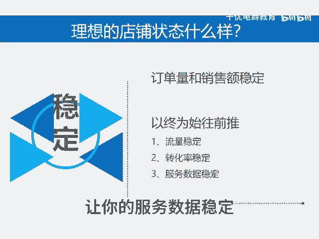

# 运营每天必做的三件事 - P1 - 千优电商教育 - BV13G2gYBEfo

一个理想的店铺是什么样子呢？就是订单量和销售额稳定。那我们以终为始把它往前推。如果要订单量和销售额稳定，那需要怎么样呢？需要你的流量稳定，需要你的转化率稳定，需要你的服务数据稳定。在拼多多上开店。

你只要做到这三条，那么你的流量基本上就会稳定。那我们再往前推，如何让流量稳定呢，那我们看拼多多它的流量结构。如果你想流量稳定，那么做付费推广，就是开车持续不断的给拼多多充值。

然后呢你可以购买到持续不断的流量，所以付费推广和你运营的过程相使终。就是你只要开店，你就得开车。那第二个就是活动流量啊。如果你的产品有价格优势，那你可以报活动，没有呢就不报活动流量呢它也相对的还行。

但是需要你价格低，再就是内容流量。所谓内容就是多多视频和多多直播。所以呢我建议你每天发布多多视频。😡。

因为这玩意儿它基本上可以说是现在的免费流量，因为真正的免费流量现在已经不多。当我们了解到这三条之后，那我们再看如何让转化率稳定。如果让你的转化率稳定，你必须做到图片文案没问题。SQ引导转化没问题。

然后销量和评价没问题。很多新手上线链接之后，做销量出评价，其实你那一套呢，它只是转化率中的一个维度。如果你的直通车持续亏，其实你只要提高转化率，它就有可能不亏。为什么？假如你100块原来出5单。

你现在呢提高了转化率出到6单出到7单，那么你可能就不再亏损。所以你每天要研究转化率。再一个即使你流量稳定，转化率还可以，但是呢如果你的服务数据出了问题，系统也会对你限流。什么叫服务数据呢。

就是DSR评分，店铺的星级消费者服务指标。所以说呢你在日常运营店铺的时候，你就要关注这些，不要等。😊，出了问题再来搞。那样的话呢就会麻烦的多。所以我们再回到刚才，如果你想让你的店铺非常稳定。

那么你就做三件事，让你的流量稳定，让你的转化率稳定，让你的服务数据稳定。这三件事是开店每天都要做的事情。我是讲师大牙，欢迎大家扫码添加我的微信，不方便扫码的朋友可以添加我的微信号80221430。

在这里给大家准备到了一套新手运营入门的大礼包，希望能够帮助大家。😊。

