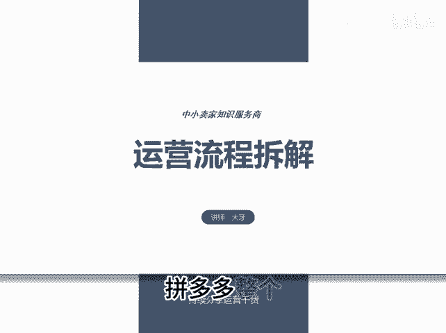
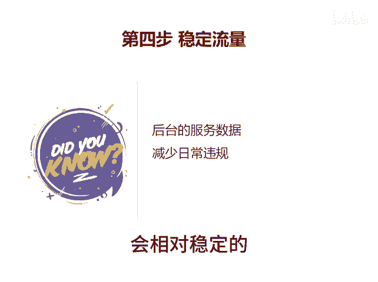
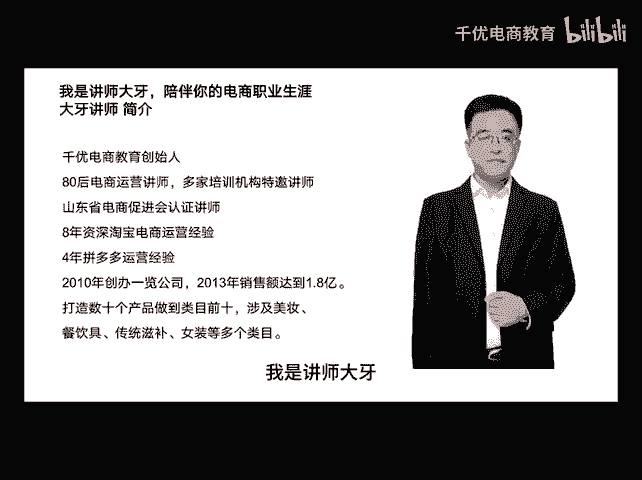

# 运营流程拆解 - P1 - 千优电商教育 - BV1qTxxesEQK

拼多多整个运营流程的拆解可以把它分成四部分，这四部分是不可或缺的，就是大部分商家把店铺没做起来呢，因为他忽略了前两步，还有些人呢忽略了第四部分。那先看第一部分做运营第一步一定是市场分析。

什么叫市场分析呢？就是知己知彼才能百战百胜。你必须相信一句话，你之所以做好，是因为同行给了你机会。那怎么做市场分析呢，找出跟你同样产品的最少20个优秀的同行，你挨个分析，那分析什么，分析他们热卖链接。

分析他们的规格，分析他们的营销套路，分析他们的类目，分析他们的人群，分析他们的视觉呈现，分析他们的销量，他们的周销量和月销量。然后再分析他们的话术，分析他们的活动等等。总之你要像了解你自己一样。

了解你这20个优秀的同行。当分析完同行之后，第二步就是规划你的链接，你不要借图，不要超标题。我们知道赚钱是精心设。😊。

的游戏你要把你的链接认真做，好好做，把新品标做上，然后做成机会商品，做一些基础评价和销量。然后呢图片一张都不能少。很多人呢10张轮博图做了8张，做了7张才说我的同行都这样。

我就不相信你的同行每个人都如此不专业。然后呢视频该有的都有店铺层级做到三层级以上，先出50个DSR评分，然后呢，你再做下一步就是获取流量，只有基本功做扎实之后啊，你的流量才容易获取吗？

现在的流量获取也比较简单，就是活动配车做上短视频开上直播就这一套吗？你说我不开直播好，ok那你开上车，然后报上活动。你说我不发视频，那也行啊。但是我想说的是你多做每一件事情，它都是有回报的。

其实开车呢很简单，前期做销售额的递增，尽量的做到不亏或者微亏是最理想的状态。如果亏的太多，他到后期比较痛苦。比如说你到我的投产比能够保本的话，你开二才能跑动。那么后期你。😡，很难实现盈利。

所以尽量微亏或者不亏。如果一个链接跑不动，可以多上几个链接尝试一下。再就是自然流量。做自然流量呢需要极致性价比。当然做多视频呢也可以给你带来很多相对免费的流量。如果没有极致性价比，那就考虑一直做强付费。

当这三步做完之后，第四步经常被很多人忽视，就是稳定流量。所谓稳定流量就是后台的服务数据，像DSR评分经级领航员这一套呢都不要低于同行的50%。如果低于30%，影响流量比较大。但另外减少日常的违规。

尽量减少在拼多多上做生意呢不可能避免像什么虚假发货，延迟发货这一套呢，你尽量的减少。只要你做到这些，你的流量呢其实是会相对稳定的。最重要的是第一步，你要先分析市场了解你的同行，我是讲师大牙。

欢迎大家扫码添加我的微信，不方便扫码的朋友可以添加我的微信号，80221430。在这里给大家准备到了。😊。

套新手运营入门的大礼包，希望能够帮助大家。