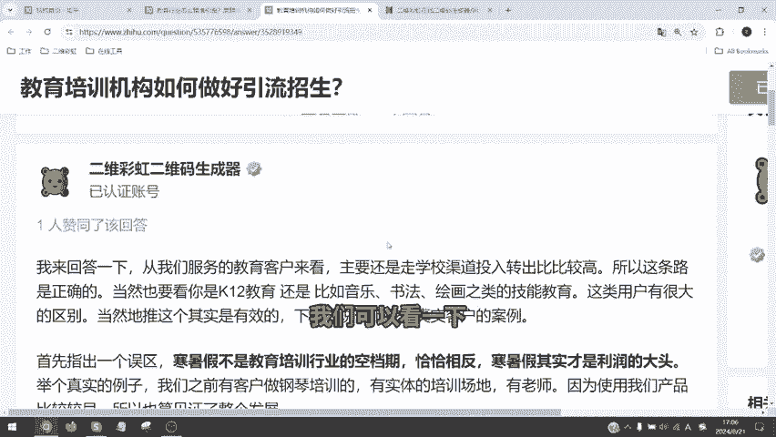
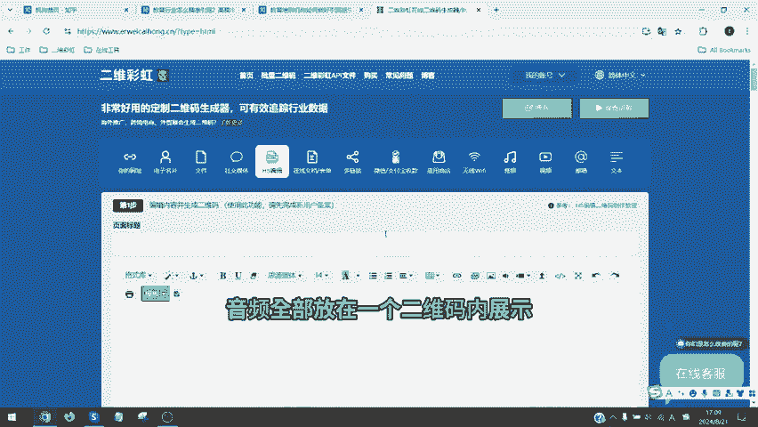
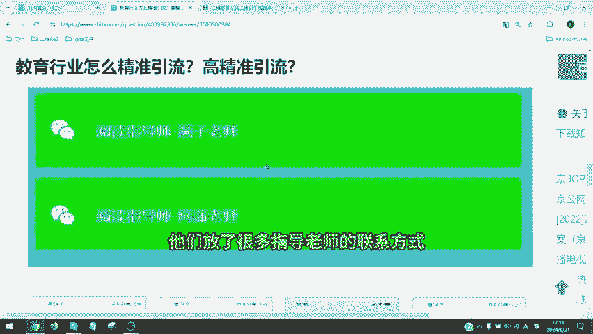
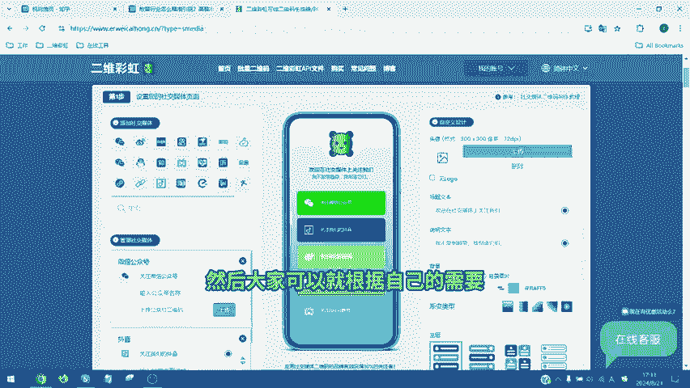
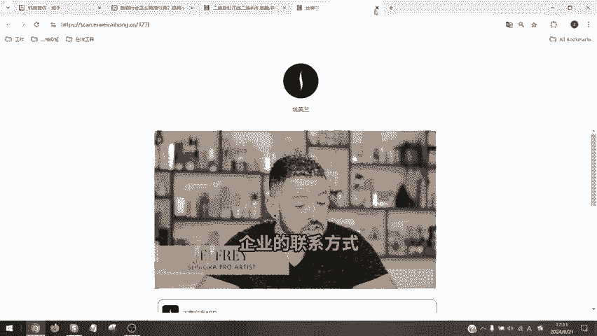

# 运营知识分享：教育行业怎么精准引流？ - P1 - 二维彩虹Erweicaihong - BV1UZsKeXEpH

🎼回答一下网络热门话题，我们有客户向我们提问说教育行业怎么引流，如何实现高精准的引流。然后他提到了说，哎所有的这个学生，然后如何去社交媒体平台去引流。然后这里头我们要先指出第一点，从我们经验来看。

教育行业引流。其实第一要先分是什么领域是你网课类的在线学习平台还是线下的文化性趣类。如果是线下培训类的，主要从我们服务的客户来看，是走线下学校的渠道。这个渠道获客是最精准的。我们可以看一下我们之前。

🎼一个服务的案例，他们呢是一开始是发传单，然后想进学校，但是没有合适的资源，他们怎么办呢？他们就去附近的小学中学门口发传单。当然不是所有的学校是值得发的。因为这个是一个教钢琴的客户嘛。

学钢琴的费用很高的，所以他们选择的是去附近口碑比较好，然后学生素质比较高的家长，然后呢去学校门口发。第二个重要的点呢是时间的选择，最好的时间是在晚上学生下学的时候。

这个时候家长在门口去接孩子比较有时间听你来讲一讲，单纯这个发传单的效果，然后其他的时间家长都是排斥的。而且同时你为了吸引家长说关注你的传单，同时也是孩子想要的时候，家长大部分时候才会停留。

这个时候他们会去准备气球，大概成本就是2到5毛钱一个，然后自己打好气拿过去那种充气的带气球。然后学校门口免费发。只要是家长留下了一些电话，领走传单或者添加微信，就免费给一个气球。

然后这里头呢其实有一个小经面，就是传单上的这个二维码。你不仅要清楚的列出你的教室的环境，你的老师的获奖荣誉，最好还能要有视频的介绍。传统的那个传单就填。😊，🎼你要有一个吸引人的东西。

1分钟1块钱体验30分钟体验课，然后不要上来就把你的价格来取写了，这样很容易就会把你的客户去吓跑。而且一定要去做留下你的微信号。这样当家长去扫码的时候，可以直接去查看你的视频图片学生练习的内容。

这是一个非常好用的一个工具。这个功能呢大家就直接可以用二维彩虹的H我可以把你的视频图片音频全部放在一个二维码内展示所有的家长打开可以查看你所有的信息，且添加客服的微信。如果你不是线下的这个的渠道。

你怎么线上的怎么那就是去社交媒体平台上去做传播。但是切在社交媒体平台上不要去直接发广告，除非你的企业或者你的产品特别有名。比如我是新东方，哎，我所有人都知道我的课程，我的师资有保障。

那么我再去直接的去做这种引流啊，你想做出国培训国留学所有人知道我的名字就知道我服务质量，剩下的这些都不要去直接打广告。你们应该怎么做呢？

反而应该去伪装成一个用户项的内容举个例子你假装是一个家长子之成绩是多少现在提高了多少。😊。

🎼也不用辅导了，你多写一点家长关心的问题，并且把你这些内容里边，然后把家长关心的问题都给解决掉。然后呢很重要，你去拿一个小号到评论区里流。比如说提问您好，我是叉叉叉请问您报的什么班之类。

然后再拿你的大账号或者主账号进行回复。相当于你把你的内容做成了一个真实用户的好评，这是一个非常好用的功能。然后呢我们都知道，无论是你在抖音小红书或者你在任何一些其他社交媒体平台引流的时候。

他们是会禁止你直接发布二维码，那你最终还是要引流到微信做转化做成交。这个时候怎么办呢？就可以使用我们的社交媒体二维码了。我们社交媒体二维码可以直接一个链接引流到所有的社交媒体平台。

你看这是我们最近一个客户的案例，他们直接把他们的视频营业时间读书分享，然后呢，他们的指导老师下边还有他们放了很多指导老师的联系方式，然后用户直接可以帮助他们从社交媒体和海报上进行引流。

这是一个非常好用的方式。我们也是来到二维彩虹选择社交媒体二维码功能。然后大家可以根据自己的需要来进行选择添加。你可以看一下我们现的客户案例。😊。

🎼这是我们斯芙兰的客户管理，可以直接播放视频，自动播放，然后可以帮他们多个社交媒体平台的信息，同时还可以放上他们的微信企业的联系方式，这是一个非常好用的功能。😊。

