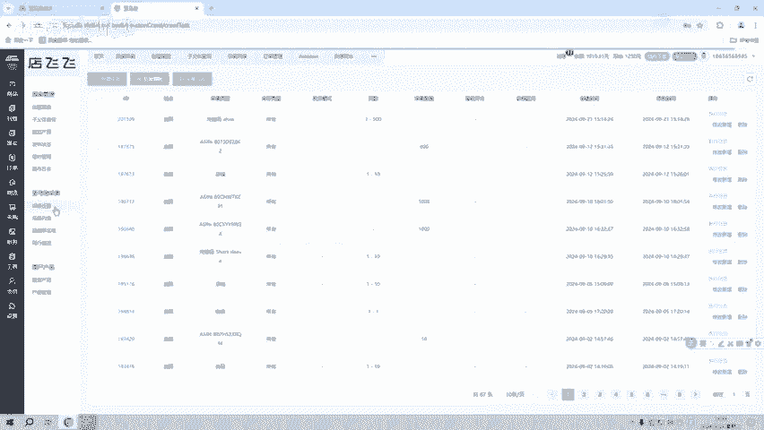
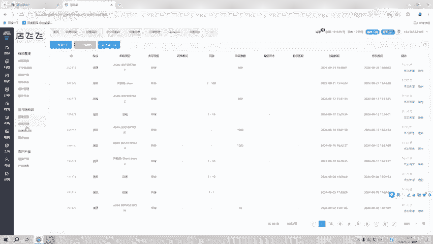

# 还不知道提升亚马逊店铺运营效率的看过来？亚马逊跟卖ERP系统！ - P1 - 小辰跨境 - BV1C2sqeYEfd

今天的话主要给咱们大家分享一下我们自发货ERP系统跟卖的一些操作方式。那现在很多这个卖家在不管是在测试我们的系统或者是正在使用我们的系统啊，如果说对于系统更卖的一些方式，不知道怎么去操作，或者选品。

我们不知道怎么去选品的话，都可以先关注小编或者是资信36来了解系统的一些具体操作方式啊，这里都会给咱们大家做一个解答。那跟卖的话就是说我们现在有这些个功能。

你像我们创建跟卖创建跟卖主要是用它的A或者是UBC来查询跟卖产品。这里的话就是说我们在其他地方找的一些A啊，然后我们可以进行个查询。第二的话就是说子付里查询，就是说我们查询遍体。

通过这个数入A查询这个遍体信息啊，哪跟卖哪个啊产哪个哪个A。第三的话就是说跟卖产品这一块，跟卖产品这一块的话，你像我们的批量任务。然后批量上架以及设置最大量数啊在这里我们都可以操作完成。

这里操作完成之后修改完成之后，我们可以直接进行一个上架啊。第三的话就是主要是我们这个采集。那现在很多用户的话主要是通过啊采集啊来使用我们系统。那采集的话，我们现在无种采集方式。

你像啊通过这个关键词店铺链接列表以及它的类目a啊，5种采集方式。那采集过来产品的话，我们会在这个采集列表里面展现出来。

像它的A粉标题品牌状态中卖家配送方式以及它的个卖数啊评论数以及上下时间平行排名在这里我们都能够显示那采集产品的话，现在很多不管是测试的用户或者是说我们正在使用一些用户，他在采集过程当中。

不知道怎么去使用啊，我们采集的方式啊，那很多这个采集方式的话，你像我们分类它需要跟这个分类跟我们的关键词要对应起来。

你比如说我们的这个服装类的那我们就需要这个输入关键词输于关输入关于这个服装协类啊个主宝类的这个产品啊才能去采集这个相对应这个关键词以及这个采集页数，我们都可以去限制啊。

你像一至1页1至100页1至20页都可以采集啊，这个价格的话和这个最低评分。在这里我们先不做去设置啊点击确定。

然后采集点击确定之后，我们将我们采集过来产品啊。点击执接执行任务。那执行任务之后啊，第一步是获取这个产品的个呃详情，然后采集过来产品会在我们的采集列表里面啊，它一一展现出来。那采集过程当中。

因为我们采集是实时数据，它不能一下子把这个所有产品都能够给你显示出来。那它是需要一个时间的啊，就是说每秒的话，我们啊每个详情大概是2到3秒的一个时间啊，具体的一些操作方式的话。

我可以关注小编或者是私信366来了解系统的一些具体操作。

