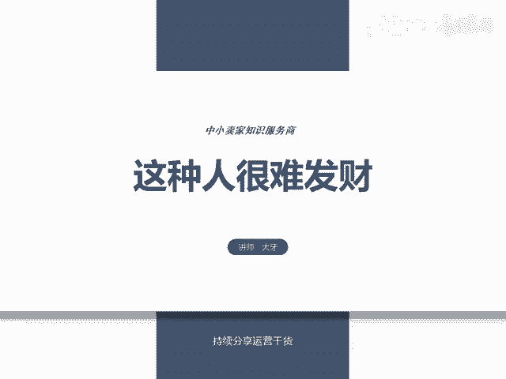
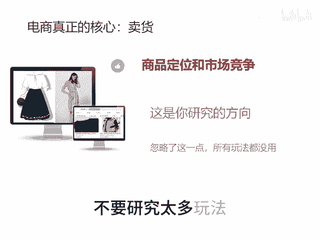
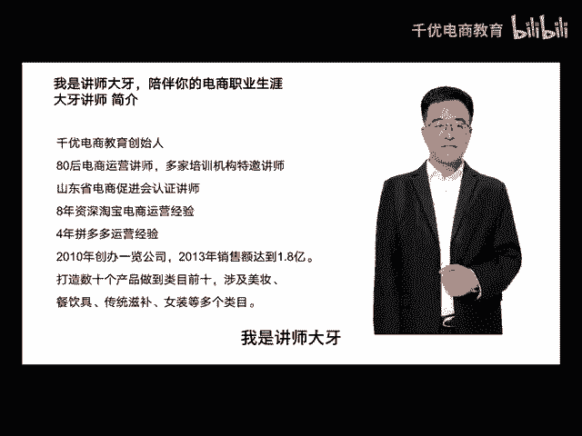

# 这种人很难发财 - P1 - 千优电商教育 - BV16S2tYKEGa

很多朋友电商一直做不好，那为什么做不好呢？其实是你研究的方向有问题。很多朋友说他我的店铺没评价，这玩意用户不下单好，结果评价做了，你发现也不出单。有人说我的店铺没流量，你做了什么炸单玩法，什么指收单。

什么拉升，结果也不行。为什么你必须知道玩法它永远学不完这博主一个玩法，那个博主一个玩法，谁讲的对，你发现不管谁讲的对不对，对你的用处都不是很大。我们必须知道电商他真正的核心是卖货，不是玩法。

你要从货品定位的方向研究，这个他永远不会错，什么产品能够很容易的做起来，就是满足消费者的需求，同时你的行业竞争不是很激烈，所以说你一定要研究产品和你的市场忽略了这一点，所有的玩法对你来说都没用。

而且呢我也建议你不要研究太多玩法，更多的时间来研究市场和竞争。不是讲师大牙，欢迎大家扫码添加我的微信，不方便扫码的朋友可以添加我的。😡。

微信号80221430。在这里给大家准备到了一套新手运营入门的大礼包，希望能够帮助大家。

