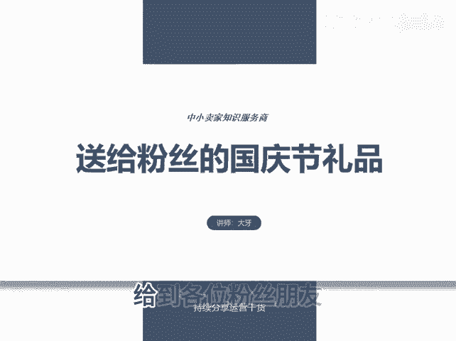
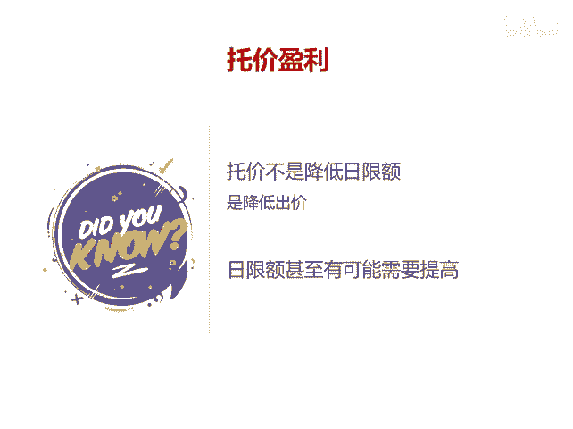

# 送给粉丝的国庆节礼品 - P1 - 千优电商教育 - BV1BYxQeYEZY

给到各位粉丝朋友这样一个国庆节的大礼。这个大礼是什么呢？就是拼多多的爆单思维。我们知道拼多多运营呢它本来没那么复杂，可是很多朋友左一个玩法右一个玩法，今天一个玩法，明天一个玩法，玩来玩去呢。

自己玩的很迷茫。其实做拼多多，你只要流程清晰，整体错都错不到哪里去，这个视频就给到大家这样的流程啊，首先第一步一定是测试链接，很多人呢他对测试有误解。有人问我，我的链接是不是要测图测款。

首先我们必须说明的是像非标品，他测款标品不测标题，你测什么款，标品我们需要做的是测试链接，你像手机这是正动的标品，你说我测试款式好卖吗？这款式不需要你来负责。你只需要测试链接。

测试链接的目的是找出有爆款属性的链接，然后我们再加大力度推广。那怎么测试呢？很简单，如果是非标多上链接，你5个为一组上去之后呢，报上活动开上车，然后看直通车里的数据哪个好。😡。

就可以标品怎么测试呢？很简单，你把同一个链接裂变成5个，做到标题不一样，SKU不一样，价格不一样，主图尽量做到不一样，然后报上活动开上车。在直通车里面呢，我们主要看哪一个链接花钱快，花钱快呢。

并且投产比还相对满意。那怎么叫投产比相对满意呢。比如说你到三的投产比能够保本的话，哎，它跑到三，那很好是吧？它跑到2。8，那也接受他如果跑到3以上，那更好判断直通车就是花费和投产比是否满意。

当找到比较满意的链接之后，我们再冲销量，冲销量的目的是迅速的提高权重，权重提高之后呢，后期才有更多的优化空间。在冲销量的阶段，一般它很难实现盈利。但是我也不要建议大家巨亏微亏是可以的那冲销量怎么冲。

其实呢整体应该向这样的一个数据，第一周整体是拉升的，就是销售额拉升。当然你的投入也得拉升，整体做一个这样的拉升。😊，发生多少呢？比如说今天你销售额1000块，明天1500，后天2002500。

你的直通车限额每天也要提高。当你拉升一周之后，第二周你可以适当的不要冲这么猛，可以让它稳定。等稳定一周之后呢，再进行托价盈利。所谓托价，它不是降低最现额是降低出价。就是你当你的直通车花费越来越快。

实际的投产比接近于你的出价。这时候呢，你再考虑呃降低出价。降低出价呢，每次建议。😡，0。10。2就是温水煮青蛙。在降价的过程中，日限额一定不要降低，甚至有必要还需要提高日限额。

其实呢这就是拼多多啊打造爆款的一个流程。其中，你要注意维护你的后台的服务数据，服务数据出问题，做起来流量流量也会掉。我是讲师大牙，欢迎大家扫码添加我的微信，不方便扫码的朋友可以添加我的微信号。

80221430。在这里给大家准备到了一套新手运营入门的大礼包，希望能够帮助大家。😊。

