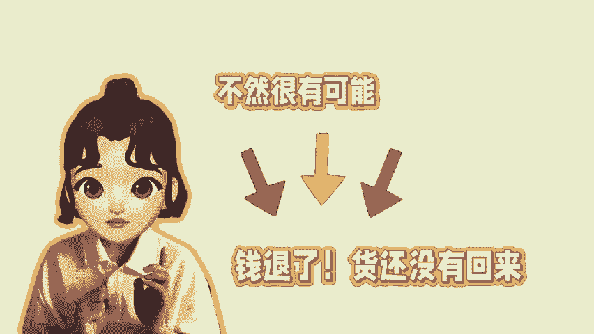

# 遇到已发货就退款的订单，商家应该这么做！ - P1 - 尘牛电商 - BV1L9xjewEB8

🎼商品发出去了，买家就来申请退款，这种在途商品被退款的情况，商家应该怎么做？这里分成两种情况。第一种，针对快递途中的退款订单，需要先找买家沟通，表示商品不想要的话，这边可以帮他拦截快递。

并且表达商品如果拦截不成功，麻烦买家到时候拒收快递，接着商家需要赶紧联系快递进行拦截，注意要等到有拦截信息才同意买家的退款申请。第二种，针对已经在派送的退款订单。这种需要买家拒收后才能退款。

先联系买家进行拒收。如果买家那边没有及时拒收。商家应该联系再派送的快递员对商品进行拦截处理，最后拦截成功才能够给买家操作退款哦。遇到已发货仅退款的订单，商家不要立马操作退款，不然很有可能钱退了货。

还没有回来，那就得不偿失了。😊。

