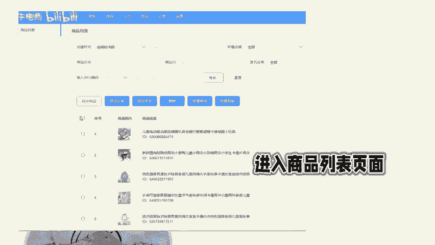
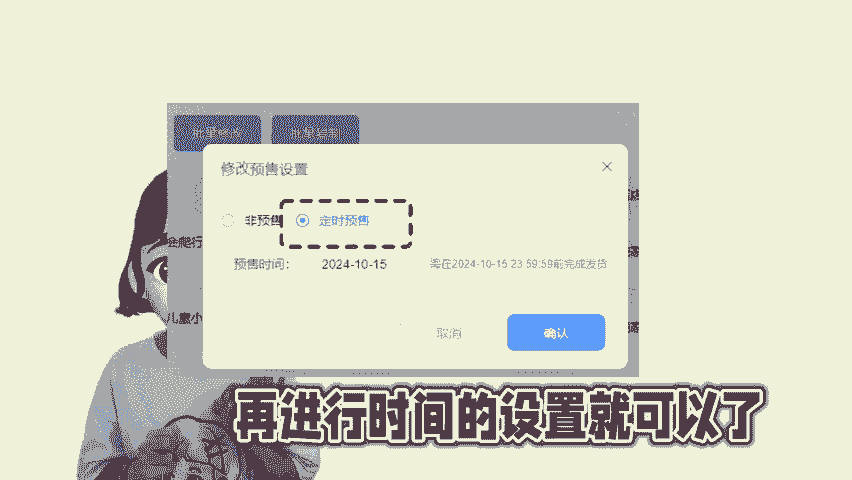

# 遇到节假日，记得设置商品的发货时间，避免超时发货 - P1 - 尘牛电商 - BV1m6xpeNEMF

🎼马上就是国庆小长假了，来不及天天发货的拼多多商家们可以批量设置商品的发货时间。比如将原本的24小时发货更改成48小时发货，这个需要怎么修改，在后台是没有批量修改发货时间这个功能的，单个修改也比较麻烦。

不适合体量大的店铺，可以用陈牛ERP来辅助修改，登录店铺之后，选择商品进入商品列表页面，选择你需要更改发货时间的商品，点击批量修改，在这里找到修改发货时间。这个选项，直接选择48小时。

然后确认这样就可以将店铺的发货时间都修改了。如果你想直接延长商品的发货时间，可以直接设置批量预售，选择定时预售，再进行时间的设置就可以了。注意了，改完记得多多查看店铺的动态和客户咨询，避免超时发货哦。

😊。

