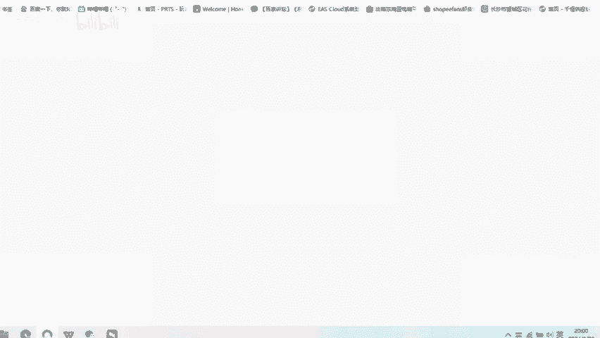
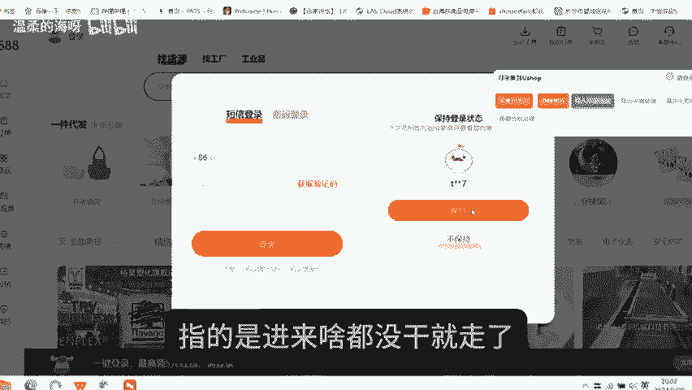
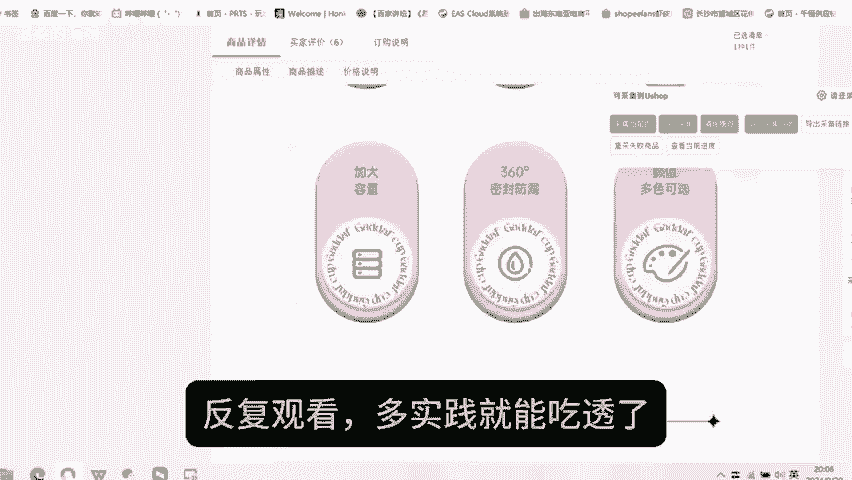

# 醒醒吧！这才是真正的分析电商数据 - P1 - 温柔的海呀 - BV1eaxseEEub

🎼真正的运营，很多时候不是数据分析太难，而是你没有找对方法。今天就来给大家分享其中的底层逻辑以及15个常见数据分析。5个电商数据分析的底层逻辑。一、看店铺整体数据。

比如曝光点击率、访客成交人数成交单量、成交金额跳失率平均浏览时长、加购率、推广金额。2、看爆款单品数据，需要关注单个产品的曝光访客成交转化率、点击率等数据。3、看进店竞品数据。

一、查看竞品价格是否有调整。2、关键词访客数在多少，对比自己产品找出不足成交关键词单量，据这个数据也可以决定我们店铺同款商品补单单量。3、流量渠道访客数观察搜索推荐活动内容付费不同渠道的访客数。

4、看推广数据，单品的展现量点击数、点击率、加购率、平均点击成本加单转化率、成交转化率根据数据不断优化SKU5看行业大盘数据。😊，🎼一、观看行业行情趋势上涨还是下降。2、观察行业搜索词变化。

近出现的热词等。3、行业商品榜单关注突然爆火的单品15个电商数据分析。一、销售额下降幅度较大，销售额下降30%以上，就要检查别的指标，访客转化率，客单价都要仔细盘查，并找出原因优化活动和高客单除外。

2、访客上涨，分析是哪个渠道流量在上涨，优化并稳住它。3、流量下降了，检查店铺数据是不是坑产下滑了，竞争对手是否来抢流量了，仅30天的数据是否有起伏，售后指标是否有问题。4、分析流量来源。

流量来自于什么地方，免费和付费的占比，每一天流量入口和前一天有什么变化。5、分析转化率，看下店铺流量来源，流量是否精准，是不是有差评，自己产品的收藏和加购。

🎼行不行？再分析一下哪些地方的转化率没有优化好，如主图，视频详情、评价、买家秀问大家6、分析客单价，将自己的客单价和竞争对手进行对比，看看对手足以新的店铺活动。7、跳失率指的是进来啥都没干就走了。

如跳试率太高，则看一下页面详情和流量是否精准。8、浏览量三倍率以上就算深度浏览，低于2。5就要分析自己页面是否需要优化。9、分析平均停留时间，分析访客是否精准，页面是否够好。10、分析点击率。

分析自己的流量是否精准，图片是否有吸引力。11、分析询单转化率，看一下客服的聊天记录，看一下聊天有没有需要改善的地方，分析一下自己的客单价，客单价不同，转化率也是不同的。12、分析复购率否有做思。

🎼老客户管理做的怎么样，分析自己的产品是否有回执。13、分析投产比，分析产品的引流是否精准，产品的转化率如何，产品的PPC多少行业的ROI是多少。14、地域分析，看自己的访客和成交主要是来自于哪个省份。

优化自己的产品和投放广告的地域。15、分析人群标签，店铺人群不精准，可以使用付费去拉。看进店人群和转化人群是否差距太大。本期主要是讲怎么去分析电商数据，分享了些常见的电商数据，宝子们可以收藏反复观看。

多实践就能吃透了。本期视频就到这里啦。我们下期再见。😊。

